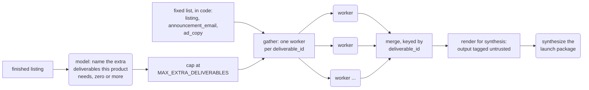

# 3.3 Orchestrator-Workers

*Fan-out, fan-in: split a task across parallel workers and merge the results. When your code wrote the worker list, that is ordinary concurrency; orchestrator-workers is the narrower pattern where the model reads the input and decides, fresh on every run, how many workers to spawn and what each one does.*

*Also called: fan-out / fan-in, parallelization, scatter-gather, manager-workers.*

## Why you'd reach for it

Some tasks are wide rather than deep. They break into independent pieces, none waiting on another's output, each easy on its own, together more than a single model call holds well. Running the pieces concurrently is the obvious move, and it is old engineering: your code knows the list, loops over it, merges the results. The gap arrives when the list itself depends on the input. Fix the list at author time and every input gets the same treatment whether it needs it or not. The system over-produces, running every piece that any input might need on all of them, or it under-produces, skipping the one piece this input needed. The second failure is the sharp one, because nothing errors: the work that should have existed never runs, and no log line marks its absence.

Take Listing Studio, a pipeline that turns a raw supplier feed into a live storefront listing for Stockwell, a mid-market commerce platform. Its launch step writes the deliverables that go out with a new product. Three never change: every product gets a storefront listing, a merchant announcement email, and ad copy, and code runs three workers for those in parallel, the same three on every run. The extras change with the product. The Aldsworth desk, a sit-stand desk from Northvale Furnishings, carries a Prop 65 warning (California's chemical-exposure notice, triggered here by formaldehyde in the MDF top) and a BIFMA furniture-safety stability claim, so it needs a printed compliance insert. Its minimum-advertised-price (MAP) flag means the ad copy needs a variant that keeps the advertised price legal, and its bulky freight needs an assembly-and-delivery blurb. A phone case needs none of those. Covering the extras in code means a trigger-rules engine that grows with every compliance regime, marketing channel, and product family the catalog meets, and each new rule is a code change. Producing every possible extra for every product spends model calls on deliverables most products have no use for. And the miss costs most: a merchandiser catches the absent insert by hand, or nobody does and the desk ships without it, a gap that surfaces as a liability question.

Orchestrator-workers closes the gap by handing the list-making to the model. Keep the fixed fan-out for the three standard deliverables. Then make one more model call: a planner reads the finished listing and names which extra deliverables this product needs, zero or more, each with a reason. Your code caps the count, runs one worker per named item, and gathers every result under a stable key. The desk's second wave runs three workers, the phone case's runs zero, and your code chose neither count.

Rectangles are your code deciding, rounded boxes are the model deciding, dashed boxes are data in flight. Nothing differs between the two rows below except the product that went in.

![Two products run through the same launch step. Above a dividing line, a rectangle holding the literal list of three standard deliverables feeds three workers, labelled the same way for every product because that list was written into the code. Below the line, a sit-stand desk carrying compliance, pricing and freight flags reaches a planner, which names three extra deliverables, and three workers spawn; a plain phone case with no flags reaches the same planner, which names none, and no worker spawns at all. Each row ends in a large count: three, three, zero.](fan-out-count.svg)

Reach for the dynamic half when:

- the subtasks vary per input, in count or in kind, so no author-time list covers them;
- they are independent, with no ordering between them, and each result can be judged without a sibling's output in hand (subtasks that feed each other are [3.1 Prompt Chaining](prompt-chaining.md)'s territory);
- the task is wider than one context window comfortably holds, and the pieces can be explored separately and condensed;
- the value of the result clears a token bill an order of magnitude above a single call (Cost, below).

The counter-trigger comes in two forms. If the subtask list is the same on every run, use the fixed half: a literal, a concurrent loop, no planner call, and an honest name for it. If the subtasks share deep context, each worker's choices constraining the others (most coding tasks have this shape), a single agent holding the full history in one window is the safer default, and the two published sides of that argument are below.

## What it actually is

Orchestrator-workers is the workflow where a central model reads the task, decides how to break it down, delegates the pieces to parallel worker calls, and synthesizes their results. Anthropic's guide, which named it, defines the workflow: "a central LLM dynamically breaks down tasks, delegates them to worker LLMs, and synthesizes their results."[^anthropic-bea] The same guide defines the neighbour it is most confused with. In Parallelization, "LLMs can sometimes work simultaneously on a task and have their outputs aggregated programmatically," in two variants: sectioning, "breaking a task into independent subtasks run in parallel," and voting, running the same task several times and aggregating the answers for diverse outputs.[^anthropic-bea] Voting is a reliability technique rather than a composition pattern, and this chapter names it only for contrast. The guide calls the two workflows "topographically similar" and puts the whole difference on one axis: in Parallelization the subtasks are pre-defined, while in orchestrator-workers they are "determined by the orchestrator based on the specific input."[^anthropic-bea]

On this book's litmus test (who makes the structural decision, the model or your code?), that axis splits the chapter's title in two. A `for` loop over a list your code already knows is sectioning wearing this chapter's name, however parallel the execution looks: the deciding happened when someone wrote the list, the same way the dispatch table in [3.2 Routing & Dispatch](the-router-that-isnt.md) decided when someone wrote the dictionary (that chapter's confusable-neighbours table carries this chapter's row: how many workers and how to decompose, against a one-time branch pick). The model deciding the decomposition, fresh on every input, is the narrower thing that earns this pattern its place among the reference's genuinely-new four; [1.2 Who Decides?](../foundations/who-decides.md) states the tell in brief (it sizes its own work), and this chapter is the full treatment. A diagram will not tell you which one you have. Parallel boxes converging on a merge look identical whether the box count came from a literal or from a model call; the tell lives in the code, in where the worker list comes from, and reading for it takes seconds.

The nearest neighbour on the model-decides side is [3.5 The Specialist Panel](specialist-panel.md): it also runs several model calls against one product, but it hands the same input to a fixed set of personas and reconciles their views, so the model picks the lens on the work and never the count of workers.

Each worker is a fresh instance of the augmented LLM, the model-plus-tools-plus-state unit of [1.4 The Augmented LLM](../foundations/the-augmented-llm.md), which already frames fan-out as several of those nodes run in parallel. The isolation is the mechanism. A worker gets its own context window, curated for its one subtask, and sees none of its siblings' reasoning; Anthropic describes its research subagents "exploring different aspects of the question simultaneously before condensing the most important tokens for the lead research agent."[^anthropic-multiagent] That is how a fan-out compresses a task wider than any single window: N windows read in parallel, and only condensed results cross back to the orchestrator. The forwarding discipline that [3.1 Prompt Chaining](prompt-chaining.md) applies at one boundary (forward the minimal validated fields, leave the transcript behind) is required here at N boundaries at once; what to condense is [1.5 Context Engineering](../foundations/context-engineering.md)'s topic and [5.4 Compaction](../knowledge/compaction-and-the-window.md)'s. The same isolation is the pattern's structural limit: a worker cannot read a sibling's intermediate reasoning, notice it is duplicating work, or catch a conflicting assumption before it ships. The skeptical case below stands on that limit.

The maturity call splits along the litmus line. The fixed half is Standard: scatter-gather (distribute the pieces, collect the results) across a worker pool with a deterministic merge is a decades-old distributed-systems idiom, the split-then-merge shape MapReduce industrialized, and running three model calls concurrently needs no maturity argument. The dynamic half is Established: a named, vendor-documented workflow, shipping in a real product, since Claude's Research feature runs an orchestrator-worker architecture in production.[^anthropic-multiagent] How an orchestrator should choose its decomposition strategy is a separate question with no settled answer; automated topology selection is active 2025-2026 research, Emerging, and out of scope here.

Established describes the mechanism. Whether it is a good default is contested, by named practitioners with production systems behind their positions, in two posts published a day apart. Cognition's Walden Yan argues against fanning out to parallel subagents at all: "actions carry implicit decisions, and conflicting decisions carry bad results," and, in his account, subagents working in isolation cannot see what a sibling is doing, so their outputs land on assumptions the synthesizer must reconcile after the fact. His recommended default is a single-threaded linear agent with the full history in one context window, reserving any splitting for a compression step on long tasks, an approach the same post admits is "hard to get right."[^cognition] Anthropic's post, published the next day, draws the boundary from the other side: multi-agent fan-out earns its cost on "tasks that involve heavy parallelization, information that exceeds single context windows, and interfacing with numerous complex tools," and it names its own bad fit plainly: "most coding tasks involve fewer truly parallelizable tasks than research, and LLM agents are not yet great at coordinating and delegating to other agents in real time."[^anthropic-multiagent] Read together, the two disagree about which tasks are the exception rather than about whether the mechanism works. The axis that decides is shared context. A research sweep splits into questions that can be explored separately; a refactor's edits constrain each other file by file. The launch step sits at the easy end, deliverables independent by construction, which is why the carrier can use the pattern honestly.

## How to do it

The shape, in the reference's visual language (rounded nodes are the model deciding, rectangles are your code):



Everything from `gather` rightward is identical for both halves. The difference lives at the left edge, a literal in one lane, a model call and a cap in the other.

The contracts come first: the planner's list and each worker's outcome are typed objects, [2.2 Structured Output](../the-unit/structured-output.md) doing inter-worker duty. `WorkerResult` carries success and failure in one shape, which the fan-in below depends on.

```python
class DeliverablePlan(BaseModel):
    """One extra deliverable the planner named for this product, and why."""
    model_config = ConfigDict(extra="forbid")

    deliverable_id: str  # stable key, e.g. "compliance_insert"
    reason: str           # why THIS product needs it


class FanOutPlan(BaseModel):
    """The planner's full output: zero or more extra deliverables, decided
    fresh from the finished listing -- never a fixed list your code already
    knows."""
    model_config = ConfigDict(extra="forbid")

    deliverables: list[DeliverablePlan]


class WorkerResult(BaseModel):
    """One worker's outcome, keyed by the same deliverable_id the planner
    (or the fixed list) named -- success or a structured failure, never a
    raised exception."""
    model_config = ConfigDict(extra="forbid")

    deliverable_id: str
    ok: bool
    content: str | None = None
    error: str | None = None
```

The fixed half is nearly nothing, on purpose. The list is a literal; the model never sees it and is never asked. `run_fixed_fanout` is this short because it delegates: the concurrency, the keying, and the failure handling all live in the shared `gather()` defined below, and the fixed half owns only the source of the list.

```python
# Every product gets these three, every time. Your code decided this list
# once, when it was written; the model is never asked, and never sees it.
STANDARD_DELIVERABLES: list[str] = ["listing", "announcement_email", "ad_copy"]


def run_fixed_fanout(worker_fn: Any, listing: dict) -> FanOutSummary:
    """Write all three standard deliverables concurrently.

    This calls the exact same gather() the dynamic half calls from plan.py.
    The fan-in cannot tell, and does not need to, that this list came from a
    literal instead of a planner call -- only the source of deliverable_ids
    differs between the two halves of step 7.
    """
    return gather(worker_fn, STANDARD_DELIVERABLES, listing)
```

The dynamic half swaps the literal for a model call and adds the one control the fixed half never needed: a cap, enforced by your code after the plan comes back and before any worker starts. The comment names the production incident this guards against, and Security & trust gives the risk category. Note `truncated`: a plan that overruns the cap is cut, and the caller is told, so the event lands in a log instead of a cost report. Treat a tripped cap as a reason to replan or route the listing to a person: the cut is positional, so nothing guarantees the dropped deliverable was the one this product could spare.

```python
# The bounded-consumption cap (OWASP LLM10 Unbounded Consumption). Anthropic's
# own postmortem names "spawning 50 subagents for simple queries" as a
# failure mode it had to guardrail against explicitly -- this is that
# guardrail, sized for a launch step that names at most a handful of real
# deliverable types.
MAX_EXTRA_DELIVERABLES = 5


@dataclass
class PlanResult:
    """The capped plan: what actually runs, and whether the model asked for
    more than the cap allows."""
    deliverables: list[DeliverablePlan]
    truncated: bool


def propose_deliverables(planner_fn: Any, listing: dict) -> PlanResult:
    """Ask the model which extra deliverables this listing needs, then
    enforce the cap before any worker runs.

    planner_fn reads the finished listing and returns a FanOutPlan naming
    zero or more extra deliverables -- the count does not exist anywhere in
    this file until planner_fn returns it. A plan naming more than
    MAX_EXTRA_DELIVERABLES is not run in full: the excess is dropped, never
    silently spawned, and the caller gets truncated=True so it can log or
    alert instead of discovering the cap only in a cost report.
    """
    plan: FanOutPlan = planner_fn(listing)
    truncated = len(plan.deliverables) > MAX_EXTRA_DELIVERABLES
    return PlanResult(
        deliverables=plan.deliverables[:MAX_EXTRA_DELIVERABLES],
        truncated=truncated,
    )
```

Both halves hand their list to the same `gather()`. The fan-in cannot tell, and does not need to know, whether the ids came from a literal or a planner. Three obligations live at this boundary, and each is in the code below. Results are keyed by `deliverable_id` and never by arrival order, because concurrent workers finish in any order and an append-based merge silently reorders output between runs. A failing worker comes back as a structured, recoverable result ("2 of 3 completed; worker `compliance_insert` failed: timeout"), never as a raw exception that takes the other N-1 workers down, and never as a silent drop that shrinks a three-part answer to two with no signal anywhere. And every worker's content is untrusted model output; `render_for_synthesis()` is the only sanctioned path onward, and Security & trust explains the tag it applies.

```python
@dataclass
class FanOutSummary:
    """The fan-in's output: every result keyed by deliverable_id -- never by
    the order workers happened to finish in -- plus a structured summary a
    synthesizer or a human can read without inspecting results by hand."""
    results: dict[str, WorkerResult]
    ok_count: int
    failed_count: int
    summary: str  # e.g. "2 of 3 completed; worker `compliance_insert` failed: timeout"


def _run_worker_safe(worker_fn: Any, deliverable_id: str, listing: dict) -> WorkerResult:
    """Run one worker and turn any exception into a structured failure.

    A raised exception here must never propagate past gather() and take the
    other N-1 workers down with it -- the partial-failure contract this
    chapter promises.
    """
    try:
        content = worker_fn(deliverable_id, listing)
        return WorkerResult(deliverable_id=deliverable_id, ok=True, content=content)
    except Exception as exc:
        return WorkerResult(deliverable_id=deliverable_id, ok=False, error=str(exc))


async def _run_all(
    worker_fn: Any, deliverable_ids: list[str], listing: dict
) -> dict[str, WorkerResult]:
    results: dict[str, WorkerResult] = {}

    async def _one(deliverable_id: str) -> None:
        # Written under its own key -- not appended -- so two workers
        # finishing in any order still land at the right place.
        results[deliverable_id] = await anyio.to_thread.run_sync(
            _run_worker_safe, worker_fn, deliverable_id, listing
        )

    async with anyio.create_task_group() as tg:
        for deliverable_id in deliverable_ids:
            tg.start_soon(_one, deliverable_id)
    return results


def gather(worker_fn: Any, deliverable_ids: list[str], listing: dict) -> FanOutSummary:
    """Run every deliverable_id's worker concurrently and merge the results.

    Three obligations live here. Results land in `results` keyed by
    deliverable_id, so a caller reading results["price_safe_ad_variant"]
    gets the right answer regardless of which worker actually finished
    first -- never trust arrival order. A failing worker never raises past
    this function: it comes back as a WorkerResult with ok=False, folded
    into `summary` as a structured, recoverable line, while the other N-1
    results are still complete. And every `.content` string in `results` is
    untrusted output from a model that read whatever the listing and
    supplier feed handed it -- see render_for_synthesis, the only
    sanctioned way to pass it on.
    """
    if not deliverable_ids:
        return FanOutSummary(
            results={}, ok_count=0, failed_count=0,
            summary="0 of 0 deliverables (nothing to run)",
        )

    results = anyio.run(_run_all, worker_fn, deliverable_ids, listing)
    failed = sorted(k for k, v in results.items() if not v.ok)
    ok_count = len(results) - len(failed)

    if failed:
        failure_notes = "; ".join(f"worker `{k}` failed: {results[k].error}" for k in failed)
        summary = f"{ok_count} of {len(results)} completed; {failure_notes}"
    else:
        summary = f"{ok_count} of {len(results)} completed"

    return FanOutSummary(results=results, ok_count=ok_count, failed_count=len(failed), summary=summary)


def render_for_synthesis(summary: FanOutSummary) -> str:
    """Render every successful worker's output as untrusted input -- the
    same discipline 2.1 Tool Use applies to a single tool result, now
    required at every worker boundary. A failed worker's error text never
    enters this string; only gather()'s own `summary` line reports failures
    to whatever reads this next.
    """
    blocks = []
    for deliverable_id in sorted(summary.results):
        result = summary.results[deliverable_id]
        if not result.ok:
            continue
        blocks.append(
            f'<worker_output id="{deliverable_id}" trust="untrusted">\n'
            f"{result.content}\n"
            "</worker_output>"
        )
    return "\n".join(blocks)
```

The provider tabs show the dynamic half; the fixed half is already provider-independent, since `run_fixed_fanout` takes any `worker_fn`. The tabs are asymmetric by design, as in the two previous chapters. The LangGraph tab shows the full graph, because `Send` is the reference mechanism for a runtime-sized fan-out: a conditional edge returns a *list* of `Send` objects, one per named deliverable, each carrying the state its worker will see ("Send takes two arguments: first is the name of the node, and second is the state to pass to that node"), and LangGraph's docs name this the map-reduce pattern, built for the case where "the number of edges may not be known" ahead of time.[^langgraph] Worker results merge into one shared state key under a dict-union reducer, so out-of-order completion is the framework's problem instead of yours.[^langgraph] The contrast case matters as much as the mechanism: a graph wired with a fixed number of parallel edges at construction time is correct, useful, and sectioning in code. If no edge's target list is computed at runtime, the model never sized anything. The two raw-SDK tabs build only `planner_fn` and `worker_fn`, each vendor's structured-output mechanism filling the `FanOutPlan` contract, and hand them to the shared `propose_deliverables` and `gather` above.

=== "LangGraph"

    ```python
    class FanOutState(TypedDict):
        listing: dict
        plan: Optional[FanOutPlan]
        # Keyed by deliverable_id and merged with dict union -- never list
        # append, so two workers finishing in any order still land at the
        # right keys instead of depending on which one wrote first.
        results: Annotated[dict[str, WorkerResult], operator.or_]


    def plan_node(state: FanOutState) -> dict:
        """The one model call: read the finished listing and name the extra
        deliverables it needs, zero or more, fresh for this product."""
        plan = planner_chain.invoke(
            "Given this finished Listing Studio product, name any extra launch "
            "deliverables it needs beyond the standard listing, announcement "
            f"email, and ad copy, and why: {state['listing']}"
        )
        return {"plan": plan}


    def continue_to_workers(state: FanOutState) -> list[Send]:
        """The fan-out: one Send per named deliverable. This list's length does
        not exist until plan_node returns -- the worker count is nowhere in
        this file."""
        deliverables = state["plan"].deliverables[:MAX_EXTRA_DELIVERABLES]
        return [
            Send("worker", {"deliverable_id": d.deliverable_id, "listing": state["listing"]})
            for d in deliverables
        ]


    def worker_node(state: dict) -> dict:
        """One worker, one deliverable. LangGraph invokes this once per Send;
        state here is whatever continue_to_workers passed for that Send, not
        the graph's full state."""
        content = llm.invoke(
            f"Write the {state['deliverable_id']} deliverable for this "
            f"Listing Studio product: {state['listing']}"
        ).content
        result = WorkerResult(deliverable_id=state["deliverable_id"], ok=True, content=content)
        return {"results": {state["deliverable_id"]: result}}


    builder = StateGraph(FanOutState)
    builder.add_node("plan", plan_node)
    builder.add_node("worker", worker_node)
    builder.add_edge(START, "plan")
    builder.add_conditional_edges("plan", continue_to_workers)
    builder.add_edge("worker", END)
    graph = builder.compile()

    result = graph.invoke(
        {"listing": {"supplier_sku": "NV-ALDSWORTH-DM", "title": "Aldsworth Dual-Motor Sit-Stand Desk"}}
    )
    print(result["results"])
    ```

=== "OpenAI Responses API"

    ```python
    def planner_fn(listing: dict) -> FanOutPlan:
        response = client.responses.create(
            model="gpt-5.5",
            input=[
                {
                    "role": "user",
                    "content": (
                        "Given this finished Listing Studio product, name any extra "
                        "launch deliverables it needs beyond the standard listing, "
                        f"announcement email, and ad copy, and why: {listing}"
                    ),
                }
            ],
            text={
                "format": {
                    "type": "json_schema",
                    "name": "FanOutPlan",
                    "schema": FanOutPlan.model_json_schema(),
                    "strict": True,
                }
            },
        )
        return FanOutPlan.model_validate_json(response.output_text)


    def worker_fn(deliverable_id: str, listing: dict) -> str:
        response = client.responses.create(
            model="gpt-5.5",
            input=[
                {"role": "user", "content": f"Write the {deliverable_id} deliverable for: {listing}"}
            ],
        )
        return response.output_text


    plan = propose_deliverables(planner_fn, ALDSWORTH_LISTING)
    summary = gather(
        worker_fn, [d.deliverable_id for d in plan.deliverables], ALDSWORTH_LISTING
    )
    print(summary.summary)
    ```

=== "Anthropic Messages API"

    ```python
    def planner_fn(listing: dict) -> FanOutPlan:
        reply = client.messages.create(
            model="claude-sonnet-4-6",
            max_tokens=1024,
            tools=[_PLAN_TOOL],
            tool_choice={"type": "tool", "name": "produce_fan_out_plan"},
            messages=[
                {
                    "role": "user",
                    "content": (
                        "Given this finished Listing Studio product, name any extra "
                        "launch deliverables it needs beyond the standard listing, "
                        f"announcement email, and ad copy: {listing}"
                    ),
                }
            ],
        )
        tool_block = next(b for b in reply.content if b.type == "tool_use")
        return FanOutPlan.model_validate(tool_block.input)


    def worker_fn(deliverable_id: str, listing: dict) -> str:
        reply = client.messages.create(
            model="claude-sonnet-4-6",
            max_tokens=1024,
            messages=[
                {"role": "user", "content": f"Write the {deliverable_id} deliverable for: {listing}"}
            ],
        )
        return next(b.text for b in reply.content if b.type == "text")


    plan = propose_deliverables(planner_fn, ALDSWORTH_LISTING)
    summary = gather(
        worker_fn, [d.deliverable_id for d in plan.deliverables], ALDSWORTH_LISTING
    )
    print(summary.summary)
    ```

One run on the Aldsworth desk, whose listing the earlier pipeline steps have already built, end to end:

1. `run_fixed_fanout` hands `gather()` the literal list, and three workers draft the storefront listing, the announcement email, and the ad copy concurrently. The fan-in returns "3 of 3 completed", keyed by deliverable id.
2. `propose_deliverables` sends the finished listing to the planner, which reads the `compliance` flags, the pricing flag, and the freight profile, and returns a `FanOutPlan` naming three extras, illustratively *"compliance_insert: Prop 65 and BIFMA claims need a printed insert. price_safe_ad_variant: MAP is enforced and the standard ad copy quotes a price. assembly_delivery_blurb: oversized freight, assembly required."*
3. Your code checks the plan against the cap: three named, five allowed, `truncated=False`. Three workers spawn, one per named item, through the same `gather()`.
4. The `compliance_insert` worker times out. `_run_worker_safe` converts the exception into a `WorkerResult` with `ok=False`, and the fan-out completes anyway: `summary` reads "2 of 3 completed; worker `compliance_insert` failed: timeout", with the other two results intact under their keys.
5. `render_for_synthesis` renders the two successful outputs as tagged, untrusted blocks; the failed worker's error text never enters the string. Whatever assembles the launch package reads the summary line and makes a call: re-run the one failed worker, or hold the listing for a person.

Run the same step on a phone case and the trace shortens. The fixed half still produces its three deliverables. The planner reads a listing with no compliance flags, no MAP, no freight notes, and returns an empty plan, and `gather()` answers "0 of 0 deliverables (nothing to run)" without spawning a worker. Same step, same code: three workers on the desk, none on the phone case.

Two production scale-ups matter.

**The synthesizer is the bottleneck.** Gathering results is mechanical; reconciling them is a judgment. In Anthropic's production system the lead agent synthesizes the workers' results and decides whether more research is needed,[^anthropic-multiagent] so the fan-in is itself a reasoning step, and it is usually where quality is won or lost. Give it explicit instructions for conflicts: a synthesizer left to its own devices can smooth disagreement over, and averaging away the one worker that got it right is a quieter failure than any timeout. A synthesizer that grades its own reconciliation and loops for another round has become a nested [3.4 Evaluator-Optimizer](evaluator-optimizer.md); one that cannot reconcile conflicting worker outputs should escalate to a person ([4.3 Human-in-the-Loop](../craft/human-in-the-loop.md)) instead of shipping a smoothed answer.

**From a launch step to a research fan-out.** The launch step's decomposition is bounded by nature (a commerce launch has only so many deliverable types, which is why a cap of five is comfortable), so it teaches the pattern at its tamest. The same shape at research scale is the carrier's category scout, a research surface that sizes its own investigation per question; that is the architecture of Claude's Research feature, and it is the scale at which one orchestrator with workers starts being marketed as "multi-agent" ([9.2 Multi-Agent](../frontier/more-than-one-agent.md) owns that layer, and much of what carries the label is this chapter's pattern under a louder name).

> **In Listing Studio.** Step 7 of the nine-step pipeline assembles the launch package in the two halves shown above: three standard deliverables from a fixed list, then a planner-named list of extras with one worker each. Both halves hand their lists to the same fan-in, and the dashboard shows each worker's status as results land. The dynamic half names deliverables and channels; page sections belong to step 5 and its specialist panel.

> **From production.** The pipeline I shipped this on assembles its final output in more than one wave. Most of its workers run over lists the code knows at author time; one wave asks the model to name the pieces that particular input calls for, then spawns one worker per name, so its width is a property of the input rather than of the source. The dependency forces the staging: that wave cannot start until its list comes back, so it never collapses into one flat gather with the others.

## Cost

Fan-out multiplies spend, and the multiplier has been measured. Anthropic reports agents using roughly 4x the tokens of a chat interaction and multi-agent systems roughly 15x,[^anthropic-multiagent] and the mechanism behind the multiple is visible in this chapter's code. Every worker carries its own context window, so the shared input is paid for once per worker: `gather()` hands the full listing to each of them, and a five-worker wave reads it five times before writing a word. The orchestrator then pays again to read every worker's output at synthesis, and the planner call itself rides on every run, including the runs where it names nothing. Treat the exact multiples as a snapshot: one system, one set of internal evals, mid-2025, and both numbers will move with every model and eval generation. The durable finding is the shape, an order of magnitude over a single call; check the live source before repeating a figure.

The decision a technical leader makes here is whether the value clears that multiple, and the comparison cuts both ways. Against the fixed alternative that produces every possible extra for every product, the planner is the cheaper design: the phone case's empty plan costs one small model call instead of a wave of irrelevant deliverables. Against a single call that would have done well enough, the whole fan-out is overhead, and that mistake is easy to approve because a demo prices one run; at thousands of listings a week the multiplier compounds into a number the demo never showed. Anthropic's stated boundary for when the cost pays sits well above a launch step: heavy parallelization, information beyond a single window, many complex tools.[^anthropic-multiagent] The launch step clears none of those literally, and its case is narrower and cheaper. One small planner call per product replaces a rules engine that would otherwise grow with every compliance regime and channel the catalog meets, and it buys that without producing the desk's three extras on a phone case that needs none. The cap is a cost control as much as a safety one: it fixes the worst-case wave, and `truncated=True` makes a runaway plan observable.

Workers can run on a cheaper model than the planner and the synthesizer, since drafting one named deliverable is an easier task than deciding what a product needs or reconciling N outputs ([8.2 Which Model?](../production/which-model.md)). The depth on the economics, model cascading included, is [8.4 Controlling Cost](../production/controlling-cost.md)'s.

## Security & trust

Fan-out changes the shape of three risks this reference names elsewhere. The attack surface is the union of every worker's inputs: each worker reading untrusted content is one more model call an indirect prompt injection (instructions planted in content the model reads, rather than typed by a user) can land on, LLM01 in the OWASP Top 10 for LLM Applications (a ranked catalog of the common security risks in LLM-backed systems).[^owasp] In the launch step every worker reads the finished listing, itself assembled from a supplier's feed and spec sheets, so a line planted in one spec sheet reaches every worker at once. In a research-shaped fan-out where each worker retrieves its own sources, the union grows with the worker count. The matching control is scoped input: hand each worker the minimum content its one deliverable needs. The launch step passes the whole listing because every deliverable draws on it; where workers' needs differ, per-worker curation shrinks the union back.

The synthesizer is where that widened surface narrows back to one output, and it trusts all of them. It reads every worker's result and reconciles them into one deliverable, so one compromised worker taints the final result even when the other N-1 came back clean. The discipline [2.1 Tool Use](../the-unit/tool-use.md) states for a single tool result, treat it as untrusted input, applies at every worker boundary here, and `render_for_synthesis()` is that rule in code: worker content crosses to the synthesizer tagged untrusted, and a failed worker's error text never crosses at all. The stakes scale with whatever the synthesized output triggers downstream, which is OWASP's LLM06 Excessive Agency territory; a launch package publishes.[^owasp]

Uncapped spawning is the third risk, OWASP's LLM10 Unbounded Consumption,[^owasp] and it has a published incident behind it rather than a hypothetical: Anthropic's postmortem names "spawning 50 subagents for simple queries" as an early failure mode it had to guardrail against explicitly.[^anthropic-multiagent] `MAX_EXTRA_DELIVERABLES` is that guardrail here. At research scale it splits in two, a total-worker bound like this one plus a concurrency limit on how many run at once; a launch step capped at five extras never needs the second.

One honesty note on the evidence. No dedicated research literature on injection or manipulation attacks specific to orchestrator-worker fan-out had surfaced as of this page's last review; the mitigations above are reasoned from OWASP's general categories plus one vendor's published incident, the same evidentiary posture 3.2 takes for router manipulation. When closer work appears, the citations here should upgrade.

## Gotchas

**The same input can fan out differently tomorrow.** Anthropic states the property plainly: agents "make dynamic decisions and are non-deterministic between runs, even with identical prompts," and one derailed step can redirect the whole trajectory.[^anthropic-multiagent] A dynamic fan-out multiplies that, N nondeterministic workers downstream of a nondeterministic plan, so worker count, decomposition, and final answer can all differ between two runs on the same listing. Two consequences follow. A green demo run is one sample rather than a behavior, so evaluate across runs ([4.2 Evaluation](../craft/proving-it-works.md) covers eval discipline under nondeterminism). And a bug report is unreproducible unless the failing run's own decomposition was recorded: log the `FanOutPlan` and the `truncated` flag with every run, because the plan is the one part you cannot re-derive later.

**Coordination failures are measured, and common.** MAST, a failure taxonomy built from 1,600+ annotated traces across seven popular multi-agent frameworks, sorts what breaks into 14 modes across three categories: system design issues, inter-agent misalignment, and task verification.[^mast] Two of those three categories are coordination problems rather than bad model output, which is the case for spending this chapter's discipline on contracts, caps, and fan-in obligations. In eval terms, exercise the planner and the fan-in separately, missing and padded plans on one side, conflicting claims, malformed keys, and partial results on the other, instead of scoring only end-to-end runs.

**Workers duplicate and contradict.** Isolation means a worker cannot see that a sibling already covered the warranty terms, or that the ad variant it is drafting assumes a price the compliance insert contradicts. This is Cognition's conflicting-implicit-decisions argument showing up at small scale,[^cognition] and when it bites on your task the fix is structural: fewer workers, more shared context, or one agent, rather than a smarter synthesizer mopping up downstream.

**The planner misses too.** Handing list-making to the model closes the rules-engine gap and opens a stochastic one. A planner that fails to name the compliance insert produces exactly the failure this chapter opened on, the deliverable that silently never runs, except now the cause is a model's judgment rather than a missing rule, so it will not be fixed by a code change and it will not reproduce on demand. The dynamic half needs a backstop for that: a deterministic check that certain flags on a listing must produce certain deliverables, run against the plan before the workers start. Let the model handle the open-ended cases and keep the ones you can name in code.

**A planner that always finds something.** The dynamic half earns its cost partly on the runs where it names nothing. A planner prompted with a menu of extras and an expectation of usefulness will pad, naming a compliance insert for products with nothing to comply with, and every padded item is a worker's worth of spend plus a deliverable someone has to notice is pointless. Keep the phone case in your eval set. If the empty plan never comes back in a catalog that has simple products in it, suspect the planner is inventing work.

**A fixed list in a planner's costume.** The inverse overclaim is billing the fixed half as the model orchestrating a team. If the worker list is in the code, it is parallelism: useful, Standard, and settled. Presenting it as agentic is the over-orchestration entry in the [Anti-Patterns Catalog](../catalogs/anti-patterns.md), this chapter's version of 3.2's dict in a router costume, and the same entry covers the build direction: a planner call and a worker pool bolted onto work a three-line loop over a known list already handles.

## In short

Split the verdict the way the step splits. Work that is the same on every run goes in a literal and runs concurrently; that is the Standard half, it needs no planner, and it should be described as parallelism without apology. Reach for the dynamic half only when the subtask list changes with the input, and build its controls before trusting it: a cap enforced in code with a `truncated` signal, a fan-in keyed by subtask id, partial failures returned as structured results, worker output treated as untrusted at the synthesis boundary, and the plan logged so any run can be replayed. Expect an order-of-magnitude token bill over a single call and make the value case first. Where subtasks share deep context, take the skeptical side's advice and keep one agent with one window. The pattern earns its keep on wide, separable work whose width varies by input, and the tell that you have it is checkable in a trace: run two different inputs through the step and count the workers.

<small class="chapter-meta">**Maturity: Standard (fixed parallel fan-out) · Established (dynamic orchestrator-workers)** (concurrent workers with a merge are a decades-old idiom; the model sizing its own fan-out is vendor-documented and shipping, with live trade-offs) · *Who decides:* your code (the fixed list) / the model (the dynamic list) · *Grounding:* production + research · *Last reviewed:* 2026-07</small>

## Sources

[^anthropic-bea]: Anthropic, "Building Effective Agents" (2024-12-19). The Parallelization definition ("LLMs can sometimes work simultaneously on a task and have their outputs aggregated programmatically") with its sectioning and voting variants; the Orchestrator-workers definition ("a central LLM dynamically breaks down tasks, delegates them to worker LLMs, and synthesizes their results"); the "topographically similar" comparison; and the boundary, subtasks pre-defined in one and "determined by the orchestrator based on the specific input" in the other. <https://www.anthropic.com/research/building-effective-agents>
[^anthropic-multiagent]: Anthropic, "How we built our multi-agent research system" (2025-06-13). The orchestrator-worker architecture behind Claude's Research feature; the token-multiplier finding (roughly 4x chat for agents, roughly 15x for multi-agent systems, measured on internal evals at publication); the subagent context-isolation framing; the lead-agent synthesis step; the non-determinism admission; the coding-tasks caveat; and the "spawning 50 subagents for simple queries" postmortem. <https://www.anthropic.com/engineering/multi-agent-research-system>
[^langgraph]: LangChain, "Graph API overview" (LangGraph docs). The `Send` API and the map-reduce pattern for fan-outs where "the number of edges may not be known" ahead of time, and the shared-state-key reducer that merges worker results. <https://docs.langchain.com/oss/python/langgraph/graph-api>
[^cognition]: Cognition (Walden Yan), "Don't Build Multi-Agents" (2025-06-12). The case against parallel subagents ("actions carry implicit decisions, and conflicting decisions carry bad results", and isolated subagents being unable to see what a sibling is doing, paraphrased here because the published sentence carries a double negative) and the single-threaded-linear-agent default, with splitting reserved for a compression step the post itself calls "hard to get right." <https://cognition.com/blog/dont-build-multi-agents>
[^mast]: Cemri, M. et al., "Why Do Multi-Agent LLM Systems Fail?" (NeurIPS 2025, Datasets and Benchmarks Track). The MAST taxonomy: 14 failure modes across 3 categories (system design issues, inter-agent misalignment, task verification), from 1,600+ annotated traces across 7 multi-agent frameworks. Category names follow the camera-ready revision, which renamed the first category from "specification issues." <https://arxiv.org/abs/2503.13657>
[^owasp]: OWASP, "Top 10 for LLM Applications 2025." LLM01 Prompt Injection, LLM06 Excessive Agency, LLM10 Unbounded Consumption: the general risk categories this chapter's fan-out-specific reasoning applies. <https://genai.owasp.org/llm-top-10/>

## See also

- [1.2 Who Decides?](../foundations/who-decides.md): the litmus tell ("it sizes its own work") in brief; this chapter is its full treatment.
- [1.4 The Augmented LLM](../foundations/the-augmented-llm.md): the unit each worker is one instance of.
- [1.5 Context Engineering](../foundations/context-engineering.md): the per-worker window economics, and what to condense before results cross back.
- [2.2 Structured Output](../the-unit/structured-output.md): the typed contracts the plan, the workers, and the fan-in all rely on.
- [3.1 Prompt Chaining](prompt-chaining.md): subtasks with an ordering between them are a chain; this chapter needs them independent.
- [3.2 Routing & Dispatch](the-router-that-isnt.md): the other two-verdict chapter, and the confusable-neighbours table this pattern has a row in.
- [3.4 Evaluator-Optimizer](evaluator-optimizer.md): the loop a self-judging synthesizer turns into.
- [3.5 The Specialist Panel](specialist-panel.md): fixed personas over one input; the model picks the lens there, the count here.
- [4.2 Evaluation](../craft/proving-it-works.md): eval discipline when the same input can produce different decompositions.
- [4.3 Human-in-the-Loop](../craft/human-in-the-loop.md): where irreconcilable worker conflicts should land.
- [8.2 Which Model?](../production/which-model.md): cheap workers, strong planner and synthesizer.
- [8.4 Controlling Cost](../production/controlling-cost.md): the token-multiplier economics in depth.
- [9.2 Multi-Agent](../frontier/more-than-one-agent.md): handoffs, swarms, and the architecture layer this pattern is the mechanism under.

## Further reading

- Anthropic, ["Building Effective Agents"](https://www.anthropic.com/research/building-effective-agents) (2024-12-19): the primary taxonomy; the Parallelization / Orchestrator-workers boundary this chapter is built on.
- Anthropic, ["How we built our multi-agent research system"](https://www.anthropic.com/engineering/multi-agent-research-system) (2025-06-13): the most detailed published production account of the pattern, with architecture, token economics, and postmortems.
- Cognition (Walden Yan), ["Don't Build Multi-Agents"](https://cognition.com/blog/dont-build-multi-agents) (2025-06-12): the best skeptical take; the shared-context argument for a single-threaded agent, from a team that builds a coding agent.
- Cemri et al., ["Why Do Multi-Agent LLM Systems Fail?"](https://arxiv.org/abs/2503.13657) (NeurIPS 2025): the MAST failure taxonomy; read it before designing your fan-in.
- LangChain, ["Graph API overview"](https://docs.langchain.com/oss/python/langgraph/graph-api): the `Send` / map-reduce mechanics for runtime-sized fan-outs, in depth.
- OWASP, ["Top 10 for LLM Applications 2025"](https://genai.owasp.org/llm-top-10/): the risk categories Security & trust reasons from, with per-category mitigations.
