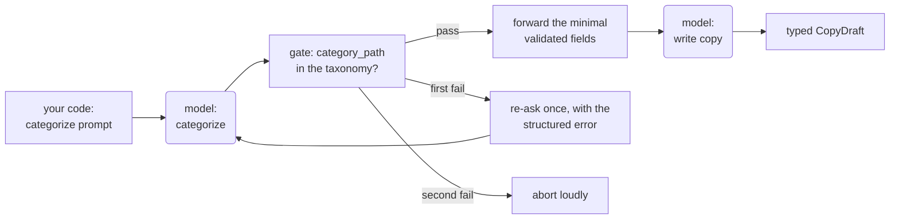

# 3.1 Prompt Chaining

<small class="chapter-meta">**Maturity: Standard** (the gated sequence is vendor guidance's default workflow shape; the fixes beyond a simple gate are still settling) · *Who decides:* your code · *Grounding:* production + research · *Last reviewed:* 2026-07</small>

*Why not one big prompt: split the task into a fixed sequence of model calls, because a single call cannot reliably hold the whole thing, and let your code own the order and gate what crosses between steps.*

*Also called: prompt pipelines, sequential workflows.*

## 1. Why you'd reach for it

A single model call can hold only so much before its attention thins, and a big task pushes past that line quietly. Ask one prompt to do five jobs at once (categorize a product, describe it, list its features, set a price, polish the voice) and every answer comes back a little worse than it would from a prompt doing one job. The costlier failure is an early mistake. The model treats its own wrong answer as settled and builds everything downstream on top of it, and because nothing errors and no request fails, no code is positioned to notice. The output just gets vaguer and less grounded as the window fills. [1.5 Context Engineering](../foundations/context-engineering.md) covers that degradation in depth.

Take a product-listing pipeline that turns a supplier's raw feed into a finished storefront page. It categorizes each product, writes the copy, builds the page sections, runs compliance checks, and publishes. Suppose the categorize job, buried inside the one big prompt, puts a sit-stand desk outside `office/desks/standing-desks`. Nothing fails. The copy gets written for the wrong shelf, the page sections answer the wrong shoppers' questions, the compliance checks run against the wrong category's rules, and the listing publishes where nobody shopping for a standing desk will look. Caught between steps, the bad category costs one extra model call. Caught after publish, it costs a mislisted product, the sales lost on the wrong shelf, and some of the team's trust in the pipeline.

Prompt chaining is the fix. Split the work at the seams where your code can check it. Categorize becomes its own call whose one-field output your code validates against the catalog taxonomy before the copy call ever runs. A failed check re-asks that step once with the validation error folded in; a second failure stops the run loudly, at the step that broke.

Reach for a chain when:

- the task decomposes into fixed subtasks you can name before the run;
- the intermediate outputs are checkable by code: a path that must exist in a taxonomy, a price against a floor, an object against a schema;
- the pipeline runs unattended, so it has to fail predictably rather than creatively.

The counter-trigger: if the model has to decide what happens next at runtime, you want the agent loop, compared in section 2. And when the subtasks are so entangled that no intermediate output means anything on its own, a chain adds round trips without adding a usable checkpoint; the Gotchas cover that case.

## 2. What it actually is

Prompt chaining is a task decomposed into an ordered sequence of model calls, where each call processes the previous call's output, your code fixes the order before the run, and a programmatic check between steps decides what is allowed to cross. Anthropic's guide, which named the pattern, describes it as decomposing "a task into a sequence of steps, where each LLM call processes the output of the previous one," and calls it "ideal for situations where the task can be easily and cleanly decomposed into fixed subtasks."[^anthropic] OpenAI's guide does not name the pattern but defines the same category of system: "A workflow is a sequence of steps that must be executed to meet the user's goal."[^openai-guide] Each step in the chain is the augmented LLM of [1.4 The Augmented LLM](../foundations/the-augmented-llm.md), one model call with its contract, doing one job.

On this book's litmus test (who makes the structural decision, the model or your code?) chaining is the honest draw. Structurally there is nothing new here. A pipeline of steps with validation between them is how batch systems have been built for decades, and your code decides the sequence, so the pattern fails the genuinely-new test. What is new is the reason you split. You are not splitting for modularity or team boundaries; you split because a single model call cannot reliably hold the whole task: attention thins as the window fills, an early wrong turn compounds silently, and only a boundary between calls gives your code a place to check.

Maturity: **Standard**, but scoped. The pattern as named, the sequence-with-a-gate shape, and the explicit trade (in Anthropic's words, "to trade off latency for higher accuracy, by making each LLM call an easier task") are default guidance in both vendors' guides.[^anthropic][^openai-guide] The pedigree is older than the agentic vocabulary: AI Chains, a CHI 2022 paper, showed that chaining LLM prompts into inspectable, editable intermediate steps improved task outcomes and users' sense of transparency and control in a 20-person study,[^aichains] and least-to-most prompting, which solves decomposed subproblems in sequence and feeds each one the previous answer, beat chain-of-thought on compositional generalization tasks.[^l2m] What is unsettled is the machinery above a simple gate (consensus and resampling schemes across steps are Emerging, see the Gotchas) and the reflex to decompose maximally, which is Contested. When this chapter says Standard, it means the gated sequence and nothing more.

**Chaining is not chain-of-thought.** Chain-of-thought is one model call reasoning stepwise inside a single response;[^cot] a chain is multiple discrete calls, each a full round trip, with your code inspecting what crosses each boundary. Conflating them imports single-call intuitions onto a pattern where none of them hold: inside one response there is no gate, no external state, and no added per-step latency or cost. A chain has all three.

**Chaining is not evaluator-optimizer.** The dividing line is who decides whether to run another round. In a chain your code decides: it advances when a deterministic check passes, and on a failure it re-runs a fixed number of times, then stops. In [3.4 Evaluator-Optimizer](evaluator-optimizer.md) the model decides: it grades its own output against a quality bar and keeps revising until the grade clears or a cap intervenes, so the iteration count is not fixed in the code. The gate makes the same point at smaller scale. A gate that is a plain code check keeps you in chaining; a gate that is itself a model grading the output (an LLM-as-a-judge, one model call scoring another's work) crosses into evaluator-optimizer only when its verdict drives an open-ended revise-until-good loop rather than a single pass or fail. Two-pass generation, draft then rewrite once in a fixed second call, stays on the chaining side, because that second pass is unconditional; this reference files it under chaining rather than as a separate pattern.

**A chain is the far end of the control spectrum from the agent loop.** A chain fixes the sequence in code before the run. An agent loop hands that decision to the model: it chooses its next action each turn and runs until an exit condition stops it. OpenAI's guide describes the loop: "Every orchestration approach needs the concept of a 'run', typically implemented as a loop that lets agents operate until an exit condition is reached. Common exit conditions include tool calls, a certain structured output, errors, or reaching a maximum number of turns."[^openai-guide] The chain wins for unattended production pipelines, where predictable cost and latency, a gate at every boundary, per-step debuggability, and clean resumability matter more than flexibility. Because each gate hands the next step a small validated state, a run that dies at step six can restart from step six on that state rather than replaying the first five; an agent loop keeps its state as the whole evolving transcript, with no equally clean point to resume from. The loop wins for open-ended tasks whose shape is unknown before the run, most visibly interactive coding agents today, though unattended server-side loops exist, deep-research agents among them. (In the carrier world, the repricer surface runs one.) A common shorthand splits it as loops for local supervised work, chains for production apps. That is fair as far as it goes, but the underlying axis is supervision and reliability tolerance rather than deployment location: a loop usually runs with a person or a hard cap watching it, while an unattended pipeline wants determinism. [1.3 Workflow or Agent?](../foundations/workflow-or-agent.md) owns the full spectrum; [9.1 Autonomous Agents](../frontier/when-you-want-autonomy.md) owns the loop in depth.

## 3. How to do it


The shape, in the reference's visual language (rounded nodes are the model deciding, rectangles are your code):



The example is the seam described above: Listing Studio's step 3 (categorize) feeding step 4 (write copy). Each step's output is a typed contract, the capability from [2.2 Structured Output](../the-unit/structured-output.md) doing inter-step duty:

```python
class CategoryDecision(BaseModel):
    """Step 3 (categorize) output: where the product belongs in the taxonomy."""
    model_config = ConfigDict(extra="forbid")

    category_path: str  # e.g. "office/desks/standing-desks"
    confidence: float    # 0.0-1.0; the model's stated confidence


class CopyDraft(BaseModel):
    """Step 4 (write copy) output: the drafted listing copy for one product."""
    model_config = ConfigDict(extra="forbid")

    description: str
    bullets: list[str]
```

Between the two calls sits what Anthropic's workflow diagram calls a "gate": a programmatic check on an intermediate step that confirms the process is on track before the next call runs.[^anthropic] The gate checks what the schema cannot: whether the category the model chose exists at all. In the companion code, `TAXONOMY` is a three-entry literal standing in for the catalog taxonomy service, and the code says so in a comment:

```python
@dataclass
class GateResult:
    ok: bool
    error: str | None = None  # structured message for the re-ask prompt if not ok


def validate_category(decision: CategoryDecision) -> GateResult:
    """The gate: category_path must be a real node in the catalog taxonomy.

    The categorize step can return a schema-valid CategoryDecision that names
    a path that does not exist. This is the check that catches that before
    the write-copy step drafts against a category that isn't real.
    """
    if decision.category_path not in TAXONOMY:
        return GateResult(
            ok=False,
            error=(
                f"category_path {decision.category_path!r} is not in the "
                f"catalog taxonomy. Choose one of: {sorted(TAXONOMY)}."
            ),
        )
    return GateResult(ok=True)
```

The chain itself is plain sequential code. Read it for two decisions: what it does when the gate fails, and how little it forwards when the gate passes:

```python
def run_chain(
    categorize_fn: Any,  # callable(messages) -> CategoryDecision
    write_copy_fn: Any,  # callable(messages) -> CopyDraft
    supplier_sku: str,
    title: str,
) -> CopyDraft:
    """Categorize, gate, write copy -- in that fixed order, every time.

    write_copy_fn never runs until categorize_fn's output clears the gate.
    On a gate failure, categorize_fn is re-asked once with the validation
    error folded in as a structured message -- the same shape as 2.2's
    re-ask loop, applied to the gate instead of the schema. A second failure
    aborts the chain loudly; it does not let an uncategorized product flow
    into the copy step.
    """
    messages = [
        {"role": "user", "content": f"Categorize {title} (SKU {supplier_sku})."}
    ]
    decision = categorize_fn(messages)
    gate = validate_category(decision)

    if not gate.ok:
        # Re-ask the SAME step once, feeding back the gate's structured error.
        messages.append({"role": "user", "content": f"Invalid category: {gate.error}"})
        decision = categorize_fn(messages)
        gate = validate_category(decision)

    if not gate.ok:
        # The retry also failed: abort loudly. No silent pass-through of an
        # unvalidated category into the copy step.
        raise RuntimeError(f"categorize step failed its gate twice: {gate.error}")

    # Only the minimal validated fields cross the gate into step two -- not
    # the categorize transcript, not the rejected first attempt.
    copy_messages = [
        {
            "role": "user",
            "content": (
                f"Write listing copy for {title} (SKU {supplier_sku}) "
                f"in category {decision.category_path}."
            ),
        }
    ]
    return write_copy_fn(copy_messages)
```

The provider variants plug into that skeleton. The three tabs are asymmetric by design: the LangGraph tab shows the full graph, nodes, the conditional edge that routes on the gate, and the abort node, because the sequential graph is the reference shape for a chain,[^langgraph] while the two raw-SDK tabs only define the step functions and hand them to the shared, tested `run_chain` above. (How you word each step's prompt belongs to [4.1 Prompt Management](../craft/prompts-are-source-code.md), and each framework's own docs teach its chain API; the tabs are here to show the shape.)

=== "LangGraph"

    ```python
    class ChainState(TypedDict):
        supplier_sku: str
        title: str
        category: Optional[CategoryDecision]
        category_error: Optional[str]  # the gate's structured error, fed back on retry
        attempt: int                   # how many times categorize has run
        copy: Optional[CopyDraft]


    def categorize_node(state: ChainState) -> dict:
        """Step 3 (categorize), gated immediately after the call."""
        prompt = f"Categorize {state['title']} (SKU {state['supplier_sku']})."
        if state.get("category_error"):
            # Re-ask the SAME step, feeding back the gate's structured error.
            prompt += f" Previous attempt was rejected: {state['category_error']}"
        decision = categorize_chain.invoke(prompt)
        gate = validate_category(decision)
        return {
            "category": decision,
            "category_error": gate.error,
            "attempt": state.get("attempt", 0) + 1,
        }


    def route_after_gate(state: ChainState) -> str:
        """The gate's routing decision: continue, retry once, or abort loudly."""
        if state["category_error"] is None:
            return "continue"
        if state["attempt"] < 2:
            return "retry"
        return "abort"


    def abort_node(state: ChainState) -> dict:
        """The retry also failed: abort loudly. No silent pass-through."""
        raise RuntimeError(
            f"categorize step failed its gate twice: {state['category_error']}"
        )


    def write_copy_node(state: ChainState) -> dict:
        """Step 4 (write copy): only the validated category_path crosses the gate."""
        decision = state["category"]
        draft = write_copy_chain.invoke(
            f"Write listing copy for {state['title']} (SKU {state['supplier_sku']}) "
            f"in category {decision.category_path}."
        )
        return {"copy": draft}


    builder = StateGraph(ChainState)
    builder.add_node("categorize", categorize_node)
    builder.add_node("write_copy", write_copy_node)
    builder.add_node("abort", abort_node)
    builder.add_edge(START, "categorize")
    builder.add_conditional_edges(
        "categorize",
        route_after_gate,
        {"continue": "write_copy", "retry": "categorize", "abort": "abort"},
    )
    builder.add_edge("write_copy", END)
    builder.add_edge("abort", END)
    chain = builder.compile()

    result = chain.invoke(
        {"supplier_sku": "NV-ALDSWORTH-DM", "title": "Aldsworth Dual-Motor Sit-Stand Desk"}
    )
    print(result["copy"].description)
    ```

=== "OpenAI Responses API"

    ```python
    def categorize_fn(messages: list[dict]) -> CategoryDecision:
        response = client.responses.create(
            model="gpt-5.5",
            input=messages,
            text={
                "format": {
                    "type": "json_schema",
                    "name": "CategoryDecision",
                    "schema": CategoryDecision.model_json_schema(),
                    "strict": True,
                }
            },
        )
        return CategoryDecision.model_validate_json(response.output_text)


    def write_copy_fn(messages: list[dict]) -> CopyDraft:
        response = client.responses.create(
            model="gpt-5.5",
            input=messages,
            text={
                "format": {
                    "type": "json_schema",
                    "name": "CopyDraft",
                    "schema": CopyDraft.model_json_schema(),
                    "strict": True,
                }
            },
        )
        return CopyDraft.model_validate_json(response.output_text)


    copy = run_chain(
        categorize_fn,
        write_copy_fn,
        supplier_sku="NV-ALDSWORTH-DM",
        title="Aldsworth Dual-Motor Sit-Stand Desk",
    )
    print(copy.description)
    ```

=== "Anthropic Messages API"

    ```python
    def categorize_fn(messages: list[dict]) -> CategoryDecision:
        reply = client.messages.create(
            model="claude-sonnet-4-6",
            max_tokens=1024,
            tools=[_CATEGORY_TOOL],
            tool_choice={"type": "tool", "name": "produce_category_decision"},
            messages=messages,
        )
        tool_block = next(b for b in reply.content if b.type == "tool_use")
        return CategoryDecision.model_validate(tool_block.input)


    def write_copy_fn(messages: list[dict]) -> CopyDraft:
        reply = client.messages.create(
            model="claude-sonnet-4-6",
            max_tokens=1024,
            tools=[_COPY_TOOL],
            tool_choice={"type": "tool", "name": "produce_copy_draft"},
            messages=messages,
        )
        tool_block = next(b for b in reply.content if b.type == "tool_use")
        return CopyDraft.model_validate(tool_block.input)


    copy = run_chain(
        categorize_fn,
        write_copy_fn,
        supplier_sku="NV-ALDSWORTH-DM",
        title="Aldsworth Dual-Motor Sit-Stand Desk",
    )
    print(copy.description)
    ```

One run on the Aldsworth desk, end to end:

1. Your code sends the categorize prompt: "Categorize Aldsworth Dual-Motor Sit-Stand Desk (SKU NV-ALDSWORTH-DM)."
2. The model returns a schema-valid `CategoryDecision` whose `category_path` is `"furniture/desks/sit-stand"`. The shape is correct; the path does not exist in the catalog.
3. The gate rejects it, and `run_chain` re-asks the categorize step once, folding the structured error into the message ("category_path 'furniture/desks/sit-stand' is not in the catalog taxonomy. Choose one of: ..." followed by the valid paths).
4. The model returns `"office/desks/standing-desks"`, and the gate passes.
5. Your code forwards only `supplier_sku`, `title`, and the validated `category_path` into the copy prompt. The categorize transcript and the rejected first attempt stay behind.
6. The copy call drafts `description` and `bullets` for a standing desk, and the chain returns the typed `CopyDraft`.

Three scale-ups matter in production.

**From two steps to nine.** The full Listing Studio pipeline, ingest through publish, is this same seam repeated: nine steps, each reading the current Listing and handing a more complete one forward, a check at every boundary. Every added step is another chance for a quiet wrong turn to become a premise for everything after it; the arithmetic lives in the Gotchas.

**From one model to several.** A chain decouples the model choice per step. Categorize is an easy classification and can run on a small, cheap model; the brand-voice polish at step 8 is where a strong model earns its price ([8.2 Which Model?](../production/which-model.md)).

**The retry discipline.** `run_chain` re-asks a failed step exactly once, then aborts. That is deliberately tighter than the bounded re-ask loop in [2.2 Structured Output](../the-unit/structured-output.md), and the reason is the round trip: every retry in a chain is a full model call with its own latency and cost, and whatever retry budget you allow gets multiplied by the number of steps. One re-ask catches the transient miss. A second failure on the same gate is evidence of a problem retries will not fix, a bad prompt, a gap in the taxonomy, a step that needs a person, and an unattended pipeline serves you better by aborting loudly at the step that broke than by quietly spending its budget. In a batch run, scope the abort: set the failed SKU aside for the merchandiser and keep the rest of the feed moving. The products in a feed are independent, so a worker pool runs their chains concurrently even though each product's chain is serial.

> **In Listing Studio.** The nine-step pipeline is this pattern at the top level: your code fixes the order from ingest to publish, and each step hands a more complete Listing to the next. The categorize-to-copy seam shown above repeats at every step boundary. Nothing publishes until every step has reported back.

> **From production.** The production system this carrier recasts runs as a multi-step pipeline where each step reports success or failure to an orchestrating service, and a failure arrives labeled with the step that produced it. A failed step blocks everything downstream until a person fixes the input and re-triggers it, and the run resumes from that step rather than starting over. It has no content gates between steps: each step judges only its own completion. The taxonomy check shown above is the tighter gate this chapter recommends on top of that baseline.

## 4. Gotchas

**Errors compound multiplicatively.** With independent per-step failure, end-to-end reliability is the product of the steps, and the product decays fast. Illustratively (this is arithmetic, not a benchmark): a step that is right 99 percent of the time gives you roughly 90 percent end-to-end across ten steps, and roughly 37 percent across a hundred. A recent industry preprint derives the same shape and argues that per-step reliability has to be engineered far past "usually right" before long chains are viable; it is not peer-reviewed, so treat it as directional.[^sixsigma] The gate keeps the decay from being silent: without one, step nine operates at whatever error the first eight accumulated.

**A silent gate is worse than no gate.** A failed check must come back as a structured, recoverable signal: re-ask the step with the validation error (the same shape as 2.2's re-ask loop, applied at the step boundary), route to a person when a retry is the wrong tool ([4.3 Human-in-the-Loop](../craft/human-in-the-loop.md)), or abort the run loudly. A gate that logs the failure and passes the object through anyway, or dies in a raw exception nothing catches, has spent a round trip to change nothing.

**Do not forward the transcript.** What crosses a gate is a context-budget decision. Each step should receive a window curated for its job (the copy step above gets three fields), and the lazy alternative, appending every prior step's output and shipping the pile forward, quietly rebuilds the mega-prompt you split to escape, spread across more calls. The pile costs tokens, and it drains attention from the input the step actually needs. [1.5 Context Engineering](../foundations/context-engineering.md) names this failure mode and owns the depth; what to summarize, compact, or carry forward is its topic and [5.4 Compaction](../knowledge/compaction-and-the-window.md)'s.

**Every step is a full round trip.** More calls means more latency and more spend; the vendor framing of the trade is latency for accuracy.[^anthropic] The trade is wrong in two common places: user-facing surfaces with an interactive latency budget, where three serial calls blow the budget one call fits inside, and steps a model already does reliably in one shot, where the extra hop buys nothing.

**Over-decomposition is its own anti-pattern.** Ten tiny steps are not safer than four substantial ones. Each split adds a round trip, a gate that can misfire, and a boundary that needs a curated context, so past the point where each step is already easy for the model, further splitting adds cost and failure surface without a reliability gain. Splitting can also hurt outright when the subtasks are entangled: a 2025 preprint models the trade as competing noise sources, finding that chunking long-context work helps when per-call degradation dominates and hurts when cross-chunk dependency dominates; the framework is Emerging, a lens rather than settled guidance.[^noise] Growing context windows shift this boundary too: they weaken the case for splitting short tasks without erasing it for long ones, leaving "decompose maximally, always" a Contested default rather than a safe habit. The [Anti-Patterns Catalog](../catalogs/anti-patterns.md) files this one.

## 5. In short

Chain when the task decomposes into fixed, code-checkable subtasks and the pipeline must run unattended and fail predictably. Gate every boundary, and make a gate failure structured and loud: re-ask once with the error, then abort or escalate, and never pass an unvalidated object forward. Forward the minimum the next step needs; the transcript is dead weight. Expect to pay a round trip per step, and prune steps that no longer earn their gate. If the model has to decide what happens next, you have left this pattern and want an agent loop. The gated sequence is Standard; treat everything above it, consensus schemes, resampling across steps, frameworks that predict when to decompose, as still settling.

## Sources

[^anthropic]: Anthropic, "Building Effective Agents" (2024-12-19). The pattern definition ("decomposes a task into a sequence of steps, where each LLM call processes the output of the previous one"), the programmatic "gate" on intermediate steps, and the stated trade ("trade off latency for higher accuracy, by making each LLM call an easier task"). <https://www.anthropic.com/research/building-effective-agents>
[^openai-guide]: OpenAI, "A Practical Guide to Building Agents" (April 2025), pp. 4 and 14, for the workflow definition and the run-loop framing quoted in section 2. The guide also holds that applications integrating LLMs without letting them control workflow execution are not agents. <https://openai.com/business/guides-and-resources/a-practical-guide-to-building-ai-agents/>
[^aichains]: Wu, T., Terry, M., and Cai, C. J., "AI Chains: Transparent and Controllable Human-AI Interaction by Chaining Large Language Model Prompts," CHI 2022. <https://doi.org/10.1145/3491102.3517582>
[^l2m]: Zhou, D., et al., "Least-to-Most Prompting Enables Complex Reasoning in Large Language Models" (2022). <https://arxiv.org/abs/2205.10625>
[^cot]: Wei, J., et al., "Chain-of-Thought Prompting Elicits Reasoning in Large Language Models" (2022). <https://arxiv.org/abs/2201.11903>
[^sixsigma]: Patel et al. (Lyzr Research), "The Six Sigma Agent" (2026). Non-peer-reviewed preprint; cited for the compounding-error shape, not as settled authority. <https://arxiv.org/abs/2601.22290>
[^noise]: Xu et al., "When Does Divide and Conquer Work for Long Context LLM? A Noise Decomposition Framework" (2025). Preprint; the chunking-helps-versus-hurts framework, cited as Emerging. <https://arxiv.org/abs/2506.16411>
[^langgraph]: LangChain, "Workflows and agents" (LangGraph docs). The reference sequential-graph shape: nodes, edges, `StateGraph`. <https://docs.langchain.com/oss/python/langgraph/workflows-agents>

## See also

- [1.3 Workflow or Agent?](../foundations/workflow-or-agent.md): the spectrum this pattern sits at the workflow end of, and the longer answer to "chain or loop?"
- [1.5 Context Engineering](../foundations/context-engineering.md): what to carry across the gate and what to leave behind, the depth behind "do not forward the transcript."
- [2.2 Structured Output](../the-unit/structured-output.md): the typed contract each gate validates, and the re-ask-with-structured-error shape this chapter's gate reuses at the step boundary.
- [3.2 Front Controller](the-router-that-isnt.md): conditional branching between steps is routing, not chaining; a chain that picks its next step from a classifier is that chapter's pattern in a chain's clothes.
- [3.3 Orchestrator-Workers](fan-out.md): where steps have no ordering dependency, fan them out in parallel instead of chaining them.
- [3.4 Evaluator-Optimizer](evaluator-optimizer.md): the model judging its own output and deciding whether to loop, the genuinely new sibling this pattern gets mistaken for.
- [4.3 Human-in-the-Loop](../craft/human-in-the-loop.md): the gate failure that needs a person rather than a retry.
- [9.1 Autonomous Agents](../frontier/when-you-want-autonomy.md): the agent loop in depth, the other end of the comparison in section 2.
