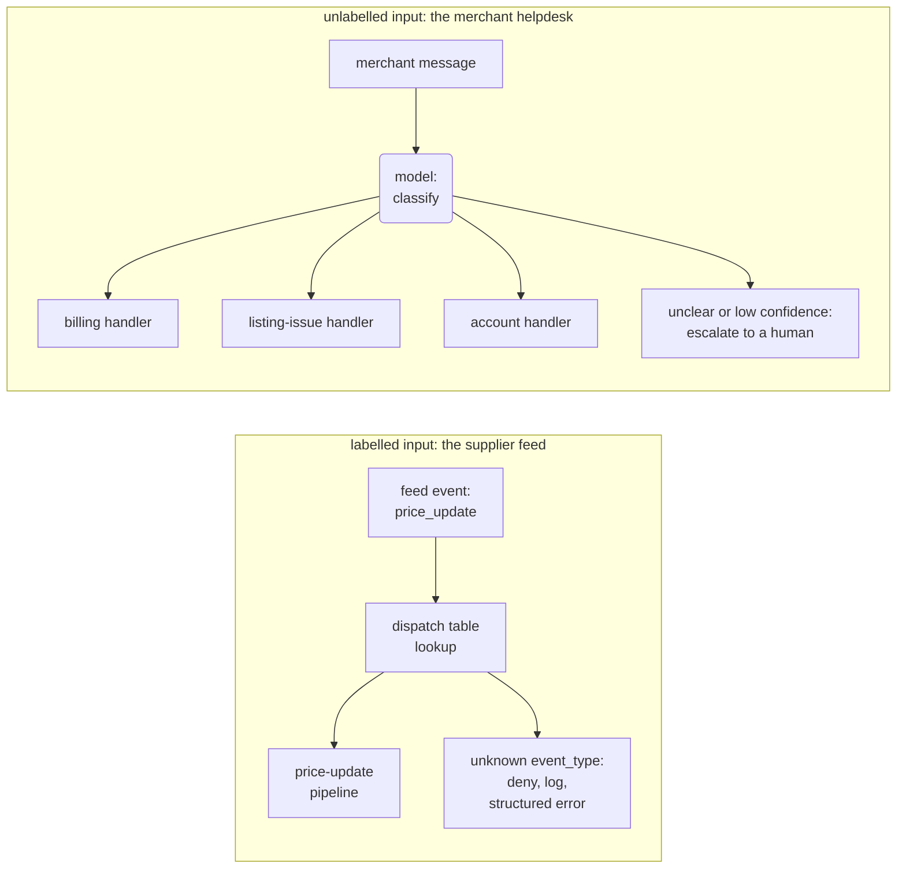

# 3.2 Routing & Dispatch

*The router that isn't one: when the input already carries a label, picking its handler is a dictionary lookup, and your code decided the outcome when it wrote the dictionary. LLM routing proper is the narrower pattern, a model that classifies unlabelled input before any handler runs.*

*Also called: front controller, dispatcher, request dispatch (the code side); intent classification, LLM routing (the model side).*

## Why you'd reach for it

> **From production.** We nearly shipped a router. The front door of a feed pipeline took each
> incoming event and started the pipeline that owned it, the architecture diagram said "router",
> and the vendor guide going around that quarter had a workflow by that name, so the label
> survived design review. Then someone opened the function. It was a dictionary: a handful of
> keys, and an `else` branch that logged and returned a structured error. Nothing was wrong with
> the code. What was wrong was that a room of engineers had been discussing the behaviour of a
> lookup table as though something inside it made a decision.

Two mechanisms share the name "routing", and the word hides which one you have. One reads a label
the caller already attached and looks up the handler that owns it. The other reads unlabelled
text and works out what it is. The first decides nothing at runtime, because your code decided
everything the day it wrote the table. The second decides on every single request, and pays a
model call to do it.

Confusing them is expensive in both directions, and neither mistake announces itself.

Put a classifier in front of input that already carries a label and you buy a model call per
event, for as long as the system runs, to re-answer a question the input answered on arrival. It
will occasionally answer differently. Nothing breaks; the cost just spreads thinly across every
event in the system, which is the hardest kind of waste to notice and the hardest to kill once
it is load-bearing.

Point a lookup table at unlabelled free text and you get the opposite failure. Take a merchant
helpdesk, the support surface attached to a commerce platform, where a merchant types *"Why was I
charged twice for my Stockwell subscription this month?"* No category field arrives with that,
because merchants do not file their questions under taxonomy headings. Keyword rules look
workable right up until they meet traffic: "charged" sends that message to billing, and it also
sends the merchant whose listing is *displaying* a wrong charge amount to billing, whose problem
is a listing bug. The billing specialist answers both, plausibly, from the wrong context. Nothing
in the logs looks wrong. You find out when the merchant complains, or when they don't and churn
instead.

So read the input before you pick the mechanism:

- the inputs already carry a reliable label (an event type on a feed, a message kind on a queue):
  dispatch on it with a table and spend zero tokens;
- the inputs are unlabelled free text, and the categories are known but fuzzy at the boundaries or
  changing over time: LLM routing, one classification call before the handler runs;
- the inputs are unlabelled but the categories are stable and the route has to add near-zero
  latency and cost: reach for a non-LLM classifier (embedding similarity or a rules engine) before
  you pay for a model call per request.

If the model has to keep deciding what to do next, turn after turn, a one-time split at the door
is the wrong shape and you want [tool use](../the-unit/tool-use.md) or an agent loop. If there is
only one handler, call it directly.


## What it actually is

Both mechanisms stand at the front of a system that has several handlers and must get each input
to the right one. What separates them is where the label comes from. A dispatch table takes a
label the caller already supplied and looks up its handler. Routing starts from unlabelled input
and classifies it before any handler runs; intent classification is the same step under another
name, assigning an input to one category from a closed set. Anthropic's guide, which named the
workflow, defines routing as a step that "classifies an input and directs it to a specialized
followup task", and allows the classification to be done by an LLM or by a more traditional
classification model or algorithm.[^anthropic] Gulli's *Agentic Design Patterns* lands on the
same definition and admits the same range: LLM-based, embedding-based, rule-based, and
ML-model-based.[^gulli]

That range matters, because "routing" covers three arrangements and only one of them puts a model
in the decision:

- **no classifier at all**: a dispatch table over already-labelled input. Nothing decides at
  runtime.
- **a non-LLM classifier**: embeddings, rules, or a trained model make a real per-request
  decision, without a model call. The `semantic-router` library is the concrete case, a
  nearest-neighbour search over example utterances attached to each route.[^semrouter]
- **an LLM classifier**: the model reads the input and picks the category, fresh every request.

A dispatch table is not an agentic pattern.

Only the third arrangement is, and only its decision has to be evaluated the way you evaluate
model output. The first is ordinary engineering and has been for decades: a table
from key to handler fronts interpreters, event loops, and web frameworks, and the pattern catalogs
wrote it up for the web tier more than twenty years ago.[^fowler][^j2ee] The middle one is the
right answer more often than its share of the conference talks suggests, because when categories
are stable and the route has to be near-free, an embedding router beats both a model call and a
keyword hack.

The LLM classifier picks from *your* categories, never its own. The taxonomy is a closed set
pinned by the classifier's output schema ([2.2 Structured Output](../the-unit/structured-output.md)),
so an answer naming a category you did not define fails validation instead of quietly creating a
route.

Function names will not tell you which arrangement you are in. LangGraph's conditional edges call
their callback a "routing function" whatever it contains.[^langgraph] The chain in
[3.1 Prompt Chaining](prompt-chaining.md) has one named `route_after_gate` that branches on a
validation-error field, with no classifier anywhere; this chapter's graph has
`route_after_classify`, which reads a model's judgment. Telling them apart takes about ten
seconds: open the function and look for a model call feeding the branch.

Three neighbours get mistaken for this pattern in design reviews.
[Tool use](../the-unit/tool-use.md) has the model choosing, but on every turn of a running
exchange rather than once at the door. [Agent handoffs](../frontier/more-than-one-agent.md) fire
from inside an already-running agent and hand the whole conversation to a peer.[^handoffs]
[Skill selection](../the-unit/skills.md) happens inline, mid-response, with no classifier step at
all. OpenAI's manager pattern, a central LLM delegating to specialists through tool calls, is
routing-shaped and belongs with the multi-agent material.[^openai-guide] The
[quick-reference](../catalogs/quick-reference.md) puts them side by side.

## How to do it

Both mechanisms, in the reference's visual language (rounded nodes are the model deciding,
rectangles are your code):



The classify call is the only rounded node on the page. Every other box, including both failure
branches, is your code.

The dispatch side is the whole pattern in one function: the front door from the story above,
taking supplier-feed events into a product-listing pipeline. The `event_type` arrives on an
external feed, so it is untrusted, and that gives the function its two rules: validate the key
before the lookup, and give unknown types an explicit deny branch rather than an exception.

```python
EVENT_HANDLERS: dict[str, Callable[[dict], DispatchResult]] = {
    "new_product": _handle_new_product,
    "price_update": _handle_price_update,
    "stock_update": _handle_stock_update,
}


def dispatch(event: dict) -> DispatchResult:
    """Look up the handler for event["event_type"] and run it."""
    # event_type is untrusted (off the supplier feed): validate against the
    # known key set before the lookup, never a dynamic getattr/eval on it.
    event_type = event.get("event_type")

    if event_type not in EVENT_HANDLERS:
        logger.warning("dispatch: rejected unknown event_type %r", event_type)
        return DispatchResult(
            ok=False,
            detail="event rejected",
            error=f"unknown event_type {event_type!r}; known types: {sorted(EVENT_HANDLERS)}",
        )

    return EVENT_HANDLERS[event_type](event)
```

Testing that takes nothing beyond ordinary dictionary tests, which is the honest argument for
using it wherever it fits.

The routing half starts with a contract rather than a model. `unclear` is a member of the
taxonomy, so when nothing fits the classifier has a correct answer available instead of a forced
guess. The enum also settles the worry that "fuzzy, evolving categories" raises: the model cannot
grow the taxonomy at runtime or drift into synonyms of the four, because anything off the set
fails validation before it reaches a handler. The set changes when you edit this class, and at no
other time.

```python
class Category(str, Enum):
    """The closed taxonomy an unlabeled merchant message can land in."""
    BILLING = "billing"
    LISTING_ISSUE = "listing_issue"
    ACCOUNT = "account"
    UNCLEAR = "unclear"


class RouteDecision(BaseModel):
    """Which category owns the message, and how confident the model is."""
    model_config = ConfigDict(extra="forbid")

    category: Category
    confidence: float  # 0.0-1.0; the model's stated confidence
```

Read `route_message` for its escalation contract. The two ways a classification can be
untrustworthy, an `unclear` answer and a real category named with low confidence, collapse onto
one path: a structured result with `escalated=True`, handed to a person, no exception raised,
because an unroutable message is an expected outcome here rather than an error. The `0.6` floor
is a code default standing in for a real one, which comes from evaluating the classifier on
labelled traffic ([4.2 Evaluation](../craft/proving-it-works.md)).

```python
@dataclass
class RouteResult:
    """The routing outcome: category, response, and whether it escalated."""
    category: Category
    response: str
    escalated: bool


def route_message(
    classify_fn: Any,  # callable(message: str) -> RouteDecision
    handlers: dict[Category, Callable[[str], str]],
    message: str,
    *,
    confidence_floor: float = 0.6,
) -> RouteResult:
    """Classify message, then hand off to its category's handler."""
    decision = classify_fn(message)

    if decision.category == Category.UNCLEAR or decision.confidence < confidence_floor:
        return RouteResult(
            category=Category.UNCLEAR,
            response=(
                f"could not route with confidence ({decision.confidence:.2f}); "
                "escalated to a human"
            ),
            escalated=True,
        )

    return RouteResult(
        category=decision.category,
        response=handlers[decision.category](message),
        escalated=False,
    )
```

Walk one input through each mechanism and the cost difference stops being abstract. The dispatch
side's entire trace is two steps:

1. A `price_update` event arrives from the supplier feed, and your code checks the key against the
   known set.
2. The dict returns the price-update pipeline, which runs.

Zero model calls, zero tokens, the same answer every time. The routing side takes five:

1. A message arrives with no label: *"Why was I charged twice for my Stockwell subscription this
   month?"*
2. Your code sends the classify prompt: the message plus the four-category taxonomy.
3. The model returns a `RouteDecision`, illustratively *"category: billing, confidence: 0.91"*.
4. The routing function reads the decision and sends it to the billing handler.
5. The billing handler answers from billing context, and the run ends with `escalated=False`.

Now the run that matters more. A rambling message touching a charge, a listing photo, and a
password reset comes back *"category: unclear, confidence: 0.42"*. The same conditional edge
sends it to the escalate node, a person gets the message with the classifier's reading attached,
and no exception appears anywhere in the trace. That path is the one to build first. A classifier
without it does not decline to answer; it guesses, confidently, and you never hear about it.

Two things change as this grows. **Categories are not free.** Each one you add lengthens the
classifier prompt, blurs a boundary with its neighbours, and adds labelled examples to maintain,
the same ceiling pressure as the tool-count problem in [2.1 Tool Use](../the-unit/tool-use.md).
A taxonomy change moves every boundary at once, so re-run the eval after each one and merge
categories that rarely fire. **Churn costs differ by family.** An LLM classifier absorbs a new
category with a prompt and schema edit; an embedding router needs example utterances written for
it;[^semrouter] a trained classifier needs retraining. If your categories shift often, let that
difference decide.

#### Wiring it to a provider

The LangGraph tab shows the whole graph, since classify-then-branch is the reference shape for
this pattern.[^langgraph] The two raw-SDK tabs build only `classify_fn`, each vendor's
structured-output mechanism filling the `RouteDecision` contract, and hand it to the
`route_message` above.

=== "LangGraph"

    ```python
    class RouterState(TypedDict):
        message: str
        decision: Optional[RouteDecision]
        response: Optional[str]
        escalated: Optional[bool]


    def classify_node(state: RouterState) -> dict:
        """The one model call: classify the unlabeled merchant message."""
        decision = classify_chain.invoke(
            "Classify this merchant helpdesk message into billing, "
            f"listing_issue, account, or unclear: {state['message']}"
        )
        return {"decision": decision}


    def route_after_classify(state: RouterState) -> str:
        """Low confidence or an off-taxonomy read escalates instead of guessing."""
        decision = state["decision"]
        if decision.category == Category.UNCLEAR or decision.confidence < 0.6:
            return "escalate"
        return decision.category.value


    def _handler_node(label: str):
        """One specialist node per category; only the label differs."""
        def node(state: RouterState) -> dict:
            return {"response": f"[{label}] {state['message']}", "escalated": False}
        return node


    def escalate_node(state: RouterState) -> dict:
        """No handler is confident enough: hand off to a human."""
        decision = state["decision"]
        return {
            "response": (
                f"could not route with confidence ({decision.confidence:.2f}); "
                "escalated to a human"
            ),
            "escalated": True,
        }


    builder = StateGraph(RouterState)
    builder.add_node("classify", classify_node)
    builder.add_node("billing", _handler_node("billing"))
    builder.add_node("listing_issue", _handler_node("listing_issue"))
    builder.add_node("account", _handler_node("account"))
    builder.add_node("escalate", escalate_node)
    builder.add_edge(START, "classify")
    builder.add_conditional_edges(
        "classify",
        route_after_classify,
        {
            "billing": "billing",
            "listing_issue": "listing_issue",
            "account": "account",
            "escalate": "escalate",
        },
    )
    builder.add_edge("billing", END)
    builder.add_edge("listing_issue", END)
    builder.add_edge("account", END)
    builder.add_edge("escalate", END)
    graph = builder.compile()

    result = graph.invoke(
        {"message": "Why was I charged twice for my Stockwell subscription this month?"}
    )
    print(result["response"])
    ```

=== "OpenAI Responses API"

    ```python
    def classify_fn(message: str) -> RouteDecision:
        response = client.responses.create(
            model="gpt-5.5",
            input=[
                {
                    "role": "user",
                    "content": (
                        "Classify this merchant helpdesk message into billing, "
                        f"listing_issue, account, or unclear: {message}"
                    ),
                }
            ],
            text={
                "format": {
                    "type": "json_schema",
                    "name": "RouteDecision",
                    "schema": RouteDecision.model_json_schema(),
                    "strict": True,
                }
            },
        )
        return RouteDecision.model_validate_json(response.output_text)


    HANDLERS = {
        Category.BILLING: lambda msg: f"[billing] {msg}",
        Category.LISTING_ISSUE: lambda msg: f"[listing_issue] {msg}",
        Category.ACCOUNT: lambda msg: f"[account] {msg}",
    }

    result = route_message(
        classify_fn,
        HANDLERS,
        "Why was I charged twice for my Stockwell subscription this month?",
    )
    print(result.response)
    ```

=== "Anthropic Messages API"

    ```python
    def classify_fn(message: str) -> RouteDecision:
        reply = client.messages.create(
            model="claude-sonnet-4-6",
            max_tokens=1024,
            tools=[_ROUTE_TOOL],
            tool_choice={"type": "tool", "name": "produce_route_decision"},
            messages=[
                {
                    "role": "user",
                    "content": f"Classify this merchant helpdesk message: {message}",
                }
            ],
        )
        tool_block = next(b for b in reply.content if b.type == "tool_use")
        return RouteDecision.model_validate(tool_block.input)


    HANDLERS = {
        Category.BILLING: lambda msg: f"[billing] {msg}",
        Category.LISTING_ISSUE: lambda msg: f"[listing_issue] {msg}",
        Category.ACCOUNT: lambda msg: f"[account] {msg}",
    }

    result = route_message(
        classify_fn,
        HANDLERS,
        "Why was I charged twice for my Stockwell subscription this month?",
    )
    print(result.response)
    ```

## Gotchas

**Misrouting is silent, and that is the whole risk.** A broken dispatch is loud: the deny branch
logs and returns a structured error, or the missing-handler bug raises. A misrouted helpdesk
message produces a fluent answer from the wrong specialist with nothing anywhere in the trace to
flag it. Treat the classifier as the model-judged step it is: build a labelled eval set for it
([4.2 Evaluation](../craft/proving-it-works.md)), log every route decision with its confidence,
and watch the category distribution drift. The alternative is learning about your accuracy from
complaints.

**Both mechanisms are attack surface.** The dispatch key comes off an untrusted feed, so validate
it against the known set before the lookup and never build the dispatch target dynamically from
the raw string; `getattr` or `eval` on attacker-influenced input is an old code-injection risk with
nothing to do with models. On the routing side, a crafted message can try to steer the classifier
toward a higher-privilege or wrong-tenant handler, and where a route grants elevated tools or data
downstream, that confused-deputy shape is the excessive-agency territory OWASP names.[^owasp]
Router manipulation has begun to attract direct study: query-independent "confounder gadget" token
sequences reroute LLM routers in both white-box and black-box settings,[^rerouting] and follow-up
work categorizes routing attacks and proposes detection.[^rerouteguard] Both target cost and
model-tier routers rather than task-category classifiers like this one, so the risk here is
reasoned rather than measured.[^scope] The mitigations hold either way: least privilege per
handler, and an escalation path for anything the classifier is unsure of.

**The accuracy-versus-cost trade is real and unsettled.** Router and cascade benchmarks
(RouterBench,[^routerbench] Hybrid LLM,[^hybridllm] RouteLLM,[^routellm] FrugalGPT[^frugalgpt])
all measure routers trading answer quality against cost along a genuine curve, and none of them
crowns a winner. Quote the finding, never the percentage.[^numbers] A vendor selling a router that
"always picks the best model" is selling past what anyone has shown.

**A dict in a router costume.** Billing a static dispatch table as intelligent or agentic routing
is the overclaim this chapter exists to deflate, and the
[Anti-Patterns Catalog](../catalogs/anti-patterns.md) files it as Fake routing. It costs more than
marketing credibility. A stakeholder who believes the front door is intelligent expects it to
cope with inputs it rejects by design, and budgets and test plans inherit the same wrong
expectation.

## In short

Read your input before you pick the mechanism. If a reliable label already exists, use a
dictionary: validate the key, give unknown types an explicit deny branch, spend zero tokens, and
do not call it agentic. If the input is unlabelled and the categories are stable, few, and
latency-sensitive, an embedding router does the job without a model call per request. If the
categories are fuzzy or genuinely shift, spend the model call, and build the failure path first:
keep `unclear` in the taxonomy, escalate low confidence to a person, and stand up a labelled eval
set before you trust the thing in front of customers. The dispatch side fails loudly if you build
its deny branch. The routing side never will, so instrument it.

<small class="chapter-meta">**Maturity: Standard (static dispatch) · Established (LLM routing)** (the dispatch table is a decades-old idiom; LLM routing is vendor-documented with settling trade-offs) · *Who decides:* your code (dispatch) / the model (LLM routing) · *Grounding:* production (dispatch) + companion repo (routing) · *Last reviewed:* 2026-07</small>

## Sources

[^anthropic]: Anthropic, "Building Effective Agents" (2024-12-19). The Routing workflow definition ("classifies an input and directs it to a specialized followup task"), the allowance that classification can be handled by an LLM or a more traditional classification model or algorithm, and routing's fit for tasks with distinct categories, customer-support triage among them. <https://www.anthropic.com/research/building-effective-agents>
[^gulli]: Gulli, *Agentic Design Patterns* (Springer Nature, 2025), ch. 2, Routing. The definition admitting LLM-based, embedding-based, rule-based, and ML-model-based classifiers; paraphrased, exact wording pending verification against the print edition.
[^fowler]: Fowler, *Patterns of Enterprise Application Architecture*, "Front Controller": "a controller that handles all requests for a Web site." Cited for the name's provenance and its web-tier scope. <https://martinfowler.com/eaaCatalog/frontController.html>
[^j2ee]: Alur, Crupi, Malks, *Core J2EE Patterns* (Sun Microsystems, 2001), "Front Controller." Centralized request handling for the J2EE web tier; paraphrased.
[^langgraph]: LangChain, "Graph API overview" (LangGraph docs). Conditional edges and the "routing function" naming (the docs' own term; community tutorials often say "router function"), cited for the shape and the naming trap. <https://docs.langchain.com/oss/python/langgraph/graph-api>
[^handoffs]: OpenAI Agents SDK, "Handoffs." Handoffs are implemented as tool calls from inside a running agent and transfer the conversation to another agent. <https://openai.github.io/openai-agents-python/handoffs/>
[^openai-guide]: OpenAI, "A Practical Guide to Building Agents" (April 2025). The manager pattern, a central LLM delegating to specialist agents via tool calls; paraphrased. <https://openai.com/business/guides-and-resources/a-practical-guide-to-building-ai-agents/>
[^semrouter]: aurelio-labs, `semantic-router`. Embedding-based routing by similarity search over example utterances attached to each route. <https://github.com/aurelio-labs/semantic-router>
[^owasp]: OWASP, "Top 10 for LLM Applications 2025." LLM01 Prompt Injection and the excessive-agency category, the general risk categories the routing-manipulation concern is reasoned from. <https://genai.owasp.org/llm-top-10/>
[^rerouting]: Shafran, Schuster, Ristenpart, Shmatikov, "Rerouting LLM Routers" (2025). Query-independent "confounder gadget" token sequences that manipulate LLM-router decisions, demonstrated in white-box and black-box settings. <https://arxiv.org/abs/2501.01818>
[^rerouteguard]: Zhang, Xu, Wang, Li, He, Wei, Ren, "RerouteGuard: Understanding and Mitigating Adversarial Risks for LLM Routing" (2026). Categorizes routing attacks into cost escalation, quality degradation, and safety bypass, and proposes an attack-detection framework. <https://arxiv.org/abs/2601.21380>
[^scope]: Scope note: both routing-attack papers target cost/model-tier routers. No published work measures the same attacks against task-category classifiers of the kind this chapter builds, so the confused-deputy risk here is argued from OWASP's general categories rather than demonstrated.
[^routellm]: Ong et al., "RouteLLM: Learning to Route LLMs with Preference Data" (2024). Learned routing between a strong and a weak model; cited for the cost/quality trade-off finding, deliberately without its benchmark-specific percentages. <https://arxiv.org/abs/2406.18665>
[^hybridllm]: Ding et al., "Hybrid LLM: Cost-Efficient and Quality-Aware Query Routing" (ICLR 2024). Difficulty-aware routing between model tiers. <https://arxiv.org/abs/2404.14618>
[^routerbench]: Hu et al., "RouterBench: A Benchmark for Multi-LLM Routing System" (2024). The router accuracy/cost benchmark; no consensus winner across both axes. <https://arxiv.org/abs/2403.12031>
[^frugalgpt]: Chen, Zaharia, Zou, "FrugalGPT: How to Use Large Language Models While Reducing Cost and Improving Performance" (2023). The LLM cascade idea. <https://arxiv.org/abs/2305.05176>
[^numbers]: The benchmarks in this cluster date from roughly 2024-2025, and each model generation has moved their curves. The cost-aware cascading corner of the space is Emerging: no default router has settled.

## See also

- [1.2 Who Decides?](../foundations/who-decides.md): the test this chapter applies twice; the dispatcher deflation is stated there in brief and argued in full here.
- [2.1 Tool Use](../the-unit/tool-use.md): the model choosing repeatedly, per turn; its tool-count ceiling is the same pressure as this chapter's category ceiling.
- [2.3 Skills](../the-unit/skills.md): the model self-selecting from a capability catalog inline, with no separate classifier step to compare against.
- [3.1 Prompt Chaining](prompt-chaining.md): `route_after_gate`, a code gate wearing a router's name; a chain that picks its next step from a classifier is this chapter's pattern inside a chain.
- [3.3 Orchestrator-Workers](fan-out.md): the model deciding how many workers and how to decompose, a different structural decision than picking one branch.
- [4.2 Evaluation](../craft/proving-it-works.md): the labelled eval set the classifier needs, the same discipline as any model-judged step.
- [4.3 Human-in-the-Loop](../craft/human-in-the-loop.md): where the `unclear` and low-confidence escalation path lands.
- [4.4 Guardrails & Safety](../craft/guardrails-and-safety.md): confidence floors and default-deny handling as guardrail instances.
- [8.4 Controlling Cost](../production/controlling-cost.md): model cascading in depth, the cost-tier cousin of the routing decision, and where the classify call's own model choice belongs.
- [9.2 Multi-Agent](../frontier/more-than-one-agent.md): agent handoffs in depth, the mid-run transfer this chapter only disambiguates.
