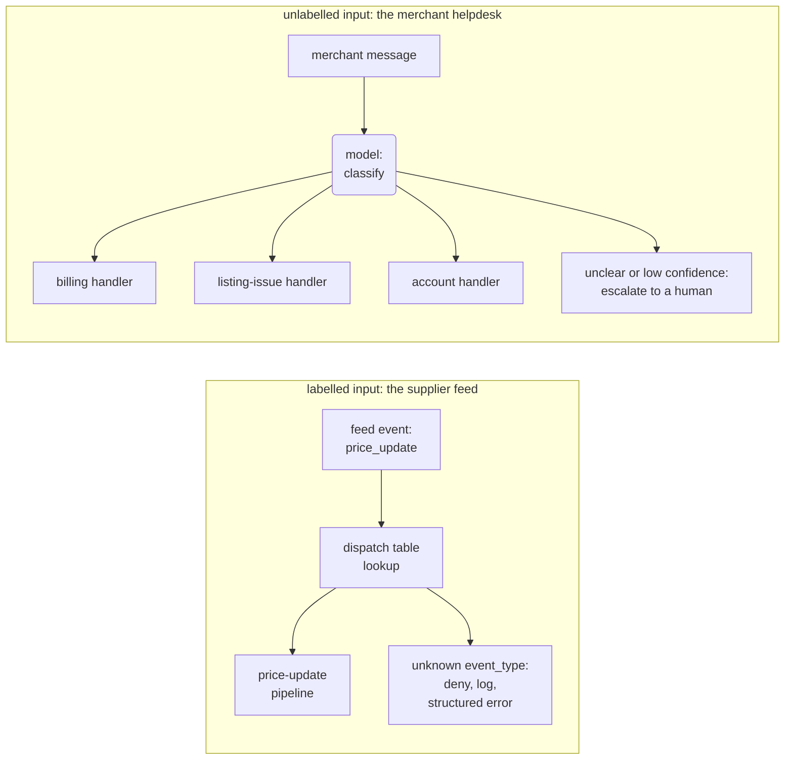

# 3.2 Routing & Dispatch

<small class="chapter-meta">**Maturity: Standard (static dispatch) · Established (LLM routing)** (the dispatch table is a decades-old idiom; LLM routing is vendor-documented with settling trade-offs) · *Who decides:* your code (dispatch) / the model (LLM routing) · *Grounding:* production + companion repo · *Last reviewed:* 2026-07</small>

*The router that isn't one: a static lookup from a label the caller already supplied to the handler that owns it is your code deciding, whatever the function is named. Genuine LLM routing, a model classifying unlabelled input before any handler runs, is the newer, narrower thing.*

*Also called: front controller, dispatcher, request dispatch (the code side); intent classification, LLM routing (the model side).*

## 1. Why you'd reach for it

Two different mechanisms go by the name "routing" in agentic systems, and each one is a mistake in the other's place. If your inputs already arrive labelled, there is no decision left to make, so a classifier in front of them buys nothing: you pay a model call and its latency on every request, and you accept a fresh chance of a misread, to re-answer a question the input already answered. If your inputs are unlabelled free text, a real decision has to be made on every request, and a lookup table cannot make it: keyword rules, or a category field users will not fill in, send messages to the wrong handler. Both mistakes are hard to spot from outside. The overbuilt door just costs more on every event, and the underbuilt one hands work to the wrong specialist, who still produces a plausible answer, so nothing in the logs looks wrong.

Take Listing Studio, a product-listing pipeline that turns a raw supplier feed into a live storefront listing. Its front door receives feed events that arrive already labelled: each one carries an `event_type` of `new_product`, `price_update`, or `stock_update`, and a plain dictionary maps the type to the processing pipeline that owns it. The decision was made when the feed integration wrote the label. An LLM classifier at this door would spend tokens and latency on every event to remake that decision, and would sometimes remake it differently. The merchant helpdesk, a support surface on Stockwell, the commerce platform Listing Studio runs on, faces the opposite input. A merchant types "Why was I charged twice for my Stockwell subscription this month?" and no category field arrives with it, because merchants do not file their questions under taxonomy headings. Keyword rules look workable here until they meet traffic: "charged" sends that message to billing, and it also sends the merchant whose listing displays a wrong charge amount, whose problem is a listing issue. The billing specialist answers both plausibly, and nobody notices until the merchant complains.

The fix is to match the mechanism to the input rather than to what anything is named. If a reliable label exists, dispatch on it: a dictionary, a validated key, zero tokens. If no label exists, classify first, and build the classifier's failure path before its happy path: keep `unclear` inside the taxonomy as a first-class answer, and give low confidence a structured escape to a human ([4.3 Human-in-the-Loop](../craft/human-in-the-loop.md)) rather than a forced guess.


Read the input, and reach for the mechanism it calls for:

- the inputs already carry a reliable label (an event type on a feed, a message kind on a queue): dispatch on it with a table and spend zero tokens;
- the inputs are unlabelled free text and the categories are known but fuzzy at the boundaries, or the set changes over time: LLM routing, one classification call before the handler runs;
- the inputs are unlabelled but the categories are stable and the route must add near-zero latency and cost: consider a non-LLM classifier (embedding similarity or a rules engine) before you pay for a model call per request.

There is also a counter-trigger: if the model must keep deciding what to do next, turn after turn, a one-time upfront split is the wrong shape, and you want [tool use](../the-unit/tool-use.md) or an agent loop instead. If there is only one handler, neither pattern applies; call it directly.

## 2. What it actually is

Dispatch and routing both stand at the front of a system that has several handlers and must get each input to the right one. What separates them is where the label comes from. A dispatch table takes a label the caller already supplied and looks up the handler that owns it; your code made the decision when it wrote the table, and at runtime there is only a lookup. Routing starts from unlabelled input and classifies it before any handler runs. Intent classification, the routing side's other alias, names that same step: assigning an input to one category from a closed set before its handler is chosen. Anthropic's guide, which named the workflow, defines routing as a step that "classifies an input and directs it to a specialized followup task," and allows the classification to be handled by an LLM or by a more traditional classification model or algorithm.[^anthropic] Gulli's independent treatment agrees, admitting LLM-based, embedding-based, rule-based, and ML-model-based classifiers.[^gulli]

So does any of this need an LLM? Mostly no. On this book's litmus test (who makes the structural decision, the model or your code? see [1.2 Who Decides?](../foundations/who-decides.md)), the word "routing" covers three arrangements, and only the last of them puts a model in the decision:

- **no classifier at all**: a dispatch table over already-labelled input; nothing decides at runtime;
- **a non-LLM classifier**: embeddings, rules, or a trained model make a real per-request decision, without an LLM;
- **an LLM classifier**: the model reads the input and decides, and only here is the pattern agentic in any sense.

A dispatch table is not an agentic pattern. This chapter carries it anyway, because the two ends of that list are chronically confused under the one word, and clearing that confusion up is the chapter's job.

**A dispatch table involves no model and no classifier of any kind.** There is nothing to classify; the caller already supplied the label. This is the sharper form of the deflation 1.2 states in brief: the common objection to calling a lookup "routing" is that no LLM is involved, and the accurate objection is that no classifier of any kind is involved. Your code decides everything, at authoring time, and the technique is ordinary engineering, Standard for decades: a table from key to handler fronts interpreters, event loops, and web frameworks, and the pattern catalogs wrote it up for the web tier more than two decades ago.[^fowler][^j2ee]

**A non-LLM classifier makes a real decision on every request, still without an LLM.** The decision comes from embedding similarity (comparing texts as vectors positioned so that similar messages land near each other), a rules engine, or a trained ML model. The semantic-router library is the concrete example: a nearest-neighbour search over example utterances attached to each route, no model call at decision time.[^semrouter] This bucket satisfies both vendor definitions of routing above, and by this book's litmus it is still code-decides, because no LLM exercises judgment in the decision; the trained artifact your code selected does. Filing it with dispatch tables would lose the real per-request decision, and billing it as agentic would overstate it. It is Established: proven, in production, with known trade-offs, and the right choice when categories are stable and the route has to be near-free.

**An LLM classifier is the one arrangement where the model decides.** The model reads the input and picks the category, fresh on every request; this is the only bucket that is new by the litmus, and the only one whose routing decision you evaluate the way you evaluate model output. It picks from *your* categories, though, never its own: the taxonomy is a closed set pinned by the classifier's output schema ([2.2 Structured Output](../the-unit/structured-output.md)), so an answer naming a category you did not define fails validation instead of creating a new route. As a technique it is Established, a named, vendor-documented workflow in production use for support and triage,[^anthropic] which is why the lens line above carries two verdicts. The litmus answers whether a thing is new; the maturity lens answers whether it is proven.

Function names will not tell you which bucket you are in. LangGraph's conditional edges (the mechanism that picks a graph's next node from a callback's return value) call that callback a "routing function" whatever it contains.[^langgraph] The prompt-chaining chapter's graph has a conditional edge named `route_after_gate` that branches on a validation-error field, pure code, no classifier anywhere ([3.1 Prompt Chaining](prompt-chaining.md)); this chapter's graph has `route_after_classify`, which reads a model's classification. To tell them apart you read the function body, and the read takes seconds: is there a model call feeding the branch?

The chapter's aliases deserve the same honesty. "Front controller" comes from the web-tier pattern catalogs: Fowler's *Patterns of Enterprise Application Architecture* entry defines it as "a controller that handles all requests for a Web site,"[^fowler] and *Core J2EE Patterns* scopes it the same way, a centralized entry point for HTTP request handling.[^j2ee] Applying the name to a generic event-type table, as this reference does, generalizes those entries beyond their original scope. The shape carries over (one entry point, a table of handlers, a default branch); the web-tier scope does not, and a reader who looks up the originals should expect the narrower definition.

Several patterns in this reference let something pick a path, and they get conflated in design reviews; the table puts the neighbours side by side:

| Pattern | Who decides | When the decision happens | Reach for it when |
|---|---|---|---|
| Dispatch table (front controller) | your code | at table-authoring time; nothing decides at runtime | the input already carries a reliable label |
| Semantic / embedding routing | your code, via a trained artifact | per request, by similarity search, with no LLM call | categories are stable and routing must add near-zero latency and cost |
| LLM routing (intent classification) | the model | once, up front, before the handler runs | categories are fuzzy, evolving, or need natural-language judgment |
| [Tool use](../the-unit/tool-use.md) (2.1) | the model | repeatedly, a fresh choice every turn of a running exchange | the task needs actions chosen step by step, and a one-time split will not do |
| [Skill selection](../the-unit/skills.md) (2.3) | the model | inline, mid-response, from a capability catalog; there is no separate classifier step | capabilities are documents the model reads and picks from itself |
| [Agent handoffs](../frontier/more-than-one-agent.md) (9.2) | the model | mid-run, via a special tool call that transfers control and conversation history | a different agent should own the rest of the conversation |
| [Orchestrator-workers](fan-out.md) (3.3) | the model | at planning time: how to decompose the task and how many workers to spawn | the work must be sized and split dynamically |
| [Model cascading](../production/controlling-cost.md) (8.4) | your code or a small learned router | per request, choosing between model tiers by predicted difficulty or cost | the same task could run on a cheaper model most of the time |

Two rows get mistaken for this chapter's patterns most often. Tool use and handoffs both let the model pick, so both read as "routing" in a design review, but neither is a one-time upfront split: a tool choice recurs on every turn of a running exchange, and a handoff fires from inside an already-running agent, transferring the whole conversation to a peer rather than classifying it at the door.[^handoffs] OpenAI's builder guide describes the adjacent manager pattern, a central LLM delegating to specialist agents through tool calls; it is routing-shaped, and its full treatment lives with the multi-agent material in 9.2.[^openai-guide]

## 3. How to do it

Both doors in one diagram, in the reference's visual language (rounded nodes are the model deciding, rectangles are your code):



The classify call is the only rounded node in the diagram; every other box, including both failure branches, is your code.

The dispatch side is the whole pattern in one function. The `event_type` arrives on an external feed, so it is untrusted, and the docstring's two rules follow from that: validate the key before the lookup, and give unknown types an explicit deny branch instead of an exception. Testing it takes nothing beyond ordinary dictionary tests.

```python
EVENT_HANDLERS: dict[str, Callable[[dict], DispatchResult]] = {
    "new_product": _handle_new_product,
    "price_update": _handle_price_update,
    "stock_update": _handle_stock_update,
}


def dispatch(event: dict) -> DispatchResult:
    """Look up the handler for event["event_type"] and run it.

    event_type is untrusted -- it comes off the supplier feed -- so it is
    validated against the known key set BEFORE the lookup. The lookup itself
    is a plain dict access, never a dynamic getattr/eval built from the raw
    string. An unrecognized type hits an explicit deny branch: logged,
    returned as a structured error, never a silent no-op and never an
    uncaught KeyError.
    """
    event_type = event.get("event_type")

    if event_type not in EVENT_HANDLERS:
        logger.warning("dispatch: rejected unknown event_type %r", event_type)
        return DispatchResult(
            ok=False,
            detail="event rejected",
            error=f"unknown event_type {event_type!r}; known types: {sorted(EVENT_HANDLERS)}",
        )

    return EVENT_HANDLERS[event_type](event)
```

That is everything the dispatch half needs. The rest of this section is the routing half, which starts with a contract rather than a model. The taxonomy is a closed enum, and `unclear` is a member of it: when nothing fits, the classifier has a correct answer available instead of a forced guess. The enum also answers a worry the "fuzzy, evolving categories" trigger tends to raise: the model cannot grow the taxonomy at runtime, invent a fifth category, or drift into synonyms of the four, because the enum rides inside the output schema and anything off the set fails validation before it reaches a handler. The set changes only when you edit this class.

```python
class Category(str, Enum):
    """The closed taxonomy an unlabeled merchant message can land in.

    unclear is a member of the taxonomy, not a bolted-on afterthought: the
    classifier names it as the answer whenever nothing else fits, instead of
    a low-confidence guess getting forced into one of the real categories.
    """
    BILLING = "billing"
    LISTING_ISSUE = "listing_issue"
    ACCOUNT = "account"
    UNCLEAR = "unclear"


class RouteDecision(BaseModel):
    """The classifier's output: which category owns this message, and how
    sure it is."""
    model_config = ConfigDict(extra="forbid")

    category: Category
    confidence: float  # 0.0-1.0; the model's stated confidence
```

`route_message` is the provider-agnostic core, the parallel of 3.1's `run_chain`: the three provider variants below all call into it, so the routing contract lives in exactly one place. Read it for the escalation contract. The two ways a classification can be untrustworthy (the model answered `unclear`, or it named a real category with confidence below the floor) collapse onto the same path: a structured `RouteResult` with `escalated=True`, handed to a human, with no exception raised, because an unroutable message is an expected outcome here rather than an error. The `0.6` floor in the signature is an illustrative code default; a floor worth trusting comes from evaluating the classifier on labelled traffic ([4.2 Evaluation](../craft/proving-it-works.md)).

```python
@dataclass
class RouteResult:
    """The routing outcome: which category handled it, and whether it
    escalated instead of running a handler."""
    category: Category
    response: str
    escalated: bool


def route_message(
    classify_fn: Any,  # callable(message: str) -> RouteDecision
    handlers: dict[Category, Callable[[str], str]],
    message: str,
    *,
    confidence_floor: float = 0.6,
) -> RouteResult:
    """Classify message, then hand off to its category's handler.

    A model call decides the category fresh on every request -- the
    genuinely-new half of this chapter, in contrast to dispatch()'s static
    lookup. `unclear` and any confidence below confidence_floor both land on
    the same escalation path: the message never gets forced into a category
    it doesn't confidently belong to, and low confidence is a structured,
    expected outcome here, not an exception.
    """
    decision = classify_fn(message)

    if decision.category == Category.UNCLEAR or decision.confidence < confidence_floor:
        return RouteResult(
            category=Category.UNCLEAR,
            response=(
                f"could not route with confidence ({decision.confidence:.2f}); "
                "escalated to a human"
            ),
            escalated=True,
        )

    return RouteResult(
        category=decision.category,
        response=handlers[decision.category](message),
        escalated=False,
    )
```

Each provider tab below supplies the classify function that `route_message` takes as its first argument. As in 3.1, the tabs are asymmetric by design: the LangGraph tab shows the full graph, classify node, conditional edge, handlers, and escalate node, because the classify-then-branch graph is the reference shape for this pattern,[^langgraph] while the two raw-SDK tabs build only `classify_fn` (each vendor's structured-output mechanism filling the `RouteDecision` contract) and hand it to the shared `route_message` above.

=== "LangGraph"

    ```python
    class RouterState(TypedDict):
        message: str
        decision: Optional[RouteDecision]
        response: Optional[str]
        escalated: Optional[bool]


    def classify_node(state: RouterState) -> dict:
        """The one model call: classify the unlabeled merchant message."""
        decision = classify_chain.invoke(
            "Classify this merchant helpdesk message into billing, "
            f"listing_issue, account, or unclear: {state['message']}"
        )
        return {"decision": decision}


    def route_after_classify(state: RouterState) -> str:
        """The routing decision: low confidence or an off-taxonomy read never
        forces its way into a real category -- it goes to escalate instead."""
        decision = state["decision"]
        if decision.category == Category.UNCLEAR or decision.confidence < 0.6:
            return "escalate"
        return decision.category.value


    def billing_node(state: RouterState) -> dict:
        return {"response": f"[billing] {state['message']}", "escalated": False}


    def listing_issue_node(state: RouterState) -> dict:
        return {"response": f"[listing_issue] {state['message']}", "escalated": False}


    def account_node(state: RouterState) -> dict:
        return {"response": f"[account] {state['message']}", "escalated": False}


    def escalate_node(state: RouterState) -> dict:
        """No handler is confident enough to own this message: hand off to a
        human instead of forcing a guess."""
        decision = state["decision"]
        return {
            "response": (
                f"could not route with confidence ({decision.confidence:.2f}); "
                "escalated to a human"
            ),
            "escalated": True,
        }


    builder = StateGraph(RouterState)
    builder.add_node("classify", classify_node)
    builder.add_node("billing", billing_node)
    builder.add_node("listing_issue", listing_issue_node)
    builder.add_node("account", account_node)
    builder.add_node("escalate", escalate_node)
    builder.add_edge(START, "classify")
    builder.add_conditional_edges(
        "classify",
        route_after_classify,
        {
            "billing": "billing",
            "listing_issue": "listing_issue",
            "account": "account",
            "escalate": "escalate",
        },
    )
    builder.add_edge("billing", END)
    builder.add_edge("listing_issue", END)
    builder.add_edge("account", END)
    builder.add_edge("escalate", END)
    graph = builder.compile()

    result = graph.invoke(
        {"message": "Why was I charged twice for my Stockwell subscription this month?"}
    )
    print(result["response"])
    ```

=== "OpenAI Responses API"

    ```python
    def classify_fn(message: str) -> RouteDecision:
        response = client.responses.create(
            model="gpt-5.5",
            input=[
                {
                    "role": "user",
                    "content": (
                        "Classify this merchant helpdesk message into billing, "
                        f"listing_issue, account, or unclear: {message}"
                    ),
                }
            ],
            text={
                "format": {
                    "type": "json_schema",
                    "name": "RouteDecision",
                    "schema": RouteDecision.model_json_schema(),
                    "strict": True,
                }
            },
        )
        return RouteDecision.model_validate_json(response.output_text)


    HANDLERS = {
        Category.BILLING: lambda msg: f"[billing] {msg}",
        Category.LISTING_ISSUE: lambda msg: f"[listing_issue] {msg}",
        Category.ACCOUNT: lambda msg: f"[account] {msg}",
    }

    result = route_message(
        classify_fn,
        HANDLERS,
        "Why was I charged twice for my Stockwell subscription this month?",
    )
    print(result.response)
    ```

=== "Anthropic Messages API"

    ```python
    def classify_fn(message: str) -> RouteDecision:
        reply = client.messages.create(
            model="claude-sonnet-4-6",
            max_tokens=1024,
            tools=[_ROUTE_TOOL],
            tool_choice={"type": "tool", "name": "produce_route_decision"},
            messages=[
                {
                    "role": "user",
                    "content": f"Classify this merchant helpdesk message: {message}",
                }
            ],
        )
        tool_block = next(b for b in reply.content if b.type == "tool_use")
        return RouteDecision.model_validate(tool_block.input)


    HANDLERS = {
        Category.BILLING: lambda msg: f"[billing] {msg}",
        Category.LISTING_ISSUE: lambda msg: f"[listing_issue] {msg}",
        Category.ACCOUNT: lambda msg: f"[account] {msg}",
    }

    result = route_message(
        classify_fn,
        HANDLERS,
        "Why was I charged twice for my Stockwell subscription this month?",
    )
    print(result.response)
    ```

Walking one run through each door makes the cost difference concrete. The dispatch side, in full:

1. A `price_update` event arrives from the supplier feed, and your code checks the key against the known set.
2. The dict returns the price-update pipeline, which runs.

The dispatch trace ends there, at zero model calls, zero tokens, and the same answer every time. The routing side takes five steps on the merchant message:

1. A message arrives with no label: "Why was I charged twice for my Stockwell subscription this month?"
2. Your code sends the classify prompt: the message plus the four-category taxonomy.
3. The model returns a `RouteDecision` naming `billing` with a confidence above the floor, illustratively *"category: billing, confidence: 0.91"*.
4. `route_after_classify` reads the decision and routes to the billing handler.
5. The billing handler answers from billing context, and the run ends with `escalated=False`.

In the contrast run, a rambling message that touches a charge, a listing photo, and a password reset comes back `unclear`, illustratively *"category: unclear, confidence: 0.42"*. The same conditional edge sends it to the escalate node, and a human gets the message with the classifier's reading attached, `escalated=True`, no exception anywhere in the trace.

Three scale-ups matter in production.

**From four categories to many.** Every category you add grows the classifier prompt and blurs a boundary with its neighbours, the same ceiling pressure as the tool-count problem in [2.1 Tool Use](../the-unit/tool-use.md): each addition is one more choice the model can get wrong. More categories also mean more labelled examples to maintain in the classifier's eval set, and a taxonomy change moves every boundary at once, so re-run the eval after each one. Keep the taxonomy small, and merge categories that rarely fire.

**Taxonomy churn.** The three classifier families absorb change at different costs. An LLM classifier takes a new category with a prompt and schema edit; an embedding router needs example utterances written for the new route;[^semrouter] a trained classifier needs retraining. If your categories shift often, that difference dominates the choice. In all three families the set changes only when you change it: the classifier picks from whatever taxonomy you shipped, and "evolving categories" names a maintenance cost you carry, never a drift the model performs on its own.

**The cost axis.** The classify call reads one message and emits one small object, so where most traffic is easy it can run on a cheaper model than the handlers use. Pushing that idea further, choosing between model tiers per request by predicted difficulty, is model cascading, a production-cost concern with its own chapter ([8.4 Controlling Cost](../production/controlling-cost.md)); this chapter only points at the door.

> **In Listing Studio.** The front door that maps each supplier-feed event to the pipeline that owns it is the dispatch table shown above; the `event_type` arrives on the feed, already labelled. The merchant helpdesk, the sibling surface, carries the LLM-routing half: unlabelled merchant messages, classified before any handler runs. Nothing about the front door involves a model.

> **From production.** The production system this carrier recasts fronts its pipeline with exactly this shape, a static lookup from event type to the graph that owns it. The team nearly adopted the vendor "routing" label for that lookup, then noticed that no decision was being made at runtime; the event producer had already supplied the label. The front door stayed a dictionary; the LLM-routing half of this chapter is grounded in the companion repo rather than production experience.

## 4. Gotchas

**Paying for a decision that was already made.** A dispatch table costs zero tokens and zero round trips. An LLM classifier in front of the same already-labelled input pays a model call per event for as long as the system runs, and can disagree with a label that was already correct.

**Misrouting is silent.** A broken dispatch is loud: the deny branch logs and returns a structured error, or the missing-handler bug raises. A misrouted helpdesk message produces a plausible answer from the wrong specialist, with no error anywhere in the trace; the downstream handler works from a wrong premise and nothing flags it. Treat the classifier like any other model-judged step. Build a labelled eval set for it ([4.2 Evaluation](../craft/proving-it-works.md)), log every route decision with its confidence, and watch the category distribution for drift; discovery through merchant complaints is what you get otherwise.

**Both doors are attack surface.** The dispatch key comes off an untrusted feed: validate it against the known set before the lookup, and never construct the dispatch target dynamically from the raw string; `getattr` or `eval` on attacker-influenced input is an old code-injection risk that has nothing to do with LLMs. On the routing side, a crafted message can try to steer the classifier toward a higher-privilege or wrong-tenant handler, a confused-deputy shape; where a route grants elevated tools or data access downstream, that is the excessive-agency territory OWASP names, alongside prompt injection.[^owasp] A small dedicated literature has begun to test router manipulation directly: query-independent "confounder gadget" token sequences reroute LLM routers in both white-box and black-box settings,[^rerouting] and follow-up work categorizes routing attacks and proposes detection defenses.[^rerouteguard] That work targets cost and model-tier routers rather than task-category classifiers like this chapter's, so for the confused-deputy risk specifically the evidence is still reasoned from OWASP's general categories rather than measured. The mitigations hold either way: least privilege per handler, and the escalation path for anything the classifier is unsure of.

**The accuracy/cost trade-off is real and unsettled.** Router and cascade benchmarks (RouterBench,[^routerbench] Hybrid LLM,[^hybridllm] RouteLLM,[^routellm] FrugalGPT[^frugalgpt]) measure routers trading answer quality against cost along a real curve, with no consensus winner, and each model generation so far has moved the curves. Cite the finding rather than a frozen percentage; the specific savings numbers in those papers were benchmark-specific and generation-specific the day they were published. A vendor selling a router that "always picks the best model" is selling past what the benchmarks show. The cost-aware cascading corner of this space is Emerging: the benchmarks are all roughly 2024-2025, and no default router has settled.

**A dict in a router costume.** Billing a static dispatch table as intelligent or agentic routing is the overclaim this chapter deflates, and the [Anti-Patterns Catalog](../catalogs/anti-patterns.md) names it Fake routing. The claim is Contested at best, and it costs more than marketing credibility: a stakeholder who believes the front door is intelligent expects it to handle inputs it rejects by design, and budgets and test plans inherit the same wrong expectations.

## 5. In short

Read your input before picking the mechanism. If a reliable label already exists, use a dictionary: validate the key, give unknown types an explicit deny branch, spend zero tokens, and do not call it agentic. If the input is unlabelled and the categories are stable, few, and latency-sensitive, a non-LLM classifier does the job without a model call per request. If the categories are fuzzy or evolving, spend the model call: keep `unclear` inside the taxonomy, give low confidence a structured escalation to a human, build a labelled eval set for the classifier, and expect to retune as the taxonomy grows. Misrouting on the classifier door is silent, so instrument the decision; the dispatch door, built with its deny branch, fails loud.

## Sources

[^anthropic]: Anthropic, "Building Effective Agents" (2024-12-19). The Routing workflow definition ("classifies an input and directs it to a specialized followup task"), the allowance that classification can be handled by an LLM or a more traditional classification model or algorithm, and routing's fit for tasks with distinct categories, customer-support triage among them. <https://www.anthropic.com/research/building-effective-agents>
[^gulli]: Gulli, *Agentic Design Patterns* (Springer Nature, 2025), ch. 2, Routing. The definition admitting LLM-based, embedding-based, rule-based, and ML-model-based classifiers; paraphrased, exact wording pending verification against the print edition.
[^fowler]: Fowler, *Patterns of Enterprise Application Architecture*, "Front Controller": "a controller that handles all requests for a Web site." Cited for the name's provenance and its web-tier scope. <https://martinfowler.com/eaaCatalog/frontController.html>
[^j2ee]: Alur, Crupi, Malks, *Core J2EE Patterns* (Sun Microsystems, 2001), "Front Controller." Centralized request handling for the J2EE web tier; paraphrased.
[^langgraph]: LangChain, "Graph API overview" (LangGraph docs). Conditional edges and the "routing function" naming (the docs' own term; community tutorials often say "router function"), cited for the shape and the naming trap. <https://docs.langchain.com/oss/python/langgraph/graph-api>
[^handoffs]: OpenAI Agents SDK, "Handoffs." Handoffs are implemented as tool calls from inside a running agent and transfer the conversation to another agent. <https://openai.github.io/openai-agents-python/handoffs/>
[^openai-guide]: OpenAI, "A Practical Guide to Building Agents" (April 2025). The manager pattern, a central LLM delegating to specialist agents via tool calls; paraphrased. <https://openai.com/business/guides-and-resources/a-practical-guide-to-building-ai-agents/>
[^semrouter]: aurelio-labs, `semantic-router`. Embedding-based routing by similarity search over example utterances attached to each route. <https://github.com/aurelio-labs/semantic-router>
[^owasp]: OWASP, "Top 10 for LLM Applications 2025." LLM01 Prompt Injection and the excessive-agency category, the general risk categories the routing-manipulation concern is reasoned from. <https://genai.owasp.org/llm-top-10/>
[^routellm]: Ong et al., "RouteLLM: Learning to Route LLMs with Preference Data" (2024). Learned routing between a strong and a weak model; cited for the cost/quality trade-off finding, deliberately without its benchmark-specific percentages. <https://arxiv.org/abs/2406.18665>
[^hybridllm]: Ding et al., "Hybrid LLM: Cost-Efficient and Quality-Aware Query Routing" (ICLR 2024). Difficulty-aware routing between model tiers. <https://arxiv.org/abs/2404.14618>
[^routerbench]: Hu et al., "RouterBench: A Benchmark for Multi-LLM Routing System" (2024). The router accuracy/cost benchmark; no consensus winner across both axes. <https://arxiv.org/abs/2403.12031>
[^rerouting]: Shafran, Schuster, Ristenpart, Shmatikov, "Rerouting LLM Routers" (2025). Query-independent "confounder gadget" token sequences that manipulate LLM-router decisions, demonstrated in white-box and black-box settings. <https://arxiv.org/abs/2501.01818>
[^rerouteguard]: Zhang, Xu, Wang, Li, He, Wei, Ren, "RerouteGuard: Understanding and Mitigating Adversarial Risks for LLM Routing" (2026). Categorizes routing attacks into cost escalation, quality degradation, and safety bypass, and proposes an attack-detection framework. <https://arxiv.org/abs/2601.21380>
[^frugalgpt]: Chen, Zaharia, Zou, "FrugalGPT: How to Use Large Language Models While Reducing Cost and Improving Performance" (2023). The LLM cascade idea. <https://arxiv.org/abs/2305.05176>

## See also

- [1.2 Who Decides?](../foundations/who-decides.md): the litmus test this chapter applies twice; the dispatcher deflation is stated there in brief and treated in full here.
- [2.1 Tool Use](../the-unit/tool-use.md): the model choosing repeatedly, per turn; its tool-count ceiling is the same pressure as this chapter's category ceiling.
- [2.3 Skills](../the-unit/skills.md): the model self-selecting from a capability catalog inline, with no separate classifier step to compare against.
- [3.1 Prompt Chaining](prompt-chaining.md): `route_after_gate`, the code gate wearing a router's name; a chain that picks its next step from a classifier is this chapter's pattern inside a chain.
- [3.3 Orchestrator-Workers](fan-out.md): the model deciding how many workers and how to decompose, a different structural decision than picking one branch.
- [4.2 Evaluation](../craft/proving-it-works.md): the labelled eval set the classifier needs, the same discipline as any model-judged step.
- [4.3 Human-in-the-Loop](../craft/human-in-the-loop.md): where the `unclear` and low-confidence escalation path lands.
- [4.4 Guardrails & Safety](../craft/guardrails-and-safety.md): confidence floors and default-deny handling as guardrail instances.
- [8.4 Controlling Cost](../production/controlling-cost.md): model cascading in depth, the cost-tier cousin of the routing decision.
- [9.2 Multi-Agent](../frontier/more-than-one-agent.md): agent handoffs in depth, the mid-run transfer this chapter only disambiguates.
