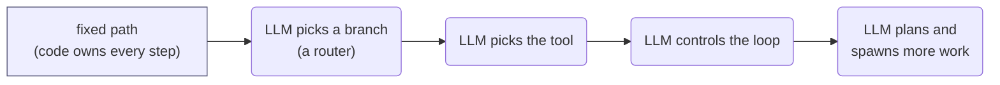

# 1.3 Workflow or Agent?

<small class="chapter-meta">**Maturity: split** (the guidance, start simple and sit near the workflow end, is Standard to Established; "go autonomous for everything" is Contested; the hybrid is Established to Emerging) · *Who decides:* a spectrum, from your code to the model · *Grounding:* research, corroborated across vendors and practitioners · *Last reviewed:* 2026-06</small>

*Workflow and agent are not two boxes, they are the two ends of one spectrum of agency: how much control over the program's flow you hand to the model. The useful question is not "is this an agent?" but "how much agency does this step need?", and the honest answer for most production work today is "less than you think."*

## Why you'd reach for it

You are about to build a feature, and someone has already decided it should be "an agent." Maybe a vendor pitch framed it that way, maybe a roadmap did, maybe it just felt like the modern choice. So you reach for an autonomous loop: a model that plans its own steps, calls its own tools, and decides when it is done. It works in the demo. Then it meets real inputs, and the trouble starts. It takes a different path on the same input twice. It costs a model call on every hop, and the hops multiply. A run that a fixed pipeline would finish in milliseconds now takes seconds of reasoning, and when it goes wrong you cannot point to the line that failed, because there is no line, there is a transcript.

The cost of that mistake is not abstract. Take Listing Studio's price step. It sets `price_cents` for the Aldsworth desk within the supplier's minimum advertised price and a margin rule. You could build it as a small autonomous agent that reasons about the market and decides. Or you could build it as a lookup against the rules with a model proposing and your code gating. The first is non-deterministic in a path where a wrong number is a contract violation, costs an inference call every time, and needs an eval suite before you can trust it at all. The second is a function you unit-test in milliseconds and ship with confidence. Same step, and the only thing that changed is how much you handed to the model. Reach for the autonomous version because "agent" sounded right, and you have bought yourself cost, latency, and a test problem you did not need.

The fix is to stop treating "workflow" and "agent" as a category you pick and start treating agency as a dial you turn. At one end your code owns every step and the model only fills in the blanks. At the other the model decides what to do next, in a loop, until it judges the goal met. Almost every real system lives somewhere between, and the engineering discipline is to sit as far toward the cheap, testable, workflow end as the task allows, and to turn the dial up only where the task genuinely demands it.

Reach for this framing when:

- someone has labelled a feature "an agent" and you need to decide how much autonomy it actually requires;
- you are sizing cost, latency, or the test strategy for a step, and the answer depends on how much flow control the model owns;
- you are choosing between a fixed pipeline, a bounded model-driven step, and a full autonomous loop, and want the decision on evidence rather than fashion.

You do not need it when the answer is obviously a fixed path (a lookup, a transform, a deterministic sequence) and nobody is selling you a reason to make it more.

## What it actually is

A workflow is a system where, in Anthropic's words, "LLMs and tools are orchestrated through predefined code paths." An agent is a system where "LLMs dynamically direct their own processes and tool usage, maintaining control over how they accomplish tasks."[^anthropic] Those are good definitions of the two ends. The mistake is to read them as two bins. Agency is not a switch, it is a continuous spectrum, and the more useful question about any given step is not which bin it falls in but how far along that spectrum it sits.

This chapter carries the autonomy-and-spectrum half of the "what is agentic" question that [1.2 Who Decides?](who-decides.md) deliberately handed off. 1.2 owns the *classification* lens: for a single pattern, does the model make the structural decision, or does your code? This chapter owns the *spectrum* lens: across the whole system, how much flow control have you handed to the model, and how much should you? They connect at one seam, and keeping it clean matters. A pattern can pass 1.2's litmus, a model made a structural call somewhere, while the system around it sits firmly at the workflow end of this chapter's spectrum. Passing the litmus is not the same as the system being "an agent." A pipeline can contain four model-made decisions and still be, by any higher autonomy bar, a workflow.

Because this is a framing chapter, the litmus question (does the model decide?) is not the verdict here. The verdict here is a maturity one, and it is deliberately split. The *guidance*, start with the simplest thing and sit near the workflow end, is about as well-supported as advice gets in this field, **Standard to Established**, endorsed across Anthropic, OpenAI, framework docs, and 2026 practitioner write-ups, and backed by the hard economics of cost, latency, and testability. The opposite habit, defaulting to an autonomous agent for everything, is **Contested**: the same sources that endorse agents warn against reaching for them by default, and the market's reflex to label any LLM app "agentic" is the overclaim 1.1 and 1.2 already flag. The synthesis most teams land on, a bounded model-driven step inside an otherwise deterministic shell, is **Established to Emerging**, clearly the direction of travel and still consolidating, which is why this chapter carries a "Last reviewed" stamp even though its core guidance is durable. The cost and latency figures below move too, so treat them as findings, not frozen numbers.

### The definition is not worth fighting over

There is no settled definition of "agentic," and a reference that pretended otherwise would read as naive. The author's working line, stated in full in [1.2](who-decides.md), is a decision-and-control distinction: an agent deciding what to do next is agentic; an agent merely doing a piece of work is a workflow. It has a like-minded published authority in LangChain's Harrison Chase, who defines an agent as "a system that uses an LLM to decide the control flow of an application."[^langchain]

Others set the bar higher, at the level of the whole system. Anthropic and OpenAI reserve "agent" for systems that independently carry out multi-step work, with OpenAI explicitly excluding single-turn LLM apps.[^anthropic][^openai] Google's Antonio Gulli frames an agent as goal-directed, perceiving and acting toward an objective.[^gulli] Hugging Face's smolagents treats agency as a continuous spectrum of degrees rather than a yes-or-no.[^smolagents] Simon Willison, after sorting 211 crowdsourced definitions into 13 categories, settled on "an LLM agent runs tools in a loop to achieve a goal," where the loop is itself the spectrum nuance.[^willison] These camps disagree on where to draw the line. They do not disagree that a line exists somewhere along a continuum, which is the only thing this chapter needs. The definition is low-value to litigate, because the patterns in this reference are useful either way. Workflow or agent, you reach for the same tools, the same contracts, the same loops, and the same guardrails.

## How the argument cashes out

The spectrum is easiest to see as one picture. Your code at the workflow end, the model at the agent end, and the rungs between them measured by how much flow control the model holds.

In the shared visual language, rectangles are where your code decides and rounded nodes are where the model decides. The leftmost node, a fixed path, is pure code. The interesting one is the second: an LLM picking an `if/else` branch. smolagents calls that a "Router" and rates it only **low** agency, because the model's output controls a single switch and nothing more.[^smolagents] That is the bridge back to 1.2: a router passes the litmus (the model made a structural call) yet sits near the workflow end of this spectrum. Move right and the model picks which tool to run ("Tool call"), then controls an iterative loop and its own continuation ("Multi-step Agent"), then can plan and start further agentic work ("Multi-Agent"). These are points along a spectrum, not a strict ladder of stars: smolagents rates the tool-call and multi-step levels the same, with the multi-agent and code-agent levels above both. The trend that matters is the one that costs you money: more flow control handed to the model, and more cost, latency, and non-determinism with it.

> **In Listing Studio.** The nine-step pipeline is the workflow end made concrete: your code owns the order of ingest, clarify, categorize, write, price, and the rest, and each step is a node you can test in isolation. The repricer, a sibling surface that watches competitor prices and adjusts within rules, is the agent end: it plans its own steps and acts in a loop. One commerce platform spans the whole spectrum.

### Why most production value sits near the workflow end

This is the chapter's least fashionable claim and its most useful one. For most work, the predefined path wins, and it wins on four grounds that a technical leader can put in a budget.

Reliability and reproducibility come first. A fixed path gives the same output for the same input, which is what an audit or a compliance review needs and what a model-driven loop cannot promise. Cost comes second: every decision you hand to the model is an inference call, and at the volume of a real catalog those calls multiply into real money, where a lookup costs effectively nothing. Latency is third: a fixed branch resolves in milliseconds while each reasoning hop costs seconds, and an autonomous loop is many hops.[^tensoria] Testability is fourth and is the one teams underestimate. A deterministic path takes ordinary unit tests; a model-driven loop needs evals to know whether it works at all, which is a heavier and less familiar discipline ([4.2 Evaluation](../craft/proving-it-works.md) covers why).[^anthropic] None of this is anti-model. It is the recognition that agency is a cost you justify, not a default you assume.

Anthropic states the operating rule directly: "find the simplest solution possible, and only increasing complexity when needed," adding that "This might mean not building agentic systems at all."[^anthropic] It is the single most-cited piece of vendor guidance on this topic, echoed by OpenAI's guide and the 2026 practitioner playbooks.[^openai][^playbook] Start at the workflow end. Turn the dial up only when you can show it helps.

### When you actually need an agent

Saying "start simple" is not saying "never use agents," and the honest version of this chapter gives the positive trigger as crisply as the caution. Reach for model-directed control when the task is genuinely open-ended, when the steps cannot be enumerated up front, when the path depends on inputs you cannot predict, or when the work needs judgment over unstructured input across a long, branchy horizon.[^openai][^tensoria] smolagents gives the test in one line: if a predetermined workflow falls short too often, that is the signal you need more flexibility, and that is where an agentic setup earns its cost.[^smolagents] The repricer is a fair example: competitor moves arrive in shapes you cannot script, so the step that decides how to respond benefits from a model in the loop, even though the guardrails around it stay fixed.

The far end of the spectrum, a fully autonomous loop that plans and acts on its own, is where this chapter stops and [9.1 When You Want Autonomy](../frontier/when-you-want-autonomy.md) begins. This chapter's job is to place autonomy on the spectrum and say when it is worth reaching for. How to actually build and contain an autonomous loop, including the repricer as the one genuinely autonomous surface in the carrier, is that chapter's job.

### The hybrid is usually the real answer

The framing as "workflow versus agent" sets up a false either/or, and the 2026 practitioner consensus is that the best production systems are neither pure. They are deterministic boundaries wrapped around a bounded-agency step: keep the fixed pipeline, and drop a small sub-agent, two to four tools, into only the step that needs judgment.[^deepset][^mindstudio] Listing Studio is exactly this shape. The graph is fixed, but the clarify-attributes step grades its own questions and loops, and the price step lets the model propose inside a hard code gate. The autonomy is real and the blast radius is bounded.

The hybrid comes with a reverse signal worth naming, because it is the move teams forget. Synthesized from the economics these write-ups describe: refactor an agent *back* to a workflow when its outputs have become stable enough to write as rules, when its cost outruns the value of its autonomy, or when you spend more time fixing it than it saves.[^tensoria][^mindstudio] Agency is a dial that turns both ways. Turning it down when the task no longer needs it is as much engineering as turning it up when the task demands it.

### The five named workflow patterns

[1.1 It's Still Engineering](its-still-engineering.md) promised this chapter would name the five workflow patterns the field has converged on. They are the recurring ways to arrange model calls along predefined paths, all sitting at the workflow end of the spectrum, and each gets its own chapter in Part III. This is the map, not the territory: one line each, then read the chapter that owns it.

- **Prompt chaining** splits a task into an ordered sequence of model calls, each working on the last one's output. The honest draw of 1.2: an old pipeline structure used for a new reason. ([3.1 Prompt Chaining](../composition/prompt-chaining.md).)
- **Routing** classifies an input and sends it to a specialized follow-up. Note the trap 1.2 dwells on: a static dispatch table is not routing, because it has no classifier to begin with. ([3.2 Front Controller](../composition/the-router-that-isnt.md).)
- **Parallelization** runs independent model calls at once and aggregates the results, for speed or for voting. It has no chapter of its own; it travels with orchestrator-workers, since fanning work out is the same machinery whether your code or the model sizes the fan-out. ([3.3 Orchestrator-Workers](../composition/fan-out.md).)
- **Orchestrator-workers** has a model break a task into subtasks and size its own fan-out. One of the genuinely-new four, because the model decides the worker count. ([3.3 Orchestrator-Workers](../composition/fan-out.md).)
- **Evaluator-optimizer** has one model generate while another grades and sends it back to revise, looping until a bar is met. Also genuinely new, because the model judges and decides whether to loop. ([3.4 Evaluator-Optimizer](../composition/evaluator-optimizer.md).)

These are workflow *patterns*, not autonomy levels: a system built entirely from them is still a workflow, however many model calls it makes. Keeping the spectrum and the litmus as separate lenses is what lets you say that and mean it.

## The skeptical read

The contested half of this chapter deserves its own treatment, because the loudest claim in the market is the one the evidence supports least. "Agents for everything" is the overclaim. The same vendors who publish careful agent guides spend the first section telling you not to default to one, and the market habit of stamping "agentic" on a chatbot or a rules engine is what Gartner named "agent washing," with the prediction that the gap between label and substance will sink a large share of agentic-AI projects before they mature.[^gartner] If a feature works as a fixed pipeline, building it as an autonomous loop does not make it more advanced. It makes it slower, costlier, and harder to trust, and it hides those costs behind a fashionable word.

The honest caveat runs the other way too. The "start simple" guidance is durable, but the numbers under it are not. Inference costs fall, latency improves, and the bounded-agency hybrid is consolidating fast enough that its boundaries will look different in a year. Treat the cost and latency figures here as findings about the shape of the trade-off, not as values to hardcode, and treat the hybrid as today's best answer with more consolidation to come. That is why the chapter is stamped, and why the verdict on autonomy is held open as Contested rather than closed as wrong. Where a task is genuinely open-ended, model-directed control is the right tool, and saying otherwise would be its own kind of overclaim.

## In short

Stop asking "is this an agent?" and start asking "how much agency does this step need?" Agency is a dial, not a category, and the engineering default is to sit as far toward the cheap, testable, workflow end as the task allows. Start with the simplest thing, a fixed path, and turn the dial up only where you can show that model-directed control earns its cost in reliability, latency, and test burden. For most production work that means a hybrid: a deterministic pipeline with a small bounded-agency step dropped into the one place that needs judgment, and the discipline to refactor that step back to rules once its output is stable. Reach for a full autonomous loop only when the task is genuinely open-ended, and treat "agents for everything" as the marketing it usually is.

## Sources

[^anthropic]: Anthropic, "Building Effective Agents" (2024-12-19). Workflows are "systems where LLMs and tools are orchestrated through predefined code paths"; agents are "systems where LLMs dynamically direct their own processes and tool usage, maintaining control over how they accomplish tasks." The simplicity rule, quoted verbatim: "we recommend finding the simplest solution possible, and only increasing complexity when needed." And: "This might mean not building agentic systems at all." Verified at the live URL 2026-06. <https://www.anthropic.com/research/building-effective-agents>
[^langchain]: Harrison Chase / LangChain, "What is an agent?": "an agent is a system that uses an LLM to decide the control flow of an application." The author's-camp anchor for the decision-based definition. Verify wording at the canonical blog post before publish. <https://www.langchain.com/blog/what-is-an-agent>
[^openai]: OpenAI, "A Practical Guide to Building Agents" (April 2025): "Agents are systems that independently accomplish tasks on your behalf," explicitly excluding single-turn LLM apps that do not control workflow execution. Corroborates "use an agent only when the task needs model-driven control." Verify before publish. <https://openai.com/business/guides-and-resources/a-practical-guide-to-building-ai-agents/>
[^gulli]: Antonio Gulli (Google), *Agentic Design Patterns: A Hands-On Guide to Building Intelligent Systems* (Springer Nature, 2025; ISBN 9783032014016). The goal-directed definition of an agent, corroborating the degrees-of-agency framing independently of Hugging Face. Verify exact wording (and the L0-to-L3 complexity levels) against the print edition before quoting; the levels framing could not be confirmed by web search. <https://link.springer.com/book/10.1007/978-3-032-01402-3>
[^smolagents]: Hugging Face, *smolagents*, "Introduction to Agents": "'agent' is not a discrete, 0 or 1 definition: instead, 'agency' evolves on a continuous spectrum." The agency-level table rates an LLM controlling an `if/else` switch as a "Router" at low agency (★☆☆), and rates both "Tool call" (an LLM controlling function execution) and "Multi-step Agent" (an LLM controlling iteration) at ★★☆, with "Multi-Agent" (one agentic workflow starting another) and "Code Agents" at ★★★. The stars are a spectrum, not a strict monotonic ladder: tool-call and multi-step tie. Also: "if the pre-determined workflow falls short too often, that means you need more flexibility." The levels anchor; verified at the live URL 2026-06, wording shifts across doc revisions. <https://huggingface.co/docs/smolagents/conceptual_guides/intro_agents>
[^willison]: Simon Willison, "I think 'agent' may finally have a widely enough agreed upon definition to be useful" (2025-09-18): "An LLM agent runs tools in a loop to achieve a goal," after grouping 211 crowdsourced definitions into 13 categories. The loop itself is a spectrum nuance. <https://simonwillison.net/2025/Sep/18/agents/>
[^deepset]: deepset, "AI Agents and Deterministic Workflows: A Spectrum, Not a Binary Choice." The explicit spectrum-not-binary framing, and the observation that many production systems combine structured workflows with autonomous capabilities. Verified live 2026-06. <https://www.deepset.ai/blog/ai-agents-and-deterministic-workflows-a-spectrum>
[^tensoria]: Tensoria, "Workflow vs AI Agent: When to Use Which (and When Not To)" (practitioner write-up). Source for the decision criteria (predictability, decision complexity, token cost and latency, reliability and debuggability, maintenance) and the directional cost/latency contrast (a fixed path costs milliseconds; each agent decision costs an inference call and seconds of latency). Cited as a finding, not frozen numbers. Verified live 2026-06. <https://tensoria.fr/en/blog/workflow-vs-ai-agent-when-to-use>
[^mindstudio]: MindStudio, "Agentic Workflows vs Traditional Automation" (practitioner write-up). Source for the hybrid pattern (a bounded sub-agent inside a deterministic shell). The refactor-agent-back-to-workflow signals are synthesized from the cost-and-stability economics it and Tensoria describe, not quoted verbatim from either. Verify URL before publish. <https://www.mindstudio.ai/blog/agentic-workflows-vs-traditional-automation>
[^playbook]: 2026 practitioner playbooks (e.g. promptengineering.org, "Agents at Work: The 2026 Playbook") corroborating "start simplest, reliability-first" as the current consensus. Cited as corroboration, not a primary authority. Verify the specific URL before publish. <https://promptengineering.org/agents-at-work-the-2026-playbook-for-building-reliable-agentic-workflows/>
[^gartner]: Gartner, "Over 40% of Agentic AI Projects Will Be Canceled by End of 2027" (newsroom, 2025-06-25), with the related "agent washing" framing. Industry-analyst signal, not a technical authority; figures are directional, cite the finding, not the number. <https://www.gartner.com/en/newsroom/press-releases/2025-06-25-gartner-predicts-over-40-percent-of-agentic-ai-projects-will-be-canceled-by-end-of-2027>

## See also

- **[1.2 Who Decides?](who-decides.md)** owns the litmus test, the *classification* lens for a single pattern (does the model decide?). This chapter is the *spectrum* lens for the whole system (how much agency does it need?); the seam is that passing the litmus does not make a system an agent.
- **[1.1 It's Still Engineering](its-still-engineering.md)** is where the promise to name the five workflow patterns was made, and the thesis this chapter's "start simple" discipline serves.
- **[1.4 The Augmented LLM](the-augmented-llm.md)** for the base unit, a model plus tools plus a contract, that sits at the workflow end and that every rung up the spectrum builds on.
- **[1.6 Do You Even Need a Framework?](do-you-need-a-framework.md)** for the build-versus-buy call once you know how much of the spectrum you actually need to orchestrate.
- **[3.1 Prompt Chaining](../composition/prompt-chaining.md)**, **[3.2 Front Controller](../composition/the-router-that-isnt.md)**, **[3.3 Orchestrator-Workers](../composition/fan-out.md)**, and **[3.4 Evaluator-Optimizer](../composition/evaluator-optimizer.md)** teach the workflow patterns this chapter only names.
- **[9.1 When You Want Autonomy](../frontier/when-you-want-autonomy.md)** owns the far end of the spectrum: how to build and contain a full autonomous loop, where this chapter only places it and says when it is worth reaching for.
- **[4.2 Evaluation](../craft/proving-it-works.md)** for why the model-driven end needs evals where the fixed path needs only unit tests.
- **[How We Label](../about/how-we-label.md)** for the maturity lens, the trust axis this chapter's split verdict is scored on.
