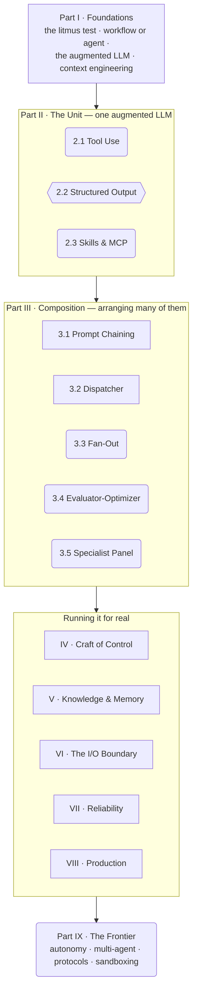

# Agentic Engineering

> An honest, curated reference on building with agents, for engineers at every level.

Most "agentic patterns" are ordinary design patterns with a language model dropped into one
slot. A few are genuinely new. The trouble is that almost nobody tells you which is which,
and the field is full of confident writing by people who never shipped any of it.

This reference is an attempt to fix that. Two rules hold it together.

## 1. One question sorts every pattern

**Who makes the structural decision: the model, or your code?**

If the *model* decides (it calls a tool, judges its own draft and loops, sizes its own work,
picks a persona), you're looking at something genuinely new. If your *code* decides and the
model is just the worker inside the structure (a dispatch table, a retry loop, a callback),
you're looking at a pattern you already know, and calling it "agentic" is marketing.

[Read the litmus test →](about/litmus-test.md){ .md-button .md-button--primary }

## 2. Every technique is labelled by how proven it is, and cites its evidence

The field is full of people dressing up minor work as breakthroughs, with no reliable way to
tell what's standard from what's hype. This reference is the cure. Two quiet signals on every
technique, in plain prose (no rings, no radar):

- **A maturity lens.** One honest line: is this the accepted default, proven-but-niche, still
  settling, or overclaimed?

    | Lens | Means |
    |---|---|
    | **Standard** | the accepted default. Reach for it without much debate |
    | **Established** | proven and common, with known trade-offs |
    | **Emerging** | gaining traction, still settling. Adopt deliberately |
    | **Contested** | overclaimed or disputed. Here's the skeptical read |

- **Cited evidence.** Every non-obvious claim footnotes a source: paper, primary doc, or
  benchmark. Where I've shipped something myself, a **From production** callout adds the
  first-hand war story on top. Research and experience both count; sources are mandatory.

[How the labelling works →](about/how-we-label.md){ .md-button }

## The map

The whole reference on one diagram. **Rounded nodes are patterns where the model makes the
structural decision** (the genuinely new ones). **Rectangles are patterns where your code
decides** (engineering you already know, with a model in one slot). **Hexagons are
capabilities**, not patterns. Every diagram in this reference keeps that convention.

Start at [Foundations](foundations/index.md) if the field is new to you; jump straight to
[The Unit](the-unit/index.md) if you're here for the patterns.

## Where to start

- **New here?** Read [The Litmus Test](about/litmus-test.md), then
  [How to Read This](about/how-to-read.md).
- **Want the patterns?** Start with [The Unit](the-unit/index.md) (a single augmented LLM),
  then [Composition](composition/index.md) (arranging many of them).
- **Leading a team?** The decision/cost/risk framing lives up top in every chapter; the
  [Anti-Patterns Catalog](catalogs/anti-patterns.md) is the fastest way to avoid expensive
  mistakes.

## This is a crowd-sourced reference

The judgement here is meant to be argued with. Anyone can open a pull request: to add a
pattern, contribute a use case, sharpen a lens, or correct an error. One maintainer reviews
and merges everything. What's non-negotiable is the discipline, not the conclusions: every
contribution carries a maturity lens and cites its evidence. [Contributing →](contributing.md)

---

*Patterns drawn from a production system, recast in a commerce setting so the ideas travel
without the domain baggage. The shapes are real; the store is a stand-in.*
