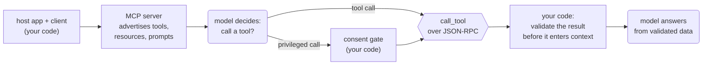

# 2.4 MCP

<small class="chapter-meta">**Maturity: Standard** (the settled cross-vendor connectivity standard, now under the Linux Foundation; "MCP makes agents reliable" is the contested overclaim) · *Who decides:* your code · *Grounding:* companion repo + research · *Last reviewed:* 2026-06</small>

*MCP, the Model Context Protocol, is a standard wire for connecting an agent to servers that expose tools, resources, and prompts, so a tool written once works across vendors. The cost of that reach is a new supply-chain trust boundary: you grant ambient authority to software you may not control.*

## Why you'd reach for it

Before there was a standard, every model provider and every framework had its own way to wire a tool to an agent. Anthropic's shape, OpenAI's shape, each framework's adapter: the same integration to your docs store or your ticketing system got rebuilt for each one, and none of it composed. Connect your retrieval store to a Claude-based agent and you wrote one adapter. Move to a different model or framework and you wrote it again. The work was glue, and the glue was per-vendor.

The cost of fixing it badly is worse than the cost of the glue. The moment your agent connects to a third-party MCP server, you have granted ambient authority to software you may not control. A malicious or compromised server can do two things to you. It can poison a tool result, which means the data the server returns carries text that reads to the model as an instruction, and that instruction lands straight in context as indirect prompt injection. Or it can pull a rug: silently change a tool's definition after you approved it, because clients verify the definition at install time, not on every call. A server you vetted on Monday turns malicious on Friday and the agent never notices. The cost is data exfiltration or an action taken in your systems that you did not intend, and it leaves no stack trace in the logs.

The fix for the glue is to connect through one protocol. MCP is a JSON-RPC interface, a lightweight remote-procedure-call format, between a host (your application), its clients (one per server connection), and servers that expose tools, resources, and prompts.[^mcp-spec] Write the integration once as an MCP server and any MCP client can reach it, and a server someone else wrote is reachable the same way. The merchant helpdesk, Stockwell's retrieval agent over its policy and how-to docs, reaches a docs server exactly the way any MCP client reaches any MCP server.

Reach for MCP when:

- you need to reach a system's tools or data over the wire, not from inside your own process;
- you want one integration to serve many models or frameworks;
- you are consuming a server someone else wrote.

Do not reach for MCP when the need is to package procedural knowledge the model loads on demand. That is a Skill, covered in [2.3](skills.md). And do not reach for it when an in-process function call already does the job and nothing outside your process needs the tool. A protocol exists to cross a boundary; if there is no boundary, you are paying for plumbing you do not use.

## What it actually is

MCP is a wire protocol with three roles. The host is your application. A client is the connection object the host opens, one per server. A server exposes three kinds of thing: tools, which are callable functions; resources, which are readable data; and prompts, which are reusable templates the server offers the host. The client can offer capabilities back the other way, including sampling (asking the host's model to complete something), roots (telling the server which files or URLs it may touch), and elicitation (asking the user for input mid-call). Transports are stdio for local servers that run as a subprocess and Streamable HTTP for remote ones, and every message rides over JSON-RPC 2.0.[^mcp-spec] The protocol was donated to the Linux Foundation's Agentic AI Foundation and is adopted across major vendors, which is what makes a tool written once reusable rather than rewritten per stack.[^lf-aaif]

Now run the litmus test the rest of this reference runs: who makes the structural decision, the model or your code? MCP deflates. Your code decides what servers to connect, what authority each one gets, and which calls require a human. The model is the worker that may call a connected tool, the same worker it is in [Tool Use](tool-use.md). MCP is connectivity plumbing: an operational convenience, not a genuinely-new architectural pattern. So the diagram below puts the protocol machinery in rectangles, your code's decisions, with one rounded node where the model chooses to call.

The maturity verdict splits along the same line. As connectivity, MCP is **Standard**: the settled cross-vendor default, governed under a neutral foundation, shipped by the major providers.[^lf-aaif] Treating tool descriptions and results as untrusted, and asking for consent before a privileged action, are also Standard practice, written into the spec.[^mcp-spec] The supply-chain risk of consuming a third-party server, and the gap between connecting an agent and making it good, are **Established**: known, measured, and not yet solved. Stronger defences against the rug pull, such as signed tool definitions, are **Emerging**.[^etdi] And the reliability overclaim is **Contested**: the skeptical read in Gotchas takes it apart.

Two neighbours are worth disambiguating. MCP tools are tools, and they obey the same call-execute-return contract as [Tool Use](tool-use.md); MCP is the standard wire that carries them across vendors, so this chapter does not re-teach the loop. A Skill packages knowledge the model reads; an MCP server provides connectivity the model reaches. They compose. A Skill can teach a workflow that drives MCP tools, so it is not a versus.

## How to do it

The shape, in the diagram language used across this reference: rounded nodes are the model deciding, rectangles are your code deciding, hexagons are a capability.



The consumer is the part you own, and it is where the trust model lives. The session below connects, lists tools, and calls one, with every guard wired in: it checks each tool description for injection on connect, applies a consent gate before any privileged call, validates the result before it reaches the model, and detects a tool list that has changed since it was cached. The transport here is an in-memory stream pair so the example runs offline; in production it would be stdio or Streamable HTTP.

<details markdown><summary>The consumer session, with all guards wired in (<code>helpdesk_mcp/client.py</code>)</summary>

```python
@dataclass
class DocsMCPSession:
    """A live session to the stockwell-docs MCP server.

    Wraps a ClientSession with the trust guards the chapter requires:
    - description injection check on connect (list_tools)
    - consent gate on privileged call_tool
    - result validation before the result enters model context
    - stale-cache detection when tool list refreshes
    """
    _session: ClientSession
    _tool_cache: list[str] = field(default_factory=list)

    async def connect(self) -> None:
        """Initialise the session and load + guard the tool list."""
        await self._session.initialize()
        await self._refresh_tools()

    async def _refresh_tools(self) -> None:
        resp = await self._session.list_tools()
        current_names = [t.name for t in resp.tools]
        if self._tool_cache:
            # Guard against rug pulls: flag if the list changed since last fetch.
            staleness = check_tool_list_staleness(self._tool_cache, current_names)
            if not staleness.ok:
                raise RuntimeError(staleness.error)
        # Guard tool descriptions against injection before caching.
        for t in resp.tools:
            check = check_description_for_injection(t.description or "")
            if not check.ok:
                raise RuntimeError(
                    f"tool {t.name!r} description rejected: {check.error}"
                )
        self._tool_cache = current_names

    async def call(
        self,
        tool_name: str,
        arguments: dict,
        *,
        approve: Callable[[str, dict], bool] = lambda _n, _a: False,
        expected_result_keys: list[str] | None = None,
    ) -> str:
        """Call a tool, applying the consent gate and result validation.

        Returns the tool's text output on success, or a structured error
        message the model can act on.
        """
        if not require_consent(tool_name, arguments, approve=approve):
            return _mcp_error(
                tool_name,
                "consent denied — privileged tool call blocked by human gate",
            )

        try:
            result = await self._session.call_tool(tool_name, arguments)
        except Exception as exc:
            return _mcp_error(tool_name, f"server unreachable or error: {exc}")

        if result.isError:
            return _mcp_error(tool_name, f"server returned an error result")

        # Extract text content from the result list.
        text_parts = [
            c.text for c in result.content if isinstance(c, types.TextContent)
        ]
        raw_text = "\n".join(text_parts)

        # Validate result shape before passing to the model (optional).
        if expected_result_keys:
            try:
                parsed = json.loads(raw_text)
            except json.JSONDecodeError:
                # Non-JSON result: shape validation skipped; pass through.
                return raw_text
            guard = validate_tool_result(parsed, expected_result_keys)
            if not guard.ok:
                return _mcp_error(tool_name, guard.error or "result validation failed")

        return raw_text
```

</details>

One run of the merchant helpdesk against the docs server, as a trace:

1. Your code connects to the docs MCP server over stdio and calls `list_tools`, getting back `search_docs` and a privileged `update_listing_status`. On connect, each tool description is scanned for injection before it is cached.
2. The merchant asks: how do I set a MAP rule on my storefront? The model decides to call `search_docs` with the merchant's question.
3. Your code validates the tool result against an expected shape before it enters context, so a poisoned result cannot smuggle in an instruction disguised as a doc excerpt.
4. If the model had instead reached for `update_listing_status`, a privileged tool, the consent gate would require explicit approval before the call ran, so no destructive call fires silently.
5. If the server were unreachable, timed out, or returned malformed data, your code returns a structured, recoverable message rather than a stack trace, and a tool list cached from an earlier session is re-checked against a fresh `list_tools` rather than assumed live.
6. The model answers the merchant from the validated doc text: *"To set a MAP rule, open the listing's pricing panel and enter the supplier's minimum advertised price; Stockwell enforces it on every listing."*

### From one server to several

The toy case is one trusted server. Production is several, and at least one of them is third-party. Each new server widens the attack surface and the ambient authority your agent holds, because every connected server can return text into context and every privileged tool it exposes is an action the model can reach. The discipline does not change with scale, but with more servers connected a single compromised one can do more damage, so the guards have to hold on every connection: vet the source before you connect it, scope each server to the least privilege that works so one compromised server cannot reach everything, and treat every tool description and every result as untrusted unless the server is one you trust.

Consent belongs here too. The spec's security model is consent-first: the host must obtain explicit user consent before it exposes data or invokes a tool.[^mcp-spec] For a local server that is a confirmation in your own UI. For a remote server it also means OAuth-style authorization, where OAuth is the delegated-authorization standard that lets the user grant the host scoped access without sharing a password. The destructive-action gate is the same one [4.3](../craft/human-in-the-loop.md) covers; here it is one line in the consumer.

```python
# Privileged tools require explicit approval before they run.
# The gate is a callable so it can be swapped for a real UI prompt in production.
PRIVILEGED_TOOLS = {"update_listing_status"}  # destructive or privileged actions


def require_consent(
    tool_name: str,
    arguments: dict,
    *,
    approve: Callable[[str, dict], bool],
) -> bool:
    """Human gate for privileged MCP tool calls.

    Returns True only if the tool is not privileged or the approval callback
    grants consent. Never calls a destructive tool silently.

    `approve` is the seam: in production it shows a UI confirmation; in tests
    it is a simple lambda. See also 4.3 Human-in-the-Loop.
    """
    if tool_name not in PRIVILEGED_TOOLS:
        return True
    return approve(tool_name, arguments)
```

The consumer above is provider-agnostic. What differs by vendor is only how the surrounding agent loop is wired. The same docs server, driven from three stacks (the import is named `helpdesk_mcp`, deliberately not `mcp`, to avoid colliding with the real `mcp` SDK on import):

=== "LangGraph"

    ```python
    # Build a LangGraph tool that delegates to the MCP docs server.
    # The MCP session is kept alive for the duration of the agent run;
    # in production it would be a long-lived connection managed by the host.

    _server = make_docs_server()


    @tool(parse_docstring=True)
    def search_merchant_docs(query: str) -> str:
        """Search Stockwell merchant docs for a policy or how-to question.

        Args:
            query: the merchant's question or keyword.
        """
        async def _call(session: DocsMCPSession) -> str:
            return await session.call("search_docs", {"query": query})

        return asyncio.run(run_with_server(_server, _call))


    agent = create_agent("openai:gpt-5.5", tools=[search_merchant_docs])

    result = agent.invoke({
        "messages": [{
            "role": "user",
            "content": "How do I set a MAP rule on my Stockwell storefront?",
        }]
    })
    print(result["messages"][-1].content)
    ```

=== "OpenAI Responses API"

    ```python
    # OpenAI Responses API: MCP tool as a manually-wired function.
    # This shows the reference-client pattern (spec-level); for OpenAI's
    # hosted-MCP shorthand see vendor docs.

    SEARCH_DOCS_TOOL = {
        "type": "function",
        "name": "search_merchant_docs",
        "description": "Search Stockwell merchant docs for a policy or how-to question.",
        "parameters": {
            "type": "object",
            "properties": {"query": {"type": "string"}},
            "required": ["query"],
            "additionalProperties": False,
        },
    }

    response = client.responses.create(
        model="gpt-5.5",
        input=[{
            "role": "user",
            "content": "How do I set a MAP rule on my Stockwell storefront?",
        }],
        tools=[SEARCH_DOCS_TOOL],
    )

    for item in response.output:
        if item.type == "function_call" and item.name == "search_merchant_docs":
            args = json.loads(item.arguments)

            async def _call(session: DocsMCPSession) -> str:
                return await session.call("search_docs", {"query": args["query"]})

            tool_output = asyncio.run(run_with_server(_server, _call))
            print("Doc result:", tool_output)
    ```

=== "Anthropic Messages API"

    ```python
    SEARCH_DOCS_TOOL = {
        "name": "search_merchant_docs",
        "description": "Search Stockwell merchant docs for a policy or how-to question.",
        "input_schema": {
            "type": "object",
            "properties": {"query": {"type": "string"}},
            "required": ["query"],
            "additionalProperties": False,
        },
    }

    reply = client.messages.create(
        model="claude-sonnet-4-6",
        max_tokens=1024,
        tools=[SEARCH_DOCS_TOOL],
        messages=[{
            "role": "user",
            "content": "How do I set a MAP rule on my Stockwell storefront?",
        }],
    )

    for block in reply.content:
        if block.type == "tool_use" and block.name == "search_merchant_docs":
            async def _call(session: DocsMCPSession) -> str:
                return await session.call("search_docs", {"query": block.input["query"]})

            tool_output = asyncio.run(run_with_server(_server, _call))
            print("Doc result:", tool_output)
    ```

OpenAI also offers a hosted MCP integration through the Responses API, where it runs the client for you and surfaces an approval step; Google has announced MCP support as well. Those are asides. The spec-level reference client above works against any MCP server and is the pattern worth learning first.

> **In the companion repo.** The merchant helpdesk connects to an in-memory docs MCP server exposing `search_docs`, and validates each result against an expected shape before it reaches the model. A privileged `update_listing_status` tool sits behind explicit consent. The same client would reach any real MCP server, local or remote, the same way.

## Exposing a server

Most of the time you consume a server; you do not build one. The default posture is to reach for a server someone else wrote, run the consumer trust model above, and stop there. Build and expose your own MCP server only when there is a concrete gap that consuming cannot fill:

- proprietary data or tools no existing server covers;
- one reusable interface you want many clients to reach the same way;
- centralized auth or shared state that belongs on the server side, not duplicated in every client.

When you do expose a server, the trust model flips: you are now the software granting authority to clients you may not control, so the spec's server security considerations become duties you owe them, written as MUSTs.[^mcp-server] The server author's duties:

- validate every tool input, do not assume the JSON schema you advertised was honored;
- implement access controls so a tool reaches only what its caller is entitled to;
- rate-limit tool invocations so a client cannot exhaust the server;
- sanitize outputs so a tool result carries no raw user input or secret back out.

Transport splits the rest of the duties in two:

- a **stdio** server takes credentials from the environment rather than the request, validates the `Origin` header on any local HTTP it speaks, and binds to localhost so nothing off the machine can reach it;[^mcp-server]
- a **remote (Streamable HTTP)** server is an OAuth 2.1 **resource server**. It audience-binds its tokens and must never accept a token that was not issued for it. Forwarding a client-supplied token onward to a downstream API, the **token-passthrough** anti-pattern, is the failure the spec names. This ban is not new in the current revision; the spec has prohibited token passthrough across revisions, so do not treat it as a fresh requirement.[^mcp-server]

The companion docs server shows the provider side. Its factory chooses what to expose and declares each tool's `inputSchema` as the validation contract, and it labels the privileged tool in its description so any client can surface the consent gate without parsing business logic.

```python
def make_docs_server() -> Server:
    """Return a fully-wired MCP docs server (no transport attached yet).

    The server author's duties start here:
    - You choose what to expose (two tools, not the whole internal API).
    - The inputSchema is the validation contract: required fields, types,
      and enums declared here are checked by the SDK before call_tool runs.
    - PRIVILEGED tools are labelled in their description so every client
      can surface the consent gate without parsing business logic.
    """
    server = Server("stockwell-docs")

    @server.list_tools()
    async def list_tools() -> list[types.Tool]:
        return [
            types.Tool(
                name="search_docs",
                description=(
                    "Search Stockwell merchant documentation. "
                    "Returns the most relevant doc excerpt for the query."
                ),
                inputSchema={
                    "type": "object",
                    "properties": {
                        "query": {
                            "type": "string",
                            "description": "The search query (1–500 characters).",
                            "minLength": 1,
                            "maxLength": _QUERY_MAX_LEN,
                        }
                    },
                    "required": ["query"],
                    "additionalProperties": False,
                },
            ),
            types.Tool(
                name="update_listing_status",
                description=(
                    "PRIVILEGED: move a listing from 'draft' to 'review'. "
                    "Requires explicit merchant approval before execution."
                ),
                inputSchema={
                    "type": "object",
                    "properties": {
                        "supplier_sku": {
                            "type": "string",
                            "description": "Supplier SKU (uppercase letters, digits, hyphens).",
                            "pattern": r"^[A-Z0-9][A-Z0-9\-]{1,63}$",
                        },
                        "new_status": {
                            "type": "string",
                            "enum": list(_VALID_STATUSES),
                        },
                    },
                    "required": ["supplier_sku", "new_status"],
                    "additionalProperties": False,
                },
            ),
        ]

    @server.call_tool()
    async def call_tool(
        name: str, arguments: dict
    ) -> list[types.TextContent] | types.CallToolResult:
        return await _dispatch(name, arguments)

    return server
```

Advertising the schema is not enforcing it. The dispatch path validates inputs again, scopes each call, and returns a structured error rather than a stack trace when a check fails.

<details markdown><summary>The server's input-validation and dispatch path (<code>helpdesk_mcp/docs_server.py</code>)</summary>

```python
async def _dispatch(
    name: str, arguments: dict
) -> list[types.TextContent] | types.CallToolResult:
    """Route a validated call and apply application-level checks.

    The SDK's validate_input=True (the default) already enforces the JSON
    schema declared in list_tools — required fields, types, enum values,
    additionalProperties. This function adds the checks that live above the
    schema layer: string emptiness, length limits, SKU format, and unknown
    tool names. All failures return a structured CallToolResult(isError=True);
    no raw exception or user input reaches the client.
    """
    if name == "search_docs":
        query = arguments.get("query", "")
        # Application checks beyond the schema's minLength/maxLength.
        if not query.strip():
            return types.CallToolResult(
                isError=True,
                content=_error("search_docs: query must not be blank"),
            )
        if len(query) > _QUERY_MAX_LEN:
            return types.CallToolResult(
                isError=True,
                content=_error(
                    f"search_docs: query exceeds {_QUERY_MAX_LEN}-character limit"
                ),
            )
        # Search — return the first matching doc excerpt.
        for _key, text in _DOCS.items():
            if any(word in text.lower() for word in query.lower().split()):
                return [types.TextContent(type="text", text=text)]
        return [types.TextContent(type="text", text="No matching docs found.")]

    if name == "update_listing_status":
        sku = arguments.get("supplier_sku", "")
        status = arguments.get("new_status", "")
        # Enum and SKU shape are enforced by the JSON schema; these checks
        # are a defensive second layer — reject anything that slips through.
        if status not in _VALID_STATUSES:
            return types.CallToolResult(
                isError=True,
                content=_error(
                    f"update_listing_status: new_status must be one of "
                    f"{sorted(_VALID_STATUSES)}"
                ),
            )
        if not _SKU_PATTERN.match(sku):
            return types.CallToolResult(
                isError=True,
                content=_error(
                    "update_listing_status: supplier_sku must be "
                    "uppercase letters, digits, and hyphens (2–64 chars)"
                ),
            )
        # Consent was already granted by the client-side gate before this call.
        return [types.TextContent(
            type="text",
            text=json.dumps(
                {"ok": True, "supplier_sku": sku, "new_status": status}
            ),
        )]

    # Unknown tool: return a structured error, never raise.
    return types.CallToolResult(
        isError=True,
        content=_error(f"unknown tool {name!r}"),
    )
```

</details>

> **In the companion repo.** The docs server the merchant helpdesk connects to is itself an MCP server. The two blocks above are its provider side: the factory that chooses what to expose, and the dispatch path that re-validates every input and returns a structured error rather than raising.

This is the consumer trust model extended to provider duties, not a full server or transport tutorial. Writing a production server end to end, with the real auth server and transport internals, is something the spec covers and this chapter leaves to it.

## Security & trust

The security spine is the reason consuming someone else's server earns its risk, so it gets its own section rather than living in Gotchas. Three failure modes carry it: tool poisoning, the third-party-server trust boundary, and skipped consent.

**Tool descriptions and results are both untrusted input. This is tool poisoning.** The poisoned result the opening described, and a description that embeds imperative text to redirect the model, are both the indirect prompt injection that [2.1](tool-use.md) warns about, now arriving over the wire. The spec itself says tool descriptions and annotations should be considered untrusted unless obtained from a trusted server.[^mcp-spec] Both map to OWASP's LLM01 Prompt Injection and LLM06 Excessive Agency.[^owasp-poison][^owasp-llm] The mitigation is the one the consumer wires in: scan descriptions on connect, and validate every result against an expected shape before it enters context. That second guard is small.

```python
@dataclass
class GuardResult:
    ok: bool
    error: str | None = None  # structured message for the model if not ok


def validate_tool_result(result: Any, expected_keys: list[str]) -> GuardResult:
    """Validate a tool result before it enters model context.

    A tool result is untrusted input from a server you may not control.
    Check that it has the expected shape before handing it to the model.
    A missing or unexpected key may indicate a poisoned or outdated server.

    Cross-refs 2.2 Structured Output for richer schema validation.
    """
    if not isinstance(result, dict):
        return GuardResult(
            ok=False,
            error=(
                f"tool result is not a dict (got {type(result).__name__}); "
                "validate the server or treat this as an untrusted response"
            ),
        )
    missing = [k for k in expected_keys if k not in result]
    if missing:
        return GuardResult(
            ok=False,
            error=(
                f"tool result missing expected keys: {missing}. "
                "Do not use this result; re-fetch or escalate."
            ),
        )
    return GuardResult(ok=True)
```

The description scan is a heuristic. It catches common injected-instruction patterns and flags them for review, and it cannot prove a description safe, so treat it as a tripwire rather than a wall.

```python
# Patterns that suggest injected instructions in a tool description.
# A legitimate description says *what a tool does*; it does not issue commands.
_INJECTION_PATTERNS = [
    r"\bignore\s+(previous|all|prior)\b",
    r"\bdo\s+not\s+(follow|obey|listen)\b",
    r"\bexfiltrat\b",
    r"\boverride\s+instructions\b",
    r"\bact\s+as\b.*\bsystem\b",
    r"disregard\s+your",
]
_INJECTION_RE = re.compile("|".join(_INJECTION_PATTERNS), re.I)


def check_description_for_injection(description: str) -> GuardResult:
    """Scan a tool description for injected instructions (tool poisoning).

    The MCP spec notes that tool descriptions 'should be considered untrusted
    unless obtained from a trusted server.' A malicious description embeds
    imperative text that redirects the model — indirect prompt injection.

    This check is a lightweight heuristic; it catches common patterns but is
    not a complete defence. Treat any flagged description as suspicious and
    do not pass it to the model until reviewed.
    """
    if _INJECTION_RE.search(description):
        return GuardResult(
            ok=False,
            error=(
                f"tool description contains suspicious instruction-like text. "
                "Do not use this tool definition until it has been reviewed."
            ),
        )
    return GuardResult(ok=True)
```

**The third-party-server trust boundary: supply chain, rug pulls, over-broad permission.** Installing an MCP server is installing software that runs with ambient authority. Vet the source and audit it before use, the same way you would any dependency.[^owasp-mcp-cheat] Beware the rug pull, where a server silently mutates a tool definition after you approved it, because clients verify the definition at install, not on every change.[^hou] The mitigation that exists today is to detect the mutation: hold the snapshot you cached and compare it against a fresh fetch, and refuse to call until you re-validate.

The poisoning scan and the staleness check are the two code-level guards. Around them sits a set of operational guardrails that the field treats as routine. Standard hygiene:

- sandbox or isolate every local server and grant it least privilege, so a compromise reaches only what that server needs;[^owasp-mcp-cheat]
- issue scoped, short-lived credentials from a vault rather than long-lived secrets baked into config;[^owasp-mcp-top10]
- require per-client consent for privileged actions, which is what defeats the **confused-deputy** problem, where a server with broad authority is tricked into acting on a client's behalf;[^owasp-mcp-top10]
- log every tool invocation for audit, so a privileged action has a trail of who approved it and when.

These guards share one threat model. Simon Willison's **lethal trifecta** names it: an agent is exposed the moment it holds all three of private data, exposure to untrusted content, and a way to exfiltrate.[^trifecta] MCP's composability is what silently assembles the trifecta, because connecting servers wires private data from one, untrusted content from another, and an outbound tool from a third into a single context without anyone deciding to. The durable defense is to remove one leg of the three and keep a human gate on the rest, because prompt injection has no reliable filter; you cannot scan your way to safety, so you architect the exposure away instead.

Emerging defenses go further than the staleness check but are not yet settled:

- **tool-definition pinning**: hash the approved definition and alert when the hash changes, the direct countermeasure to the rug pull. This is OWASP guidance, not a spec requirement;[^owasp-mcp-top10]
- **signed and versioned tool definitions (ETDI)**: a research proposal to make a definition cryptographically verifiable, still outside the spec;[^etdi]
- **egress controls and tool-result size or shape limits**, which cap how much a poisoned result can carry and where an exfiltration could send it.

```python
def check_tool_list_staleness(
    cached_names: list[str],
    current_names: list[str],
) -> GuardResult:
    """Detect whether a cached tool list has gone stale.

    A rug pull — a server mutating its tool definitions after the client
    cached them — is a known supply-chain risk. A tool that existed at
    install time may have changed name, schema, or behaviour. Flag the
    mismatch so the consumer re-fetches rather than acting on a stale
    capability claim.

    Pass the names from your cached snapshot and the names from a fresh
    list_tools() call. If they differ, treat the cache as invalid.
    """
    added = set(current_names) - set(cached_names)
    removed = set(cached_names) - set(current_names)
    if added or removed:
        return GuardResult(
            ok=False,
            error=(
                f"tool list has changed since last fetch — "
                f"added: {sorted(added)}, removed: {sorted(removed)}. "
                "Re-fetch and re-validate before calling any tool."
            ),
        )
    return GuardResult(ok=True)
```

Tool-definition pinning is Emerging because it is guidance rather than a settled part of the protocol; signed tool definitions are further out still, a research proposal.[^etdi] Known incidents in this class are real and named in the footnotes.[^cve] The general guardrail machinery, blast-radius scoping and allowlisting, is covered in depth in [4.4](../craft/guardrails-and-safety.md), and the destructive-action gate is [4.3](../craft/human-in-the-loop.md)'s; the trust boundary itself is this chapter's to own.

**Authorization and consent are not optional.** The consent-first model and how it is wired are above, under "From one server to several." The point worth repeating here is the cost of skipping it: a privileged action taken without a human in the loop, and no audit trail of who approved it.

## Cost

Connecting servers is not free. Most clients load every connected tool's definition into the context window before they know what the task needs, the same way raw tool schemas are loaded in [2.1](tool-use.md). Many servers compound it, because each one you connect adds its full slate of tool definitions to the same window.

As a dated example, Anthropic reports that roughly 58 tools across 5 servers come to about 55,000 tokens of definitions loaded before the conversation begins.[^mcp-advanced] Treat that as a finding from one vendor at one date, not a constant; the figure moves with the servers you connect and how verbosely they describe their tools.

The mitigations form a ladder, each rung cheaper on tokens and costlier in machinery than the last:

- **filter or allowlist** which tools reach the model, and namespace them so two servers' tools cannot collide. This is Standard and cheap, but you decide the allowlist by hand;[^owasp-mcp-cheat]
- **lazy or on-demand tool discovery**, where definitions load only when a tool is actually reached for. Emerging, with large best-case reductions, at the cost of an extra round-trip when a tool is first used;[^mcp-token]
- **retrieval over tools (tool-search)** and **code-execution or progressive-disclosure** patterns, where the model retrieves or writes code against tool definitions only as it needs them. Emerging, the biggest reductions Anthropic reports, but they add infrastructure and round-trips you now own.[^mcp-token]

One honest caution: client-side token *reporting* can overstate the real MCP cost, because what a client counts as loaded is not always what the model is billed for. Verify against the provider's own usage numbers before you size a budget on a client's figure, and treat every count here as a dated finding rather than a fixed price.

## Ecosystem & tooling

The tooling around MCP has grown faster than the standard itself, and most of it answers the Cost and Security sections above. The parts worth knowing:

- the **official MCP registry** is a metadata catalog. It verifies that a publisher controls the namespace it claims through GitHub or DNS verification, which establishes provenance rather than quality or safety. It is still in preview, and a listing tells you only who published a server;[^mcp-registry]
- discovery is fragmented across directories whose listing counts track inversely with how hard they vet. Docker's signed catalog is strict and small; open hubs are loose and large. Read a high count as a sign of loose curation;[^owasp-mcp-cheat]
- **gateways and proxies** (Docker MCP Gateway, Cloudflare's MCP portals, IBM's ContextForge) centralize auth, scope and filter which tools reach the model, and add observability. They are the operational answer to the Cost and Security sections, one chokepoint instead of per-client wiring;[^owasp-mcp-cheat]
- **scanners** (mcp-scan, now under Snyk) check a server for known issues before you trust it, the supply-chain equivalent of a dependency audit;[^owasp-mcp-cheat]
- cross-vendor support is broad but uneven. Anthropic, OpenAI (hosted MCP via the Responses API), Google, and Microsoft all support MCP, but the support state varies by surface and by preview-versus-GA.[^openai-mcp][^lf-aaif] Never say "everyone supports MCP" without qualifying which surface and which maturity you mean.

## Gotchas

**The failure-return contract.** When a server is unreachable, times out, or returns malformed data, return a structured, recoverable message to the model, not a raw stack trace, so it can retry or escalate rather than crash the run. And never assume a stale cached tool list is still live: the SDK's own guidance flags that a cached tool list can go stale when definitions change.[^openai-mcp] Skip this and the agent either loops on a dead server or calls a tool that has since changed underneath it.

**The skeptical read, and the reliability check.** MCP gives you connectivity. Standardising the wire does not make the model good at using what is on the other end of it. On careful benchmarks, models complete only a minority of realistic multi-step MCP tasks, and the score moves with the model and the benchmark, so cite the finding and check the live source rather than quoting a frozen number.[^mcpmark][^mcp-universe] The Contested claim is "MCP makes agents reliable"; the Established reality is a measured reliability gap. Size your expectations to the measurements.

## In short

Use MCP when you need connectivity, and reach for a Skill when you need knowledge; they compose. The wire is the easy part. The hard part is the trust boundary you cross by consuming someone else's server: treat tool descriptions and results as untrusted, validate every result against an expected shape before it enters context, vet and least-privilege-scope every server, gate privileged actions behind explicit consent, and make failures structured and recoverable. The connection is standardised; whether the agent is good at using what the connection reaches is a separate question, and a measured one.

## Sources

[^mcp-spec]: Model Context Protocol specification, revision 2025-11-25 (modelcontextprotocol.io specification), including "Security and Trust & Safety," "Tool Safety," and "User Consent and Control." <https://modelcontextprotocol.io/specification/2025-11-25>
[^mcp-server]: Model Context Protocol specification, server tools and security best practices: the server "Security Considerations" MUSTs (validate inputs, access control, rate-limit, sanitize output), the OAuth 2.1 resource-server role, and the token-passthrough ban. <https://modelcontextprotocol.io/specification/2025-11-25/server/tools> and <https://modelcontextprotocol.io/specification/2025-11-25/basic/security_best_practices>
[^lf-aaif]: Linux Foundation, "Agentic AI Foundation" announcement, 2025-12-09. <https://www.linuxfoundation.org/press/linux-foundation-announces-the-formation-of-the-agentic-ai-foundation> MCP donated and governed under a neutral foundation.
[^openai-mcp]: OpenAI Agents SDK, MCP documentation (openai.github.io/openai-agents-python/mcp), including the `cache_tools_list` caveat that a cached tool list can go stale.
[^owasp-poison]: OWASP, "MCP Tool Poisoning" (owasp.org/www-community/attacks), mapping to LLM01 Prompt Injection and LLM06 Excessive Agency.
[^owasp-mcp-cheat]: OWASP MCP Security Cheat Sheet (cheatsheetseries.owasp.org). Supply-chain, rug pull, least-privilege scoping, gateways, scanners, namespacing.
[^owasp-mcp-top10]: OWASP MCP Top 10 (work in progress). <https://owasp.org/www-project-mcp-top-10/> Confused-deputy, scoped credentials, tool-definition pinning as a rug-pull countermeasure.
[^owasp-llm]: OWASP, "Top 10 for LLM Applications 2025" (genai.owasp.org), LLM01 and LLM06.
[^hou]: Xinyi Hou, Yanjie Zhao, Shenao Wang, and Haoyu Wang, "Model Context Protocol (MCP): Landscape, Security Threats, and Future Research Directions," arXiv:2503.23278. Threats across the server lifecycle.
[^etdi]: Manish Bhatt, Vineeth Sai Narajala, and Idan Habler, "ETDI: Mitigating Tool Squatting and Rug Pull Attacks in Model Context Protocol (MCP) by using OAuth-Enhanced Tool Definitions and Policy-Based Access Control," arXiv:2506.01333, 2025.
[^mcpmark]: Zijian Wu et al., "MCPMark: A Benchmark for Stress-Testing Realistic and Comprehensive MCP Use," arXiv:2509.24002, 2025. Models completing a minority of realistic multi-step MCP tasks; cite the finding, not a frozen number.
[^mcp-universe]: Ziyang Luo et al. (Salesforce AI Research), "MCP-Universe: Benchmarking Large Language Models with Real-World Model Context Protocol Servers," arXiv:2508.14704, 2025. <https://arxiv.org/abs/2508.14704> Corroborating the multi-step reliability gap.
[^mcp-token]: Anthropic engineering, "Code execution with MCP: building more efficient agents." <https://www.anthropic.com/engineering/code-execution-with-mcp> Upfront context loading, the 150K-to-2K-token reduction example, and the lazy-discovery / code-execution mitigations. Treat the figures as dated findings.
[^mcp-advanced]: Anthropic engineering, "Advanced tool use." <https://www.anthropic.com/engineering/advanced-tool-use> The source of the figure: "That's 58 tools consuming approximately 55K tokens before the conversation even starts." Treat as a dated finding.
[^trifecta]: Simon Willison, "The lethal trifecta for AI agents: private data, untrusted content, and external communication," 2025-06-16. <https://simonwillison.net/2025/Jun/16/the-lethal-trifecta/>
[^mcp-registry]: "The MCP Registry is now in preview," modelcontextprotocol.io blog, 2025-09-08. <https://blog.modelcontextprotocol.io/posts/2025-09-08-mcp-registry-preview/> Still in preview. The namespace-verification detail (a publisher proves it controls the GitHub or DNS namespace it claims) is documented in the registry docs: <https://modelcontextprotocol.io/registry>. This is provenance, not an endorsement of quality or safety.
[^cve]: Incidents in this class: the rug-pull class (MCPoison, CVE-2025-54136), prompt-injection-to-execution (CurXecute, CVE-2025-54135), and the postmark-mcp package incident, September 2025.

## See also

- [2.1 Tool Use](tool-use.md): MCP tools are tools and obey the same call-execute-return contract, so the loop is taught there, not re-taught here.
- [2.2 Structured Output](structured-output.md): validating a tool result against a schema before it enters context is the poisoning mitigation this chapter leans on, and the schema machinery lives there.
- [2.3 Skills](skills.md): packaging the procedural knowledge that drives MCP tools; a Skill and an MCP server compose, where a Skill teaches the workflow and MCP carries the connection.
- [4.3 Human-in-the-Loop](../craft/human-in-the-loop.md): the consent gate and the destructive-action approval the consumer wires in.
- [4.4 Guardrails & Safety](../craft/guardrails-and-safety.md): blast-radius scoping, allowlisting, and remote-server authorization, the general machinery this chapter points to.
- [9.3 The Protocol Landscape](../frontier/protocol-landscape.md): A2A and the competing protocols, out of scope here and a pointer only.
