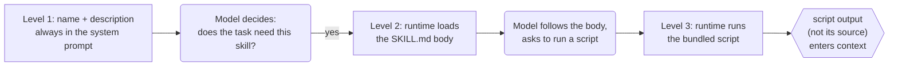

# 2.3 Skills

<small class="chapter-meta">**Maturity: Established** (the packaging mechanism is shipping and stabilising; the "new paradigm" framing is contested) · *Who decides:* mostly your runtime (the model only picks which skill) · *Grounding:* research + companion repo · *Last reviewed:* 2026-06</small>

*A folder of procedural knowledge the runtime reveals to the model in stages, so the window holds only what the task needs. Installing one is a supply-chain decision: its instructions are followed and its scripts run.*

## 1. Why you'd reach for it

A model often needs procedural knowledge that only some of its calls will use. Listing Studio's price step has to apply the supplier's minimum advertised price (MAP), the floor a contract forbids you to undercut, and the house margin rule. The ingest step never touches either. If you paste the pricing rules into the system prompt, every call pays for them in tokens and in attention, including the dozens of calls that never price anything. Multiply that across a house style, a category taxonomy, and a half-dozen multi-step workflows, and the prompt fills with reference material the current task does not need.

The convenience answer is to download a community skill that already packages those rules. That is where the cost story turns, because a Skill is not a passive document. A `SKILL.md` body is instructions the model will follow, and any bundled script executes with whatever authority you grant it.[^skills-overview] Install a "helpful" skill without reading it and you have installed third-party code. Its markdown can carry injected instructions, where text inside fetched or loaded content reads to the model as a command rather than as data,[^owasp-llm01] and its script can read a secret or take a privileged action.[^owasp-llm06] The cost of skipping the audit is a supply-chain compromise, a defect introduced through a dependency you trusted by default,[^owasp-mcp-cheat] that arrives looking like a convenience.

A benign skill can still fail you. A skill is pulled in by matching its `description`. Write a description that never triggers and you have stranded the whole capability: it sits in context doing nothing while still spending your token budget on its metadata.

The fix in miniature: package the knowledge as a Skill, a `SKILL.md` plus optional bundled files and scripts, and let the runtime reveal it in stages. The runtime keeps only a one-line description in context until the model decides the task needs the skill, then loads the body, then runs a bundled script only on demand. The pricing rules cost almost nothing until the price step actually prices something.

Reach for a Skill when:

- You have reusable procedural knowledge or a workflow the model needs only sometimes, like the MAP and margin rules at the price step.
- You want to package rules and a reference script together so they travel as one unit.
- You want the same know-how to ride along across sessions without living permanently in the prompt.

The counter-trigger: do not reach for a Skill when the need is connectivity to a live system's tools or data over the wire. That is [MCP](mcp.md), chapter 2.4. A Skill packages knowledge; an MCP server provides connectivity.[^newstack-md] And when the knowledge is small enough to live permanently in the prompt, leave it in the prompt; staged loading is overhead you do not need.

## 2. What it actually is

A Skill is a folder of procedural knowledge: a `SKILL.md` file with YAML `name` and `description` fields and a fuller instruction body, plus optional bundled files and executable scripts, that the runtime reveals to the model in stages.[^skills-overview] Anthropic's framing for it is an onboarding guide for a new hire: the reference a capable worker reaches for to do a specific job well, not a rewrite of how the worker thinks.[^skills-eng]

Run the litmus test on it, the question this book sorts every pattern by: who makes the structural decision, the model or your code? On a Skill, your code does. A Skill is context engineering as packaging, where context engineering is the discipline of choosing what goes into the model's window and what stays out. Your runtime decides what to reveal and when. The only thing the model decides is which skill to pull in. That is real value, and it is operational rather than architectural. A Skill is not a genuinely-new agentic pattern, and selling folders-of-markdown as a breakthrough overclaims it.

**Maturity: Established.** The packaging mechanism is shipping and stabilising, and the parts that matter for building on it, the three-level loading model and the split between packaging knowledge and providing connectivity, are settling into accepted practice.[^skills-overview][^skills-eng] Progressive disclosure as a context principle, the idea of loading context in stages, is older and stronger, and counts as Standard. The framing that "Skills are a new paradigm" or the endgame is Contested: the word "skills" today lumps together markdown instructions, packaged code, and workflow orchestration that have little in common, and the durable win is routing plus context management, not smarter prompts.[^kinney][^ossinsight] Dependable audit and signing tooling for third-party skills is still Emerging, which is why the security burden in §4 falls on you rather than on the ecosystem.

A Skill is not an agent, and not a tool. It packages the workflow that may call tools (the call-execute-return contract from [Tool Use](tool-use.md)), and it can teach the model how to drive an [MCP](mcp.md) server. Skills compose with tools and MCP; this is not a versus.

## 3. How to do it

Progressive disclosure loads context in stages so the window only ever holds what the current task needs. A Skill realises it at three levels. Rounded nodes are the model deciding, rectangles are your code or runtime deciding, the hexagon is the capability the skill packages:



Level 1 is the metadata: the `name` and `description`, always in the system prompt, tiny by design. Level 2 is the `SKILL.md` body, the full how-to, loaded only when the skill is triggered. Level 3 is a referenced file or script, read or executed only on demand, where the script's output enters context and its source never does.

The loader carries the whole mechanism in two pieces. First, the Level-1 payload, the metadata that rides in the system prompt for every registered skill whether or not it is ever used:

```python
@dataclass
class SkillMeta:
    """Level-1 payload — always in the system prompt.

    Tiny by design: the model reads name + description for every skill in the
    registry. The full body (Level 2) loads only when the skill is triggered.
    Everything that can be deferred, is deferred.
    """
    name: str          # YAML front-matter `name` field
    description: str   # YAML front-matter `description` field
    skill_dir: Path    # path to the skill bundle on disk
```

Second, the three load functions, one per level. The Level-3 function carries the failure-return contract: when a script errors, times out, or produces nothing, it returns a structured, recoverable message rather than a raw stack trace, and never reports a silent success.

```python
def load_skill_meta(skill_dir: Path) -> SkillMeta:
    """Level 1 — parse only the YAML front matter from SKILL.md.

    Returns a SkillMeta without reading the body. Called at startup so that
    every registered skill contributes a tiny name+description token budget
    to the system prompt, regardless of whether it is ever triggered.
    """
    skill_md = skill_dir / "SKILL.md"
    raw = skill_md.read_text(encoding="utf-8")
    fm = _parse_front_matter(raw)
    return SkillMeta(
        name=fm["name"].strip(),
        description=fm["description"].strip(),
        skill_dir=skill_dir,
    )


def load_skill_body(meta: SkillMeta) -> str:
    """Level 2 — load the full SKILL.md body.

    Called only when the skill is triggered (the model chose this skill or
    the runtime matched a keyword). The body contains the detailed how-to
    instructions that fill the model's context for this task.
    """
    skill_md = meta.skill_dir / "SKILL.md"
    raw = skill_md.read_text(encoding="utf-8")
    # Strip the YAML front matter; return the markdown body.
    return _strip_front_matter(raw).strip()


def run_skill_script(
    meta: SkillMeta,
    script_name: str,
    args: list[str],
    timeout_seconds: float = 10.0,
) -> str:
    """Level 3 — run a bundled script and return its stdout as a string.

    The script's *output* enters the model's context, never the source.
    Any error (non-zero exit, timeout, malformed output) returns a
    structured, recoverable message — never a raw stack trace.

    Security: the script runs in an isolated subprocess with the arguments
    you supply. Never pass untrusted input as arguments without sanitising.
    Scope what the script can reach: it should read only what you give it
    and write nothing.
    """
    script_path = meta.skill_dir / script_name
    if not script_path.exists():
        return _script_error(
            script_name,
            f"script {script_name!r} not found in skill bundle",
        )

    try:
        result = subprocess.run(
            [sys.executable, str(script_path)] + args,
            capture_output=True,
            text=True,
            timeout=timeout_seconds,
        )
    except subprocess.TimeoutExpired:
        return _script_error(script_name, f"timed out after {timeout_seconds}s")
    except Exception as exc:
        return _script_error(script_name, f"failed to launch: {exc}")

    if result.returncode != 0:
        # The script itself returned a structured error (JSON); pass it through.
        stderr_hint = result.stderr.strip()[:200] if result.stderr else ""
        output = result.stdout.strip() or stderr_hint or "(no output)"
        return _script_error(script_name, f"exit {result.returncode}: {output}")

    output = result.stdout.strip()
    if not output:
        return _script_error(script_name, "script exited 0 but produced no output")

    return output
```

The `SKILL.md` itself is the unit a contributor ships. The format is YAML front matter (the Level-1 metadata) followed by a markdown body (Level 2), with a bundled-files section that points at the Level-3 scripts:

```text
---
name: map-compliance
description: Validate a proposed price against the supplier MAP floor and gross-margin rules. Use when pricing or compliance checking is required.
---

# MAP Compliance Skill

A pricing analyst uses this skill to verify that a proposed listing price:

1. **Does not undercut the MAP floor.** ...
2. **Meets the margin floor.** Stockwell requires at least 20 % gross margin ...

## How to use this skill

Call the bundled `check_map.py` script with the SKU and proposed price:

    python check_map.py NV-ALDSWORTH-DM 41900
```

The runtime side, where the three levels plug into an agent, differs only by SDK. The LangGraph version is the default; the OpenAI Responses and Anthropic Messages variants show the same three levels wired through their own tool loops.

=== "LangGraph"

    ```python
    # Level 1: load metadata at startup — tiny token budget, always in the system prompt.
    skill = load_skill_meta(_SKILL_DIR)

    # The system prompt carries only the name + description (Level 1).
    # The full body (Level 2) is loaded below only when this skill is triggered.
    SYSTEM_PROMPT = (
        "You are a pricing specialist for Stockwell. "
        f"Available skill: {skill.name} — {skill.description}"
    )

    # Level 2: load the full body on trigger (e.g. when the task is pricing-related).
    skill_body = load_skill_body(skill)


    @tool(parse_docstring=True)
    def check_map_price(supplier_sku: str, proposed_price_cents: int) -> str:
        """Run the MAP-compliance check for a proposed price.

        Args:
            supplier_sku: the product SKU to check.
            proposed_price_cents: the proposed listed price in cents.
        """
        # Level 3: run the bundled script; its output enters context, not the source.
        return run_skill_script(skill, "check_map.py", [supplier_sku, str(proposed_price_cents)])


    agent = create_agent(
        "openai:gpt-5.5",
        tools=[check_map_price],
        system_message=SYSTEM_PROMPT + "\n\n" + skill_body,
    )

    result = agent.invoke({
        "messages": [{
            "role": "user",
            "content": (
                "Set a listed price for the Aldsworth Dual-Motor Sit-Stand Desk "
                "(SKU NV-ALDSWORTH-DM). Use the MAP-compliance skill to validate "
                "the price before confirming it."
            ),
        }]
    })
    print(result["messages"][-1].content)
    ```

=== "OpenAI Responses API"

    ```python
    # Level 1: name + description in the system prompt, Level 2: body on trigger.
    skill = load_skill_meta(_SKILL_DIR)
    skill_body = load_skill_body(skill)

    CHECK_MAP_TOOL = {
        "type": "function",
        "name": "check_map_price",
        "description": (
            "Run the MAP-compliance check for a proposed price. Returns a JSON "
            "result confirming whether the price meets the MAP floor and margin rules."
        ),
        "parameters": {
            "type": "object",
            "properties": {
                "supplier_sku": {"type": "string"},
                "proposed_price_cents": {"type": "integer"},
            },
            "required": ["supplier_sku", "proposed_price_cents"],
            "additionalProperties": False,
        },
    }

    response = client.responses.create(
        model="gpt-5.5",
        instructions=(
            f"Available skill: {skill.name} — {skill.description}\n\n{skill_body}"
        ),
        input=[{
            "role": "user",
            "content": (
                "Set a listed price for the Aldsworth Dual-Motor Sit-Stand Desk "
                "(SKU NV-ALDSWORTH-DM). Use the MAP-compliance skill to validate."
            ),
        }],
        tools=[CHECK_MAP_TOOL],
    )

    # If the model called a tool, run Level 3 and feed the result back.
    for item in response.output:
        if item.type == "function_call" and item.name == "check_map_price":
            args = json.loads(item.arguments)
            # Level 3: run the bundled script; stdout enters context, not the source.
            tool_output = run_skill_script(
                skill, "check_map.py",
                [args["supplier_sku"], str(args["proposed_price_cents"])],
            )
            print("Script output injected into context:", tool_output)
    ```

=== "Anthropic Messages API"

    ```python
    # Level 1: name + description in the system prompt, Level 2: body on trigger.
    skill = load_skill_meta(_SKILL_DIR)
    skill_body = load_skill_body(skill)

    CHECK_MAP_TOOL = {
        "name": "check_map_price",
        "description": (
            "Run the MAP-compliance check for a proposed price. Returns a JSON "
            "result confirming whether the price meets the MAP floor and margin rules."
        ),
        "input_schema": {
            "type": "object",
            "properties": {
                "supplier_sku": {"type": "string"},
                "proposed_price_cents": {"type": "integer"},
            },
            "required": ["supplier_sku", "proposed_price_cents"],
            "additionalProperties": False,
        },
    }

    reply = client.messages.create(
        model="claude-sonnet-4-6",
        max_tokens=1024,
        system=(
            f"Available skill: {skill.name} — {skill.description}\n\n{skill_body}"
        ),
        tools=[CHECK_MAP_TOOL],
        messages=[{
            "role": "user",
            "content": (
                "Set a listed price for the Aldsworth Dual-Motor Sit-Stand Desk "
                "(SKU NV-ALDSWORTH-DM). Use the MAP-compliance skill to validate."
            ),
        }],
    )

    for block in reply.content:
        if block.type == "tool_use" and block.name == "check_map_price":
            # Level 3: run the bundled script; stdout enters context, not the source.
            tool_output = run_skill_script(
                skill, "check_map.py",
                [block.input["supplier_sku"], str(block.input["proposed_price_cents"])],
            )
            print("Script output injected into context:", tool_output)
    ```

One run, at the price step, for the Aldsworth desk:

1. The MAP-compliance skill's Level-1 metadata sits in the system prompt at near-zero cost: a name and a one-line description, nothing more.
2. At the price step the model decides the task needs the compliance rules and triggers the skill.
3. The runtime loads the Level-2 `SKILL.md` body into context: the MAP and margin workflow, in full.
4. The model follows that workflow and asks to run the bundled `check_map.py` (Level 3) on a proposed price, say *"I'll list it at $419.00, which I'll validate first."*
5. The runtime executes the script offline and returns a structured result, the floor and a pass or fail, into context. The script's source never enters context, only its output.
6. The model reads the result and sets `price_cents` at or above the floor, at `41900`, above the $399.00 MAP.

The runtime decided what to reveal at each level and ran the script; the model only decided that pricing was the task and which skill fit it.

### From one skill to a library

The singular case is one skill the model can hardly miss. Production hits the plural fast, and three things degrade together as the catalog grows. In practice, selection by `description` gets harder when many descriptions overlap, so the model pulls the wrong skill or none. Every skill's Level-1 metadata still rides in the system prompt whether or not it is ever used, so the always-on cost scales with the size of the library rather than with what any one task needs. And a description that fails to trigger silently strands its skill, which is cheap to miss precisely because nothing errors.

The discipline follows from those three. Keep descriptions distinct and trigger-precise, so the model can tell two skills apart and knows when each applies. Treat the Level-1 metadata as a budget you spend deliberately rather than a free shelf you keep adding to. The principle underneath, that every token in the window costs both money and the model's attention, is the context economy, covered in [Context Engineering](../foundations/context-engineering.md); this chapter owns the Skills mechanism, 1.5 owns the principle.

> **In the companion repo.** The MAP-compliance skill packages the floor and margin rules as a `SKILL.md` plus a `check_map.py` script. The price step pulls it in only when it sets `price_cents`. The script returns the floor and a pass or fail, never its own source.

## 4. Gotchas

1. **A Skill is untrusted code and instructions: audit before use.** A `SKILL.md` body is injected instructions the model will follow, and bundled scripts execute, so installing a third-party skill is installing third-party code. Read the body and the scripts before you trust them; this is Anthropic's own guidance.[^skills-overview] The body is a prompt-injection surface, the OWASP (Open Worldwide Application Security Project) LLM01 risk, where loaded text reads to the model as a command.[^owasp-llm01] The folder as a whole is a supply-chain surface: a dependency you adopt by download, with the same audit obligation as any other.[^owasp-mcp-cheat] Validating a script's output against a schema before you act on it is a poisoning mitigation, covered in [Structured Output](structured-output.md).

2. **Scope what a skill's scripts can touch.** A script that can read any file or call any service is an excessive-agency risk, the OWASP LLM06 class: the more a script can do, the more a single bad run costs.[^owasp-llm06] Give it the least privilege that works, the way `run_skill_script` runs `check_map.py` in a subprocess with only the arguments you pass and a write-nothing contract. Gate the irreversible actions behind a person. The general machinery for that, allowlisting and blast-radius control and the human gate, lives in [Guardrails & Safety](../craft/guardrails-and-safety.md) and [Human-in-the-Loop](../craft/human-in-the-loop.md).

3. **Make script failures structured and recoverable.** When a bundled script errors, times out, or returns malformed data, the failure has to come back to the model as a structured, recoverable message, never a raw stack trace and never a silent success. The `run_skill_script` failure path does exactly this: a missing script, a timeout, a non-zero exit, and an empty output all return a `[skill-script-error]` line the model can act on. Skip it and the agent loops on a dead script or proceeds on bad state.

4. **Progressive disclosure earns its keep, and its failure mode is the mirror of that.** Every instruction block and script output in the window costs both tokens and degraded attention, so staged loading saves on both. A description that never triggers strands the whole skill while still spending its Level-1 token budget at idle. The general principle is the context economy in [Context Engineering](../foundations/context-engineering.md).

5. **"Skills are a new paradigm" is overclaimed.** The term today covers markdown instructions, packaged code, and workflow orchestration that have little in common, and the durable win is routing plus context management rather than smarter prompts.[^kinney] Treat the current shape as a useful packaging convention that may not survive in its present form, not as an endgame.[^ossinsight] That is the Contested half of the maturity verdict, and the reason to size the claim to what the mechanism actually does.

## 5. In short

Use Skills to package procedural knowledge the model needs only sometimes, like the MAP and margin rules at the price step. They are an Established, practical mechanism, and progressive disclosure is the discipline that justifies them: keep the Level-1 metadata tight and the descriptions trigger-precise. The hard part is not authoring the folder, it is trusting one you did not write. Audit the body and the scripts before you deploy, scope what those scripts can reach, and make their failures structured and recoverable. A Skill packages knowledge; an MCP server provides connectivity; the two compose. And do not buy the "new paradigm" pitch.

## Sources

[^skills-overview]: Anthropic, "Agent Skills" overview, including the three-level loading table and the audit-before-use guidance. <https://platform.claude.com/docs/en/agents-and-tools/agent-skills/overview>
[^skills-eng]: Anthropic, "Equipping agents for the real world with Agent Skills" (2025-10-16). The onboarding-guide framing and the loading model. <https://www.anthropic.com/engineering/equipping-agents-for-the-real-world-with-agent-skills>
[^owasp-llm01]: OWASP, "LLM01:2025 Prompt Injection," Top 10 for LLM Applications 2025. The `SKILL.md` body as injected instructions the model follows. <https://genai.owasp.org/llmrisk/llm01-prompt-injection/>
[^owasp-llm06]: OWASP, "LLM06:2025 Excessive Agency," Top 10 for LLM Applications 2025. What a skill's scripts are allowed to touch; least privilege. <https://genai.owasp.org/llmrisk/llm062025-excessive-agency/>
[^owasp-mcp-cheat]: OWASP, "MCP Security Cheat Sheet." The supply-chain class as it applies to installable capabilities. <https://cheatsheetseries.owasp.org/cheatsheets/MCP_Security_Cheat_Sheet.html>
[^newstack-md]: The New Stack, "The case for running AI agents on Markdown files instead of MCP servers." Skills as procedural knowledge versus MCP for connectivity. <https://thenewstack.io/skills-vs-mcp-agent-architecture/>
[^kinney]: Kinney, S., "Agent Skills, Stripped of Hype." The skeptical read on the paradigm framing. <https://stevekinney.com/writing/agent-skills>
[^ossinsight]: OSS Insight, "Agent Skills Are Not the Endgame: They're Just a Transitional Layer," Mar 2026. The skeptical read on durability. <https://ossinsight.io/blog/agent-skills-explosion-2026>

## See also

- [2.1 Tool Use](tool-use.md), the call-execute-return contract a skill often packages; a skill teaches the workflow, so do not re-teach the loop.
- [2.4 MCP](mcp.md), for connectivity over the wire; a skill can teach the workflow that drives MCP tools, so they compose, it is not a versus.
- [1.5 Context Engineering](../foundations/context-engineering.md), for progressive disclosure as the general context-economy principle; this chapter owns the Skills mechanism, 1.5 owns the principle.
- [2.2 Structured Output](structured-output.md), for validating a skill script's output against a schema as a poisoning mitigation.
- [4.3 Human-in-the-Loop](../craft/human-in-the-loop.md) and [4.4 Guardrails & Safety](../craft/guardrails-and-safety.md), for approval and blast-radius control over what a skill's scripts may touch.
