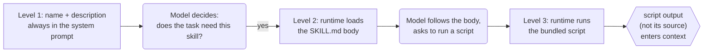

# 2.3 Skills

<small class="chapter-meta">**Maturity: Established** (the packaging mechanism is shipping and stabilising; the "new paradigm" framing is contested) · *Who decides:* mostly your runtime (the model only picks which skill) · *Grounding:* research + companion repo · *Last reviewed:* 2026-06</small>

*A folder of procedural knowledge the runtime reveals to the model in stages, so the window holds only what the task needs. Installing one is a supply-chain decision: its instructions are followed and its scripts run.*

## 1. Why you'd reach for it

A model often needs procedural knowledge that only some of its calls will use. Listing Studio's price step has to apply the supplier's minimum advertised price (MAP), the floor a contract forbids you to undercut, and the house margin rule. The ingest step never touches either. If you paste the pricing rules into the system prompt, every call pays for them in tokens and in attention, including the dozens of calls that never price anything. Multiply that across a house style, a category taxonomy, and a half-dozen multi-step workflows, and the prompt fills with reference material the current task does not need.

The convenience answer is to download a community skill that already packages those rules. But a Skill is not a passive document. A `SKILL.md` body is instructions the model will follow, and any bundled script executes with whatever authority you grant it.[^skills-overview] Install a "helpful" skill without reading it and you have installed third-party code. Its markdown can carry injected instructions, where text inside fetched or loaded content reads to the model as a command rather than as data,[^owasp-llm01] and its script can read a secret or take a privileged action.[^owasp-llm06] The cost of skipping the audit is a supply-chain compromise, a defect introduced through a dependency you trusted by default.[^owasp-mcp-cheat]

A benign skill can still fail you. A skill is pulled in by matching its `description`. Write a description that never triggers and you have stranded the whole capability: it sits in context doing nothing while still spending your token budget on its metadata.

The fix in miniature: package the knowledge as a Skill, a `SKILL.md` plus optional bundled files and scripts, and let the runtime reveal it in stages. The runtime keeps only a one-line description in context until the model decides the task needs the skill, then loads the body, then runs a bundled script only on demand. The pricing rules cost almost nothing until the price step actually prices something.

Reach for a Skill when:

- You have reusable procedural knowledge or a workflow the model needs only sometimes, like the MAP and margin rules at the price step.
- You want to package rules and a reference script together so they travel as one unit.
- You want the same know-how to ride along across sessions without living permanently in the prompt.

The counter-trigger: do not reach for a Skill when the need is connectivity to a live system's tools or data over the wire. That is [MCP](mcp.md), chapter 2.4. A Skill packages knowledge; an MCP server provides connectivity.[^newstack-md] And when the knowledge is small enough to live permanently in the prompt, leave it in the prompt; staged loading is overhead you do not need.

## 2. What it actually is

A Skill is a folder of procedural knowledge: a `SKILL.md` file with YAML `name` and `description` fields and a fuller instruction body, plus optional bundled files and executable scripts, that the runtime reveals to the model in stages.[^skills-overview] Anthropic's framing for it is an onboarding guide for a new hire: the reference a capable worker reaches for to do a specific job well, not a rewrite of how the worker thinks.[^skills-eng]

Run the litmus test on it, the question this book sorts every pattern by: who makes the structural decision, the model or your code? On a Skill, your code does. A Skill is context engineering as packaging, where context engineering is the discipline of choosing what goes into the model's window and what stays out. Your runtime decides what to reveal and when. The only thing the model decides is which skill to pull in. The value there is real, but it is operational rather than architectural. A Skill is not a genuinely-new agentic pattern, and selling folders-of-markdown as a breakthrough overclaims it.

**Maturity: Established overall, with parts moving at different speeds.** The packaging mechanism is shipping and stabilising, and the parts that matter for building on it, the three-level loading model and the split between packaging knowledge and providing connectivity, are settling into accepted practice.[^skills-overview][^skills-eng] The `SKILL.md` format itself is trending toward Standard: it was open-sourced as the Agent Skills standard and is being adopted across tools beyond its origin.[^skills-standard][^codex-skills] Progressive disclosure as a context principle, the idea of loading context in stages, is older and stronger, and counts as Standard. What is still Emerging is the surrounding ecosystem: governance and versioning of the format, distribution and packaging conventions, and dependable audit and signing tooling for third-party skills, which is why the security burden in the Security & trust section falls on you rather than on the ecosystem. The framing that "Skills are a new paradigm" or the endgame is Contested: the word "skills" today lumps together markdown instructions, packaged code, and workflow orchestration that have little in common, and the durable win is routing plus context management more than smarter prompts.[^kinney][^ossinsight]

A Skill is not an agent, and not a tool. It packages the workflow that may call tools (the call-execute-return contract from [Tool Use](tool-use.md)), and it can teach the model how to drive an [MCP](mcp.md) server. Skills compose with tools and MCP; this is not a versus.

## 3. How to do it

Progressive disclosure loads context in stages so the window only ever holds what the current task needs. A Skill realises it at three levels. Rounded nodes are the model deciding, rectangles are your code or runtime deciding, the hexagon is the capability the skill packages:



Level 1 is the metadata: the `name` and `description`, always in the system prompt, tiny by design. Level 2 is the `SKILL.md` body, the full how-to, loaded only when the skill is triggered. Level 3 is a referenced file or script, read or executed only on demand, where the script's output enters context and its source never does.

The loader carries the whole mechanism in two pieces. First, the Level-1 payload, the metadata that rides in the system prompt for every registered skill whether or not it is ever used:

```python
@dataclass
class SkillMeta:
    """Level-1 payload — always in the system prompt.

    Tiny by design: the model reads name + description for every skill in the
    registry. The full body (Level 2) loads only when the skill is triggered.
    Everything that can be deferred, is deferred.
    """
    name: str          # YAML front-matter `name` field
    description: str   # YAML front-matter `description` field
    skill_dir: Path    # path to the skill bundle on disk
```

This is the place to be precise about how the model loads only some skills, because it is the part most people get wrong. The skill body is not in the prompt. What rides in the prompt is one line per installed skill: its `name` and its `description`, roughly a hundred tokens each, assembled into a single catalog the model can see on every call.[^skills-cc] Selection is the model reading those lines and choosing the one whose description matches the task. There is no router in front of it, no classifier, no embedding lookup, just the model reading text. A reverse-engineering of Claude Code's skills came to the same conclusion: the matching is the model reading descriptions, not a separate routing layer.[^skills-internals] When a description matches, the runtime loads that skill's Level-2 body from disk; the Level-3 scripts run only when the model asks for them.

The catalog itself is the entire selection surface, and the loader builds it from nothing but the names and descriptions:

```python
def build_skill_catalog(metas: list[SkillMeta]) -> str:
    """Render the always-resident Level-1 catalog for the system prompt.

    Every installed skill contributes exactly one line — its name and its
    description — and nothing more. The body (Level 2) and script output
    (Level 3) stay off the context until a skill is triggered.

    This is what "selection is a catalog, not a router" means in practice:
    the model reads each line and matches the task to a description. There is
    no classifier, no embedding lookup, no routing logic — just text. The
    token budget grows linearly with the number of installed skills, which is
    the cost to keep in mind when the catalog gets large.
    """
    lines = [f"{m.name}: {m.description}" for m in metas]
    return "\n".join(lines)
```

The body is `[f"{m.name}: {m.description}" for m in metas]`: names and descriptions, nothing else.

- The catalog is always resident, so every installed skill's metadata is paid for on every call whether the skill is used or not, and the catalog has a budget.
- As the catalog grows the cost rises and the selection accuracy drops together, the same way an oversized tool list degrades tool choice ([Tool Use](tool-use.md)): more descriptions to read, more chances to read the wrong one or none.
- Some runtimes truncate or drop descriptions past a budget, which can make a skill undiscoverable even though it is installed. The runtime does not error; the docs surface it (a `/doctor` diagnostic, for instance), so you find out only if you go looking.[^skills-cc]
- The mitigations are to keep descriptions precise and keyword-first so they match on the words a task actually uses, to enable or disable skills so only the relevant set is resident, and to namespace skills so two similar ones stay distinguishable.

Second, the three load functions, one per level. The Level-3 function carries the failure-return contract: when a script errors, times out, or produces nothing, it returns a structured, recoverable message rather than a raw stack trace, and never reports a silent success.

```python
def load_skill_meta(skill_dir: Path) -> SkillMeta:
    """Level 1 — parse only the YAML front matter from SKILL.md.

    Returns a SkillMeta without reading the body. Called at startup so that
    every registered skill contributes a tiny name+description token budget
    to the system prompt, regardless of whether it is ever triggered.
    """
    skill_md = skill_dir / "SKILL.md"
    raw = skill_md.read_text(encoding="utf-8")
    fm = _parse_front_matter(raw)
    return SkillMeta(
        name=fm["name"].strip(),
        description=fm["description"].strip(),
        skill_dir=skill_dir,
    )


def load_skill_body(meta: SkillMeta) -> str:
    """Level 2 — load the full SKILL.md body.

    Called only when the skill is triggered (the model chose this skill or
    the runtime matched a keyword). The body contains the detailed how-to
    instructions that fill the model's context for this task.
    """
    skill_md = meta.skill_dir / "SKILL.md"
    raw = skill_md.read_text(encoding="utf-8")
    # Strip the YAML front matter; return the markdown body.
    return _strip_front_matter(raw).strip()


def run_skill_script(
    meta: SkillMeta,
    script_name: str,
    args: list[str],
    timeout_seconds: float = 10.0,
) -> str:
    """Level 3 — run a bundled script and return its stdout as a string.

    The script's *output* enters the model's context, never the source.
    Any error (non-zero exit, timeout, malformed output) returns a
    structured, recoverable message — never a raw stack trace.

    Security: the script runs in an isolated subprocess with the arguments
    you supply. Never pass untrusted input as arguments without sanitising.
    Scope what the script can reach: it should read only what you give it
    and write nothing.
    """
    script_path = meta.skill_dir / script_name
    if not script_path.exists():
        return _script_error(
            script_name,
            f"script {script_name!r} not found in skill bundle",
        )

    try:
        result = subprocess.run(
            [sys.executable, str(script_path)] + args,
            capture_output=True,
            text=True,
            timeout=timeout_seconds,
        )
    except subprocess.TimeoutExpired:
        return _script_error(script_name, f"timed out after {timeout_seconds}s")
    except Exception as exc:
        return _script_error(script_name, f"failed to launch: {exc}")

    if result.returncode != 0:
        # The script itself returned a structured error (JSON); pass it through.
        stderr_hint = result.stderr.strip()[:200] if result.stderr else ""
        output = result.stdout.strip() or stderr_hint or "(no output)"
        return _script_error(script_name, f"exit {result.returncode}: {output}")

    output = result.stdout.strip()
    if not output:
        return _script_error(script_name, "script exited 0 but produced no output")

    return output
```

The `SKILL.md` itself is the unit a contributor ships. The format is YAML front matter (the Level-1 metadata) followed by a markdown body (Level 2), with a bundled-files section that points at the Level-3 scripts:

```text
---
name: map-compliance
description: Validate a proposed price against the supplier MAP floor and gross-margin rules. Use when pricing or compliance checking is required.
---

# MAP Compliance Skill

A pricing analyst uses this skill to verify that a proposed listing price:

1. **Does not undercut the MAP floor.** ...
2. **Meets the margin floor.** Stockwell requires at least 20 % gross margin ...

## How to use this skill

Call the bundled `check_map.py` script with the SKU and proposed price:

    python check_map.py NV-ALDSWORTH-DM 41900
```

The runtime side, where the three levels plug into an agent, differs only by SDK. The LangGraph version is the default; the OpenAI Responses and Anthropic Messages variants show the same three levels wired through their own tool loops.

=== "LangGraph"

    ```python
    # Level 1: load metadata at startup — tiny token budget, always in the system prompt.
    skill = load_skill_meta(_SKILL_DIR)

    # The system prompt carries only the name + description (Level 1).
    # The full body (Level 2) is loaded below only when this skill is triggered.
    SYSTEM_PROMPT = (
        "You are a pricing specialist for Stockwell. "
        f"Available skill: {skill.name} — {skill.description}"
    )

    # Level 2: load the full body on trigger (e.g. when the task is pricing-related).
    skill_body = load_skill_body(skill)


    @tool(parse_docstring=True)
    def check_map_price(supplier_sku: str, proposed_price_cents: int) -> str:
        """Run the MAP-compliance check for a proposed price.

        Args:
            supplier_sku: the product SKU to check.
            proposed_price_cents: the proposed listed price in cents.
        """
        # Level 3: run the bundled script; its output enters context, not the source.
        return run_skill_script(skill, "check_map.py", [supplier_sku, str(proposed_price_cents)])


    agent = create_agent(
        "openai:gpt-5.5",
        tools=[check_map_price],
        system_message=SYSTEM_PROMPT + "\n\n" + skill_body,
    )

    result = agent.invoke({
        "messages": [{
            "role": "user",
            "content": (
                "Set a listed price for the Aldsworth Dual-Motor Sit-Stand Desk "
                "(SKU NV-ALDSWORTH-DM). Use the MAP-compliance skill to validate "
                "the price before confirming it."
            ),
        }]
    })
    print(result["messages"][-1].content)
    ```

=== "OpenAI Responses API"

    ```python
    # Level 1: name + description in the system prompt, Level 2: body on trigger.
    skill = load_skill_meta(_SKILL_DIR)
    skill_body = load_skill_body(skill)

    CHECK_MAP_TOOL = {
        "type": "function",
        "name": "check_map_price",
        "description": (
            "Run the MAP-compliance check for a proposed price. Returns a JSON "
            "result confirming whether the price meets the MAP floor and margin rules."
        ),
        "parameters": {
            "type": "object",
            "properties": {
                "supplier_sku": {"type": "string"},
                "proposed_price_cents": {"type": "integer"},
            },
            "required": ["supplier_sku", "proposed_price_cents"],
            "additionalProperties": False,
        },
    }

    response = client.responses.create(
        model="gpt-5.5",
        instructions=(
            f"Available skill: {skill.name} — {skill.description}\n\n{skill_body}"
        ),
        input=[{
            "role": "user",
            "content": (
                "Set a listed price for the Aldsworth Dual-Motor Sit-Stand Desk "
                "(SKU NV-ALDSWORTH-DM). Use the MAP-compliance skill to validate."
            ),
        }],
        tools=[CHECK_MAP_TOOL],
    )

    # If the model called a tool, run Level 3 and feed the result back.
    for item in response.output:
        if item.type == "function_call" and item.name == "check_map_price":
            args = json.loads(item.arguments)
            # Level 3: run the bundled script; stdout enters context, not the source.
            tool_output = run_skill_script(
                skill, "check_map.py",
                [args["supplier_sku"], str(args["proposed_price_cents"])],
            )
            print("Script output injected into context:", tool_output)
    ```

=== "Anthropic Messages API"

    ```python
    # Level 1: name + description in the system prompt, Level 2: body on trigger.
    skill = load_skill_meta(_SKILL_DIR)
    skill_body = load_skill_body(skill)

    CHECK_MAP_TOOL = {
        "name": "check_map_price",
        "description": (
            "Run the MAP-compliance check for a proposed price. Returns a JSON "
            "result confirming whether the price meets the MAP floor and margin rules."
        ),
        "input_schema": {
            "type": "object",
            "properties": {
                "supplier_sku": {"type": "string"},
                "proposed_price_cents": {"type": "integer"},
            },
            "required": ["supplier_sku", "proposed_price_cents"],
            "additionalProperties": False,
        },
    }

    reply = client.messages.create(
        model="claude-sonnet-4-6",
        max_tokens=1024,
        system=(
            f"Available skill: {skill.name} — {skill.description}\n\n{skill_body}"
        ),
        tools=[CHECK_MAP_TOOL],
        messages=[{
            "role": "user",
            "content": (
                "Set a listed price for the Aldsworth Dual-Motor Sit-Stand Desk "
                "(SKU NV-ALDSWORTH-DM). Use the MAP-compliance skill to validate."
            ),
        }],
    )

    for block in reply.content:
        if block.type == "tool_use" and block.name == "check_map_price":
            # Level 3: run the bundled script; stdout enters context, not the source.
            tool_output = run_skill_script(
                skill, "check_map.py",
                [block.input["supplier_sku"], str(block.input["proposed_price_cents"])],
            )
            print("Script output injected into context:", tool_output)
    ```

One run, at the price step, for the Aldsworth desk:

1. The MAP-compliance skill's Level-1 metadata sits in the system prompt at near-zero cost: a name and a one-line description, nothing more.
2. At the price step the model decides the task needs the compliance rules and triggers the skill.
3. The runtime loads the Level-2 `SKILL.md` body into context: the MAP and margin workflow, in full.
4. The model follows that workflow and asks to run the bundled `check_map.py` (Level 3) on a proposed price, say *"I'll list it at $419.00, which I'll validate first."*
5. The runtime executes the script offline and returns a structured result, the floor and a pass or fail, into context. The script's source never enters context, only its output.
6. The model reads the result and sets `price_cents` at or above the floor, at `41900`, above the $399.00 MAP.

The runtime decided what to reveal at each level and ran the script; the model only decided that pricing was the task and which skill fit it.

### From one skill to a library

The singular case is one skill the model can hardly miss. Production hits the plural fast, and the catalog cost above is the price of getting there: as the library grows, the always-on metadata budget grows with it and selection gets harder at the same time. The discipline that keeps a library workable is the same one the bullets named. Keep descriptions distinct and trigger-precise, so the model can tell two skills apart and knows when each applies. Treat the Level-1 metadata as a budget you spend deliberately rather than a free shelf you keep adding to, and disable the skills a given workload never needs. The principle underneath, that every token in the window costs both money and the model's attention, is the context economy, covered in [Context Engineering](../foundations/context-engineering.md); this chapter owns the Skills mechanism, 1.5 owns the principle.

> **In the companion repo.** The MAP-compliance skill packages the floor and margin rules as a `SKILL.md` plus a `check_map.py` script. The price step pulls it in only when it sets `price_cents`. The script returns the floor and a pass or fail, never its own source.

## 4. Security & trust

Installing a skill is a supply-chain decision, and it is the part of this chapter most likely to cost you. A skill is untrusted code plus untrusted instructions. The `SKILL.md` body is followed as instructions the moment a task triggers the skill, and any bundled script runs with whatever authority your agent has. The fix is the same one you already apply to an open-source dependency: read it before you trust it. Audit the body for instructions you would not have written, and audit the scripts for what they read, write, and call over the network. Do both, because the body and the scripts are two separate ways in.[^skills-overview]

The body is a prompt-injection surface, the OWASP (Open Worldwide Application Security Project) LLM01 risk, where loaded text reads to the model as a command rather than as data.[^owasp-llm01] The scripts are an excessive-agency surface, the LLM06 risk: the more a script can reach, the more a single bad run costs.[^owasp-llm06] Scope what the scripts can touch to the least privilege that does the job, and keep the blast radius small, the way `run_skill_script` runs `check_map.py` in a subprocess with only the arguments you pass and a write-nothing contract. Gate the irreversible actions behind a person. The general machinery for that, allowlisting and blast-radius control and the human gate, lives in [Guardrails & Safety](../craft/guardrails-and-safety.md) and [Human-in-the-Loop](../craft/human-in-the-loop.md); the supply-chain class itself is the one OWASP names for installable capabilities.[^owasp-mcp-cheat]

The uncomfortable part is that skills are unsafe by default. Today's default skill is unversioned, unsigned, unsandboxed, and unreviewed: you get a folder and the runtime's trust, with nothing between them. The risk is not hypothetical. A February 2026 security study of public skills reported that roughly one in seven scanned (about 13.4%) carried a critical issue, from prompt injection to data exfiltration.[^toxicskills] Treat that as a dated finding from one vendor's scan, not a fixed rate, but treat the direction as real: a marketplace of folders that execute with your permissions is exactly the surface attackers go for. Scanning and validation tooling exists, and running a skill through it before you install is worth the minute it takes. That tooling, and where the format is heading, is the next section.

When a script does fail, the failure has to come back structured and recoverable rather than as a raw stack trace or a silently swallowed success. The `run_skill_script` failure path does this: a missing script, a timeout, a non-zero exit, and an empty output all return a `[skill-script-error]` line the model can act on. Skip it and the agent loops on a dead script or proceeds on bad state.

## 5. Ecosystem & tooling

The packaging mechanism is settling, but the ecosystem around it, the standard, the distribution, and the signing, is still forming. Three parts are worth knowing before you build on it.

The format is becoming a real cross-vendor standard. The `SKILL.md` format was open-sourced in late 2025 as the open Agent Skills standard, with a published spec, and it is being adopted across tools well beyond its origin, including OpenAI Codex, Cursor, Gemini CLI, and Copilot.[^skills-standard][^codex-skills] What is not settled is the governance and a first-class `version` field, which is why a skill you install today still has no built-in way to tell you which revision you got.

Distribution is mostly convention. A skill ships as a folder, usually over git, and the internal default is a private repository with code review on the way in. Packaging and versioning are still left to convention rather than enforced by the format. Microsoft's Agent Package Manager (APM) is one contender for fixing that: a manifest plus a lockfile that pins each skill by content hash, so an install is reproducible and you can tell whether the bytes changed.[^apm] The honest caveat is that APM is community-maintained, pre-1.0, and not a supported Microsoft product (the repository is hosted in the microsoft GitHub org), and you adopt it as you would any early open-source tool.

Safety validation and provenance are arriving alongside. Scanners now exist that check a skill for prompt-injection, data-exfiltration, excessive-agency, and supply-chain patterns before you install it. NVIDIA SkillSpector is one, open source, and it is the kind of tool the Security & trust finding above argues for running by default.[^skillspector] Provenance is forming too: an NVIDIA-Verified skill carries a signed Skill Card attesting what it does.[^nvidia-verified] Both are Emerging, not yet standard.

> **From production.** I have used NVIDIA SkillSpector to validate the safety of skills before installing them, and contributed a scanner rule for one of the exfiltration patterns it now checks. I have also used Microsoft APM to distribute skills internally. Neither is a settled standard yet, so I treat the scan and the lockfile as risk reduction, not as a reason to skip reading the skill.

## 6. Gotchas

The supply-chain and script-safety edges have their own section above, the catalog-budget and never-triggering edges are in the How section, and the "new paradigm" overclaim is the Contested half of the maturity line; these are the rest.

1. **Validate a skill script's output before acting on it.** A script's stdout enters context, so a poisoned or malformed result is a way to steer the agent even after you have audited the body. Validating that output against a schema before you act on it is a poisoning mitigation, covered in [Structured Output](structured-output.md).

2. **A skill body can drift from the script it ships with.** The body is followed as instructions while the bundled script runs as code, and nothing keeps the two in step. A `SKILL.md` that documents one flag set and a `check_map.py` that expects another will pass an audit of either file read alone, so read them together and pin the pair when you distribute.

## 7. In short

Use Skills to package procedural knowledge the model needs only sometimes, like the MAP and margin rules at the price step. They are an Established, practical mechanism, and progressive disclosure is the discipline that justifies them: keep the Level-1 catalog tight and the descriptions trigger-precise, because that catalog is the whole selection surface and there is no router behind it. The hard part is not authoring the folder, it is trusting one you did not write. Audit the body and the scripts before you deploy, scope what those scripts can reach, run a scanner over a third-party skill while the signing ecosystem is still Emerging, and make script failures structured and recoverable. A Skill packages knowledge; an MCP server provides connectivity; the two compose. And do not buy the "new paradigm" pitch.

## Sources

[^skills-overview]: Anthropic, "Agent Skills" overview, including the three-level loading table and the audit-before-use guidance. <https://platform.claude.com/docs/en/agents-and-tools/agent-skills/overview>
[^skills-eng]: Anthropic, "Equipping agents for the real world with Agent Skills" (2025-10-16). The onboarding-guide framing and the loading model. <https://www.anthropic.com/engineering/equipping-agents-for-the-real-world-with-agent-skills>
[^owasp-llm01]: OWASP, "LLM01:2025 Prompt Injection," Top 10 for LLM Applications 2025. The `SKILL.md` body as injected instructions the model follows. <https://genai.owasp.org/llmrisk/llm01-prompt-injection/>
[^owasp-llm06]: OWASP, "LLM06:2025 Excessive Agency," Top 10 for LLM Applications 2025. What a skill's scripts are allowed to touch; least privilege. <https://genai.owasp.org/llmrisk/llm062025-excessive-agency/>
[^owasp-mcp-cheat]: OWASP, "MCP Security Cheat Sheet." The supply-chain class as it applies to installable capabilities. <https://cheatsheetseries.owasp.org/cheatsheets/MCP_Security_Cheat_Sheet.html>
[^newstack-md]: The New Stack, "The case for running AI agents on Markdown files instead of MCP servers." Skills as procedural knowledge versus MCP for connectivity. <https://thenewstack.io/skills-vs-mcp-agent-architecture/>
[^kinney]: Kinney, S., "Agent Skills, Stripped of Hype." The skeptical read on the paradigm framing. <https://stevekinney.com/writing/agent-skills>
[^ossinsight]: OSS Insight, "Agent Skills Are Not the Endgame: They're Just a Transitional Layer," Mar 2026. The skeptical read on durability. <https://ossinsight.io/blog/agent-skills-explosion-2026>
[^skills-cc]: Claude Code skills documentation. The always-resident catalog budget, and how descriptions can be silently truncated or dropped past a budget so a skill becomes undiscoverable. <https://code.claude.com/docs/en/skills>
[^skills-internals]: Lee, H., "Claude Skills deep dive," a practitioner reverse-engineering of the selection mechanism (2025-10-26). The finding that selection is the model reading descriptions, with no separate router, classifier, or embedding lookup. <https://leehanchung.github.io/blogs/2025/10/26/claude-skills-deep-dive/>
[^skills-standard]: The open Agent Skills standard and its published specification. <https://agentskills.io> and <https://agentskills.io/specification>
[^codex-skills]: OpenAI, "Codex skills," documenting Codex adopting the skills format. <https://developers.openai.com/codex/skills>
[^apm]: Microsoft Agent Package Manager (APM): a manifest plus content-hash lockfile for reproducible skill installs. Community-maintained, pre-1.0, and not a supported Microsoft product (the repository is hosted in the microsoft GitHub org). <https://github.com/microsoft/apm>
[^skillspector]: NVIDIA SkillSpector, an open-source scanner that checks a skill for prompt-injection, data-exfiltration, excessive-agency, and supply-chain patterns before install. <https://github.com/NVIDIA/SkillSpector>
[^nvidia-verified]: NVIDIA, "NVIDIA-Verified Agent Skills provide capability governance for AI agents." The signed Skill Card and verification programme. <https://developer.nvidia.com/blog/nvidia-verified-agent-skills-provide-capability-governance-for-ai-agents/>
[^toxicskills]: Snyk, "ToxicSkills: malicious AI agent skills." A February 2026 security-vendor study reporting roughly one in seven public skills scanned (about 13.4%) carrying a critical issue; treat as a dated finding from one vendor's scan, not a fixed rate. <https://snyk.io/blog/toxicskills-malicious-ai-agent-skills-clawhub/>

## See also

- [2.1 Tool Use](tool-use.md), the call-execute-return contract a skill often packages; a skill teaches the workflow, so do not re-teach the loop.
- [2.4 MCP](mcp.md), for connectivity over the wire; a skill can teach the workflow that drives MCP tools, so they compose, it is not a versus.
- [1.5 Context Engineering](../foundations/context-engineering.md), for progressive disclosure as the general context-economy principle; this chapter owns the Skills mechanism, 1.5 owns the principle.
- [2.2 Structured Output](structured-output.md), for validating a skill script's output against a schema as a poisoning mitigation.
- [4.3 Human-in-the-Loop](../craft/human-in-the-loop.md) and [4.4 Guardrails & Safety](../craft/guardrails-and-safety.md), for approval and blast-radius control over what a skill's scripts may touch.

## Further reading

External deep-dives for a reader who wants more than this chapter covers. These are primary sources rather than aggregators; each is annotated with why you'd open it.

- **The vendor mechanism.** Anthropic, [Equipping agents for the real world with Agent Skills](https://www.anthropic.com/engineering/equipping-agents-for-the-real-world-with-agent-skills). The three-level loading model and the onboarding-guide framing, straight from the team that shipped the format.
- **The open standard.** The [Agent Skills specification](https://agentskills.io/specification). The portable `SKILL.md` format itself: what the spec pins down and what it deliberately leaves to the runtime.
- **The loading reality.** The [Claude Code skills documentation](https://code.claude.com/docs/en/skills). How selection actually behaves in a shipping runtime: the always-resident catalog budget, and how descriptions get truncated or dropped so a skill goes undiscoverable.
- **Safety.** NVIDIA's [SkillSpector](https://github.com/NVIDIA/SkillSpector), the open-source scanner to run over a skill before you trust it, and Snyk's [ToxicSkills study](https://snyk.io/blog/toxicskills-malicious-ai-agent-skills-clawhub/) for the threat data behind the supply-chain warning.
- **The skeptical take.** Kinney, [Agent Skills, Stripped of Hype](https://stevekinney.com/writing/agent-skills), and OSS Insight, [Agent Skills Are Not the Endgame](https://ossinsight.io/blog/agent-skills-explosion-2026). The honest read on the "new paradigm" framing and how durable the win is.
