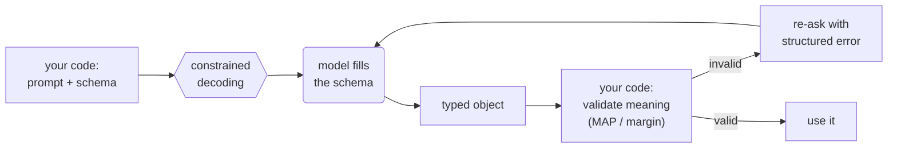

# 2.2 Structured Output

<small class="chapter-meta">**Maturity: Standard** (the accepted default whenever code, not a person, consumes the model's output) · *Who decides:* a capability, not a pattern · *Grounding:* research + companion repo · *Last reviewed:* 2026-06</small>

*The machine-checkable contract: a schema the model must fill, so its output is something your code can read instead of prose it has to parse.*

*Also called: function calling (for outputs), constrained decoding, JSON / structured-output mode.*

## 1. Why you'd reach for it

Ask a bare model to set a price and it answers in a sentence that happens to contain a number. "I'd list the Aldsworth desk at $419." Or "$419.00 USD, comfortably above MAP." Or "around 419 dollars, though you could go higher." Your code does not want a sentence; it wants an integer it can write to `price_cents`. So you reach for a regex, and the regex works until the day the model phrases the answer a new way. Then the parse returns nothing, or worse, the wrong number, and the listing stalls in `draft` or ships a price no one chose.

Hand the model a typed contract instead. You name the fields you need (a price in cents, a currency code, a line of reasoning) and the model fills them. What comes back is an object your code reads as `decision.price_cents`, an integer, without parsing anything. The schema is the promise the model has to keep, and the API holds it to that promise.

But the promise only covers structure. A schema makes the model fill the right fields with the right types; it cannot check whether the values are correct. Take the Aldsworth Dual-Motor Sit-Stand Desk from Northvale Furnishings, SKU `NV-ALDSWORTH-DM`. The model returns a clean `PricingDecision`: every field present, every type correct, `price_cents` set to `38900`. That object parses and validates, yet `38900` is $389.00, below Northvale's $399.00 minimum advertised price (MAP), the floor the supplier contract forbids you to undercut. A sub-MAP price can void that agreement and pull the listing, and a price under your margin floor sells the desk at a loss. The schema enforced the structure but never asked whether the number was allowed, so a wrong price ships silently because the object looked correct.

Reach for a schema whenever code, not a person, consumes the model's output:

- **Code parses it.** You extract a field, cast a type, read a number.
- **Code branches on it.** A category routes the listing; a flag gates the next step.
- **Code stores or forwards it.** The value lands in `price_cents`, a database row, the next stage's input.

The counter-trigger: if a human just reads the text, a free-text answer is fine and a schema is overhead. Brand-voice copy that a merchandiser reviews does not need one. The priced number your pipeline writes to the catalog does.

## 2. What it actually is

A schema is a typed contract you hand the model: the fields it must return, their types, and which are required. Structured output is the same constrained-decoding machinery as tool and function calling, aimed at a different target. Constrained decoding means the model's token sampler is restricted so it cannot emit a token that would break the declared shape.[^outlines] Tool use points that machinery at a function's *input* schema: the model fills the schema and your code runs the function. Structured output points it at the model's *response* schema: the model fills the schema and your code reads the typed object. The difference is only in what happens next: a tool call runs a function, while a structured-output call shapes the text the model already produced. Both run through the same decoder, so only the target schema changes. That is why several vendors ship strict tool use and JSON outputs as one feature.[^anthropic]

This sorts the litmus test cleanly. Structured output is not a who-decides pattern, because nothing structural is decided at runtime. It is a **capability**, a hexagon in this book's diagram language, the junior partner to [Tool Use](tool-use.md). Never sell it as a distinct agentic pattern; it is a feature you switch on.

**Maturity: Standard.** Structured output as a capability, and strict schema-constrained decoding as its reliable mode, are the accepted default; every major provider ships them, and when code consumes the model's output there is no real reason to reach for anything else.[^openai][^anthropic] The caveats worth knowing are about using it well; none of them is a reason to avoid it. First, a schema fixes the structure of the output but cannot vouch for its meaning: it does not "solve" hallucination, and a schema-valid object can still be wrong, out of range, or carry injected text inside a string field, so you validate the content in your own code.[^gemini] Second, and narrower, forcing a tight format can blunt a model's reasoning on hard tasks; the size of that effect is disputed,[^tam][^dottxt] and it has a cheap, standard fix (reason-then-format, below). Adherence can also fray on deeply nested, union-heavy, or recursive schemas, so keep them tight and measure the ones that carry weight.[^jsonschemabench]

Three reliability tiers are worth keeping straight, because they get conflated and the difference is where listings break:

1. **Prompt-and-pray.** You ask in the prompt ("reply with JSON") and hope. The model usually complies, but nothing guarantees valid JSON, the field names drift, and the format tends to break first when the answer runs long.
2. **JSON mode.** The API guarantees syntactically valid JSON. It does not guarantee your fields or your types. You can get a clean object with the wrong shape and trust it.[^openai]
3. **Strict schema mode.** The decoder is constrained against your JSON Schema and cannot emit a violating token, so the shape is guaranteed.[^openai][^xgrammar] The trade-off is that your schema must sit inside the subset of JSON Schema the provider supports, and adherence frays near the edges of that subset.[^jsonschemabench]

## 3. How to do it

The flow has five moving parts. Your code sends the prompt and the schema; the model fills the schema under constrained decoding (the capability); a typed object comes back; your code validates its *meaning*; on a semantic failure you re-ask with a structured error, otherwise you use it. Rounded nodes are the model deciding, rectangles are your code, the hexagon is the capability:



### The contract

The schema is the typed contract. You can express it as a raw JSON Schema, a `TypedDict`, or a Pydantic model; we use Pydantic because the libraries consume the class directly: `with_structured_output(PricingDecision)` and the provider SDK helpers take the model and derive the JSON Schema from it. The format on the wire is JSON, the settled default every hosted provider accepts; constrained decoding can in principle target other grammars, and so other formats like YAML or XML, but JSON Schema is what you reach for in practice.[^outlines][^xgrammar] Two choices in the model are load-bearing: `extra="forbid"` forbids stray keys, and the `reasoning` field comes *first*. The ordering is deliberate. It is the reason-then-format mitigation (Gotcha 2): the model writes free-text reasoning before it commits to a constrained number, which guards against the format itself suppressing useful thought. The model thinks in prose, then the typed payload follows.

```python
class PricingDecision(BaseModel):
    """The model's complete pricing decision for one Listing Studio product.

    Fields are ordered so the model reasons before it commits to a number.
    reasoning comes first: free-text chain of thought that the model writes
    before it fills in the typed payload. price_cents and the rest follow.
    """
    model_config = ConfigDict(extra="forbid")  # schema-valid shape, no stray keys

    # Reason first: free-text chain of thought before the number is locked in.
    # This is the reason-then-format mitigation — the model thinks in prose
    # before it commits to a constrained integer (see coverage item 7).
    reasoning: str

    # The typed payload.
    price_cents: int           # listed price, e.g. 41900 for $419.00
    currency: str              # ISO-4217 code, e.g. "USD"
    confidence: float          # 0.0–1.0; the model's stated confidence
```

### The call

The call differs by provider in shape, not in idea. The same mental model holds across all three: hand over the schema, get back an object that fits it. The LangGraph default wraps the model with `with_structured_output`; the raw-SDK tabs show what that does underneath. On Anthropic the stable way to get structured output *is* tool calling pointed at the output: you declare the response schema as a tool's `input_schema` and force the call with `tool_choice`, which is the junior-partner equivalence from §2 made literal.

=== "LangGraph"

    ```python
    # init_chat_model + with_structured_output: one line gives the model a contract
    # it must fill. The returned object is a typed PricingDecision — no parsing,
    # no regex, no free-text wrangling.
    llm = init_chat_model("openai:gpt-5.5")
    pricing_chain = llm.with_structured_output(PricingDecision)

    decision: PricingDecision = pricing_chain.invoke(
        "Set a listed price for the Aldsworth Dual-Motor Sit-Stand Desk "
        "(SKU NV-ALDSWORTH-DM, MAP floor $399.00, landed cost $280.00). "
        "Reason through the MAP and margin rules, then produce a PricingDecision."
    )
    print(decision.price_cents)   # e.g. 41900
    ```

=== "OpenAI Responses API"

    ```python
    # OpenAI Responses API: strict json_schema mode.
    # response_format carries the JSON schema; strict=True engages the
    # grammar-constrained decoder so the output is guaranteed to match the shape.
    response = client.responses.create(
        model="gpt-5.5",
        input=[
            {
                "role": "user",
                "content": (
                    "Set a listed price for the Aldsworth Dual-Motor Sit-Stand Desk "
                    "(SKU NV-ALDSWORTH-DM, MAP floor $399.00, landed cost $280.00). "
                    "Reason through the MAP and margin rules, then produce a PricingDecision."
                ),
            }
        ],
        text={
            "format": {
                "type": "json_schema",
                "name": "PricingDecision",
                "schema": PricingDecision.model_json_schema(),
                "strict": True,
            }
        },
    )

    # Guard: check for a refusal or truncation before parsing (Gotcha — item 5).
    if response.status == "incomplete":
        raise RuntimeError(
            f"response incomplete (finish reason: {response.incomplete_details}); "
            "cannot parse a truncated structured-output response"
        )

    decision = PricingDecision.model_validate_json(response.output_text)
    print(decision.price_cents)   # e.g. 41900
    ```

=== "Anthropic Messages API"

    ```python
    # Anthropic Messages API: tool-forcing for structured output.
    # Define the response schema as a tool's input_schema; tool_choice forces the
    # model to call it. Same constrained-decoding machinery as tool use — the model
    # fills the schema rather than answering in free prose.
    reply = client.messages.create(
        model="claude-sonnet-4-6",
        max_tokens=1024,
        tools=[_PRICING_DECISION_TOOL],
        tool_choice={"type": "tool", "name": "produce_pricing_decision"},
        messages=[
            {
                "role": "user",
                "content": (
                    "Set a listed price for the Aldsworth Dual-Motor Sit-Stand Desk "
                    "(SKU NV-ALDSWORTH-DM, MAP floor $399.00, landed cost $280.00). "
                    "Reason through the MAP and margin rules, then produce a PricingDecision."
                ),
            }
        ],
    )

    # Guard: check for refusal or truncation before parsing (Gotcha — item 5).
    if reply.stop_reason not in ("tool_use", "end_turn"):
        raise RuntimeError(
            f"unexpected stop_reason {reply.stop_reason!r}; "
            "may be a refusal or truncation — inspect reply.content"
        )

    tool_block = next(b for b in reply.content if b.type == "tool_use")
    decision = PricingDecision.model_validate(tool_block.input)
    print(decision.price_cents)   # e.g. 41900
    ```

### Validate the meaning

Now the central point. The object parsed, so the shape is good. Whether the *content* is allowed is your code's job, and it is the job the schema cannot do. The validator checks the three rules the schema never saw: the MAP floor, the margin floor, and a confidence floor below which a decision is held for a person rather than published.

```python
@dataclass
class ValidationResult:
    ok: bool
    error: str | None = None  # structured message for the re-ask prompt if not ok


def validate_pricing_decision(
    decision: PricingDecision,
    map_floor_cents: int = MAP_FLOOR_CENTS,
    cost_cents: int = COST_CENTS,
    margin_floor_pct: float = MARGIN_FLOOR_PCT,
) -> ValidationResult:
    """Check a schema-valid PricingDecision for semantic correctness.

    Valid shape is not valid content. The schema guarantees the object parses;
    this function guarantees the price is within policy. Three checks:

    1. MAP floor — the price must not undercut the supplier's minimum advertised
       price or the listing is in breach of contract.
    2. Margin floor — the price must cover cost plus the required gross margin
       so the listing is profitable.
    3. Confidence floor — decisions the model marks as uncertain are held for
       human review rather than published automatically.
    """
    margin_floor_cents = int(cost_cents / (1 - margin_floor_pct))

    if decision.price_cents < map_floor_cents:
        return ValidationResult(
            ok=False,
            error=(
                f"price_cents {decision.price_cents} undercuts the MAP floor "
                f"({map_floor_cents}). Raise the price to at least {map_floor_cents}."
            ),
        )

    if decision.price_cents < margin_floor_cents:
        return ValidationResult(
            ok=False,
            error=(
                f"price_cents {decision.price_cents} does not meet the "
                f"{margin_floor_pct:.0%} gross-margin floor "
                f"(minimum {margin_floor_cents} given cost {cost_cents}). "
                f"Raise the price to at least {margin_floor_cents}."
            ),
        )

    if decision.confidence < CONFIDENCE_FLOOR:
        return ValidationResult(
            ok=False,
            error=(
                f"confidence {decision.confidence:.2f} is below the "
                f"floor ({CONFIDENCE_FLOOR}). Revise reasoning or flag for review."
            ),
        )

    return ValidationResult(ok=True)
```

### Re-ask, do not throw

When validation fails, the recoverable move is to hand the model the validation message and let it try again, not to raise an exception that ends the pipeline run. This is old validation discipline applied to a model response: the error is structured, human-readable, and actionable, and the loop is bounded so a model that cannot satisfy the rule fails loudly instead of spinning.[^instructor]

<details markdown><summary>The bounded re-ask loop</summary>

```python
def price_with_reask(
    call_fn: Any,          # callable(messages) -> PricingDecision | None
    messages: list[dict],
    max_retries: int = 3,  # loop cap — a stuck model fails loudly, not silently
) -> PricingDecision:
    """Bounded re-ask loop: parse + semantic validation, structured error on failure.

    On a parse failure or a MAP/margin/confidence violation, this function hands
    the model a structured, human-readable error message so it can self-correct on
    the next attempt. It does not raise a raw exception — that would end the run.
    Instead it appends the error as a user turn and tries again, up to max_retries.

    call_fn is the seam the provider variants inject (LangGraph / Responses /
    Anthropic). It receives the current message list and returns a PricingDecision
    on success, or None / raises pydantic.ValidationError on a parse failure.
    """
    from pydantic import ValidationError

    current_messages = list(messages)
    for attempt in range(1, max_retries + 1):
        try:
            decision = call_fn(current_messages)
        except (ValidationError, Exception) as exc:
            # Parse failure: the object did not fit the schema. Build a structured
            # error the model can act on, not a raw traceback.
            if attempt >= max_retries:
                raise RuntimeError(
                    f"structured-output call failed after {max_retries} attempts"
                ) from exc
            current_messages.append(
                {
                    "role": "user",
                    "content": (
                        f"Your previous response did not parse correctly: {exc}. "
                        "Please produce a valid PricingDecision JSON object."
                    ),
                }
            )
            continue

        result = validate_pricing_decision(decision)
        if result.ok:
            return decision

        # Semantic failure: the object parsed but violated policy. Feed the
        # structured error back so the model can self-correct on the next turn.
        if attempt >= max_retries:
            raise RuntimeError(
                f"pricing decision failed validation after {max_retries} attempts: "
                f"{result.error}"
            )
        current_messages.append(
            {"role": "user", "content": f"Invalid pricing decision: {result.error}"}
        )

    # Unreachable, but makes the type-checker happy.
    raise RuntimeError("price_with_reask exhausted retries")
```

</details>

One run on the Aldsworth desk, end to end:

1. Your code sends the prompt and the `PricingDecision` schema. The model fills it under constrained decoding and returns `reasoning` followed by `price_cents` of `38900`.
2. The schema validates the *shape*. Every field is present and typed, so it passes; the typed object is in hand.
3. Your code runs `validate_pricing_decision`. `38900` is below the MAP floor of `39900`, so it builds a structured error: "price_cents 38900 undercuts the MAP floor (39900). Raise the price to at least 39900."
4. `price_with_reask` appends that error as a user turn and calls again rather than raising.
5. The model reads the floor it missed and returns a corrected decision at or above `39900`. The validator passes and your code accepts it.

Look at how the work divided. The schema and the decoder produced a well-formed object; your code caught the one that was well-formed and wrong. The model fixed it only because you told it precisely how it was wrong.

### When one schema becomes many

A single flat schema like `PricingDecision` is the easy case. Production schemas grow, and reliability frays as they do: deeply nested objects, union types, recursion, and long enums are where adherence degrades, an Emerging finding that is benchmarked but unsettled, so measure your real schema rather than assuming it holds.[^jsonschemabench] The schema also rides in your input tokens on every call, so a sprawling contract taxes every request in both tokens and the model's attention. A tight schema is the fix, and tight means five concrete things:

- **Only the fields the step uses.** If your code will not read, branch on, or store a field, drop it. Every field is tokens in the schema, tokens in the filled output, and one more thing to validate.
- **Flat over deeply nested.** Prefer a flat object to a tree of wrappers; nesting, unions, and recursion are where both token cost and adherence get worse.
- **Precise types over open ones.** An `int` for cents, an enum or `Literal` for a small fixed set, a bounded range where the provider supports it. Narrow types leave fewer ways to return a valid but useless value.
- **Required fields and `extra="forbid"`.** A schema where everything is optional and extras are allowed barely constrains anything; precision matters as much as size.
- **Short descriptions, terse but clear names.** Descriptions and field names are tokens too, and names ride in both the schema and the emitted JSON. Trim to the one clarification the model needs, and stop short of cryptic.

This is a standing line item in your context budget, covered in [Context Engineering](../foundations/context-engineering.md).

> **In Listing Studio.** Structured output appears twice in the pipeline: at **categorize**, to place the desk in the catalog taxonomy, and at **price**, to return a typed `PricingDecision`. The price step pairs the schema with a code-side MAP and margin check, because a schema-valid number can still be a contract violation. The schema gets you a clean object; your code decides whether it is allowed to ship.

## 4. Gotchas

1. **JSON mode is not structured output.** JSON mode guarantees valid JSON, not the field names or the types you asked for; only strict schema mode constrains the decoder to your shape.[^openai] Reaching for JSON mode and trusting the result is how you get a syntactically clean object with the wrong fields, parsed without complaint and acted on.

2. **Format constraint may suppress reasoning.** There is a real finding that forcing a tight output format can degrade a model's reasoning compared with letting it answer freely.[^tam] There is an equally real rebuttal that the degradation traces to prompting and to forcing the answer before the reasoning, and that well-ordered constrained generation matches or beats free text.[^dottxt] The magnitude, and even the direction, of that effect are disputed. The defensible move is reason-then-format: put a free-text `reasoning` field first, let the model think before it commits to the typed payload, and measure your own task rather than assuming either side is right. The schema above is built that way.

3. **A valid schema does not guarantee valid content.** Constrained decoding fixes the syntax and the structure of the output, but it cannot make the values right. The `38900` `PricingDecision` is valid in every field and still below MAP. A schema-valid object can be hallucinated, out of range, or carry injected instructions inside a string field, and passing it straight downstream is exactly the OWASP "improper output handling" risk.[^owasp-llm05] Validate the meaning in your code, every time.

4. **The schema lives in your input tokens.** The schema is part of the prompt and is sent on every call, so a large or deeply nested schema costs tokens and attention on every request, and strict-mode compilation can add latency to the first call.[^jsonschemabench] Two levers cut the cost. Keep the schema tight, using the five practices above. And because the schema is a stable prefix, place it ahead of the variable input so the provider's prompt cache can charge it at a discount after the first call, turning a per-call cost into close to a one-time one. See [Controlling Cost](../production/controlling-cost.md) for prompt caching in depth.

5. **Refusals and truncation break even the shape.** A safety refusal returns the refusal message, not your object, and the safety behavior takes precedence over the schema. A `max_tokens` cutoff returns JSON that stops mid-string and will not parse.[^openai][^anthropic] Neither yields a parseable object, so check the stop or finish reason before you parse, as the provider tabs above do. Deeply nested, union, and enum schemas plus streaming partial objects are where the shape frays earliest; this chapter does not teach streaming.

## 5. In short

Use strict schema mode any time downstream code consumes the model's output, and skip it when a human just reads the text. Keep the schema tight and put reasoning first. After the schema validates the shape, validate the meaning in your own code; the MAP and margin check is not optional, because a schema-valid `38900` is a delisted desk. On failure, re-ask with a structured error rather than throwing, and bound the loop. The schema gets you a well-formed object; checking that it is also correct is your code's job.

## Sources

[^openai]: OpenAI, "Structured Outputs." <https://developers.openai.com/api/docs/guides/structured-outputs>
[^anthropic]: Anthropic, "Structured outputs." <https://platform.claude.com/docs/en/build-with-claude/structured-outputs>
[^gemini]: Google, "Structured output" (Gemini API). <https://ai.google.dev/gemini-api/docs/structured-output>
[^outlines]: Willard, B., and Louf, R., "Efficient Guided Generation for Large Language Models" (2023). <https://arxiv.org/abs/2307.09702>
[^xgrammar]: Dong, Y., et al., "XGrammar: Flexible and Efficient Structured Generation Engine for Large Language Models" (2024). <https://arxiv.org/abs/2411.15100>
[^tam]: Tam, Z. R., et al., "Let Me Speak Freely? A Study on the Impact of Format Restrictions on Performance of Large Language Models" (2024). <https://arxiv.org/abs/2408.02442>
[^dottxt]: dottxt, "Say What You Mean: A Response to 'Let Me Speak Freely'." <https://blog.dottxt.ai/say-what-you-mean.html>
[^jsonschemabench]: Geng, S., et al., "JSONSchemaBench: A Rigorous Benchmark of Structured Outputs for Language Models" (2025). <https://arxiv.org/abs/2501.10868>
[^instructor]: Instructor, "Validation and retries." <https://python.useinstructor.com/concepts/reask_validation/>
[^owasp-llm05]: OWASP, "LLM05:2025 Improper Output Handling," Top 10 for LLM Applications 2025. <https://genai.owasp.org/llmrisk/llm052025-improper-output-handling/>

## See also

- [2.1 Tool Use](tool-use.md), the senior partner: function calling is structured output that also runs a function, the same constrained-decoding machinery aimed at a tool's input instead of the response.
- [1.5 Context Engineering](../foundations/context-engineering.md), because the schema rides in the input tokens on every call and is a standing line item in the context budget.
- [4.2 Evaluation](../craft/proving-it-works.md), for measuring schema-adherence and content correctness as metrics rather than assuming them.
- [4.4 Guardrails & Safety](../craft/guardrails-and-safety.md), for validating and encoding the output before it acts downstream, the depth behind "valid shape is not valid content."
