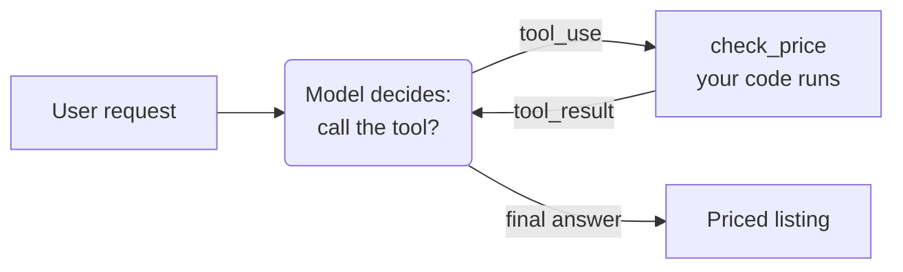

# 2.1 Tool Use

<div class="chapter-meta" markdown>
**Maturity: Standard** (every major vendor ships it, and the base of the augmented LLM) · *Grounding:* production + research
</div>

*Giving the model hands. You describe a function to the model; the model decides when to call it; your code runs the call and owns the result.*

> "Tool access is one of the highest-leverage primitives you can give an agent."[^2]
>
> Anthropic, *Tool use with Claude*

## 1. Why you'd reach for it

A language model can reason about almost anything you put in the prompt, but it cannot reach outside it. It has no way to look up a fact that postdates its training, read a row from your database, or change anything in the world. Whatever it produces is text. A tool lets it act on the real system instead.

Take pricing. You ask the model to set the price on a sit-stand desk in your catalog, and it gives you a confident $379. The supplier's contract sets a minimum advertised price of $399, but that floor lives in your pricing rules, and the model has never seen it. So the $379 goes live, the price is now below the contract floor, and a sub-MAP price can get your catalog dropped.

Give the model a tool and the problem goes away. You hand it a function that checks a proposed price against the rules. It proposes $379, the function reports a floor of $399, and the model revises. The model still writes the number, but the floor comes from your code.

So reach for a tool when the model needs something it cannot get on its own: a fact that has changed, a value from your data, a check it cannot run, an action in the world. When your own code already holds the answer, call the code and leave the model out of it.

## 2. What it actually is

A tool is two things: a function in your code, and a description of that function the model can read. You give the model the description as a JSON schema, the same shape on every major API:

```python
# What you describe to the model. It reads this, never your code, so the
# description and the schema have to be good. The same shape works on every
# major API.
PRICE_CHECK_TOOL = {
    "name": "check_price",
    "description": (
        "Check a proposed price for a product against the supplier's minimum "
        "advertised price (MAP) and margin floor. Call this before quoting a price."
    ),
    "input_schema": {
        "type": "object",
        "properties": {
            "supplier_sku": {"type": "string"},
            "proposed_price_cents": {"type": "integer"},
        },
        "required": ["supplier_sku", "proposed_price_cents"],
        "additionalProperties": False,
    },
}
```

The model never sees the function body. It picks a tool from the `description` and fills in arguments that fit the schema, so both have to be right. Mark every field required, forbid extras with `additionalProperties: false`, and keep the set small; vendors put the comfortable ceiling around twenty tools.[^3]

Behind the schema is ordinary code:

```python
# The tool itself: plain code the model cannot argue with. The floor is
# hardcoded here for one desk; in production it is a lookup in your pricing rules.
def check_price(supplier_sku: str, proposed_price_cents: int) -> dict:
    floor_cents = 39900  # $399.00 MAP for the Aldsworth desk
    ok = proposed_price_cents >= floor_cents
    return {"ok": ok, "floor_cents": floor_cents}
```

`check_price` returns a plain result the model cannot talk past. The floor is hardcoded here for one desk; in production it is a lookup in your pricing rules. Either way the number comes from your code, not the model.

**Maturity: Standard.** Every major vendor ships tool use, and Anthropic places it at the base of the augmented LLM, the unit it treats as the foundation of an agentic system.[^1] The benchmarks bear this out: on suites like SWE-bench, giving a model even basic tools produces large jumps in what it can do.[^2]

## 3. How to do it

Wiring it up is a short loop. You offer the tool, the model decides whether to call it, you run the call and hand back the result, and the model carries on until it has an answer. The shape, before the code (rounded boxes are where the model decides; rectangles are your code, a convention every diagram in this reference keeps):



With an Anthropic client in hand (`client = anthropic.Anthropic()`), the same loop in code:

```python
messages = [
    {
        "role": "user",
        "content": "Set a price for the Aldsworth sit-stand desk, SKU NV-ALDSWORTH-DM.",
    }
]

# Offer the tool. The model decides whether to use it.
reply = client.messages.create(
    model="claude-sonnet-4-6",
    max_tokens=1024,
    tools=[PRICE_CHECK_TOOL],
    messages=messages,
)

# While the model asks for the tool, run it and hand back the result.
while reply.stop_reason == "tool_use":
    messages.append({"role": "assistant", "content": reply.content})
    results = []
    for block in reply.content:
        if block.type == "tool_use":
            output = check_price(**block.input)  # your code runs, not the model
            results.append(
                {
                    "type": "tool_result",
                    "tool_use_id": block.id,
                    "content": str(output),
                }
            )
    messages.append({"role": "user", "content": results})
    reply = client.messages.create(
        model="claude-sonnet-4-6",
        max_tokens=1024,
        tools=[PRICE_CHECK_TOOL],
        messages=messages,
    )

# No more tool calls: the model has settled on an answer.
print(reply.content[0].text)
```

Three things in that loop are worth naming. The model decides: `reply.stop_reason` is `tool_use` only when it chooses to call the tool. Your code runs the function and returns a `tool_result`; the model never executes anything itself. And the loop repeats, so when the model proposes $379, reads the $399 floor in the result, and tries again, the same code handles the next call. That read-then-act cycle is the pattern ReAct named: interleave reasoning with tool calls instead of forcing an answer in one shot.[^4]

You set how much choice the model has. The default `tool_choice` of `auto` lets it decide each turn; `required` forces a call, a named tool pins one, and `none` turns tools off.[^3] Auto invites two opposite mistakes: the model skips a tool it needed, or it calls one it did not and pays for the round trip.[^8]

!!! example "In Listing Studio"
    This is step 6 of the pipeline, **price**. The model proposes `price_cents` for the Aldsworth listing, and `check_price` gates it against `compliance.map_enforced` and the margin floor before the listing's `status` can move from `draft` to `review`. Devon's code owns that gate. The model only proposes the number.

In the real pipeline this loop runs inside a LangGraph node, and the listing is read from and written to Postgres rather than held in a variable. The call and the tool are the same code.

## 4. Gotchas

An agent with tools can do real damage, so most of the work is in the failure modes.

1. **The model fabricates arguments.** It calls the right tool with a wrong value: a made-up SKU, a price with an extra zero, a date that never existed. Inventing plausible arguments is among the most common tool failures in the research, and a stronger model shrinks it without closing it.[^5] So validate every argument inside the tool before you act on it: confirm the SKU exists and the price is in range. The schema's types and `required` list catch shape errors; your code catches the rest.

2. **Tool results are untrusted input.** A product description you fetch, a row you read, a web page a tool returns: any of it can carry text that reads to the model as an instruction. Treat tool output as data, never as a command, and never let raw output trigger another action unchecked. This is indirect prompt injection, the first entry on the OWASP Top 10 for LLM applications, and injected text can make the agent leak your data or take an action you did not intend.[^6]

3. **The model can skip the tool.** With `tool_choice: auto` the model can answer without ever calling `check_price` and hand you a price straight from the text. The fix is a gate in your code: a price reaches `review` only after `check_price` has passed, whatever the model did. Forcing the call with `tool_choice` helps, but a forced call still trusts the model to act on the result. This is the anti-pattern the chapter feeds the catalog: the model left to police a rule the code should own.

4. **Give each tool the least power that works.** A tool scoped to read one table cannot drop another. Keep the destructive, irreversible actions, the refunds and deletes and publishes, behind a person rather than behind a model's confidence. OWASP calls this excessive agency: the more an over-scoped tool can do, the more damage a single wrong call does.[^6] [Knowing When to Ask](../craft/human-in-the-loop.md) covers the human gate, and [Guardrails & Safety](../craft/guardrails-and-safety.md) covers enforcing it.

5. **Plan for the call to fail.** Tools time out and return half an answer. Make retries idempotent so a repeat does not double-charge. Cap the loop so a model stuck calling the tool fails loudly instead of spinning. And remember that tools writing shared state race with people. When Maya edits the same desk the agent is pricing, two writers fight over one row, and the locking and isolation are your code's job.[^6]

6. **Know how often this works.** On realistic multi-step tasks, even frontier models finish fewer than half, and they hold up worse than that across repeated runs.[^7] That is the case for gating every consequential action and keeping each agent's scope narrow. These models are fluent enough that the unreliability is easy to miss. Design for it anyway.

7. **Tools cost tokens and time.** The schemas ride along in the input on every request, and each call is one more round trip.[^2] Trace every call, so a run that fails can be replayed and debugged.

## 5. In short

Give the model the price-check tool, but never let an unchecked price reach `review`. The model owns the proposal and the retry. Your code owns the schema, the validation, the permissions, and the final say on whether anything the tool returns is acted on.

## Sources

[^1]: Anthropic, "Building effective agents" (2024). <https://www.anthropic.com/research/building-effective-agents>
[^2]: Anthropic, "Tool use with Claude." <https://platform.claude.com/docs/en/docs/build-with-claude/tool-use/overview>
[^3]: OpenAI, "Function calling." <https://developers.openai.com/api/docs/guides/function-calling>
[^4]: Yao, S., et al., "ReAct: Synergizing Reasoning and Acting in Language Models" (2022). <https://arxiv.org/abs/2210.03629>
[^5]: Patil, S., et al., "Gorilla: Large Language Model Connected with Massive APIs" (2023). <https://arxiv.org/abs/2305.15334>
[^6]: OWASP, "Top 10 for LLM Applications" (2025). <https://genai.owasp.org/llm-top-10/>
[^7]: Yao, S., et al., "tau-bench: A Benchmark for Tool-Agent-User Interaction in Real-World Domains" (2024). <https://arxiv.org/abs/2406.12045>
[^8]: Ross, H., et al., "When2Call: When (not) to Call Tools" (2025). <https://arxiv.org/abs/2504.18851>

## See also

- [2.2 The Machine-Checkable Contract](structured-output.md), the typed-output side of the same boundary.
- [2.3 Skills & MCP](skills-and-mcp.md), for connecting tools at scale.
- [4.3 Knowing When to Ask](../craft/human-in-the-loop.md), on gating destructive actions behind a human.
- [4.4 Guardrails & Safety](../craft/guardrails-and-safety.md), on enforcing the check as a gate and defending against injection.
- [The Anti-Patterns Catalog](../catalogs/anti-patterns.md), for "the model self-polices a rule the code should own."
