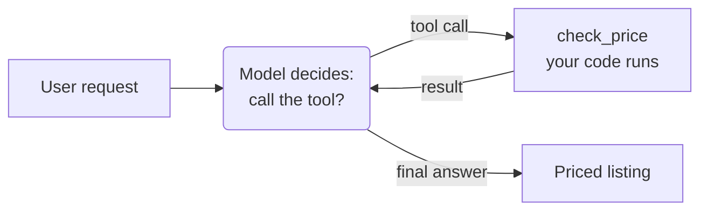
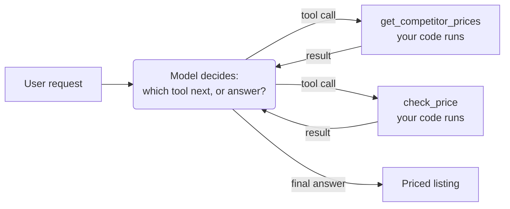

# 2.1 Tool Use

<small class="chapter-meta">**Maturity: Standard** (every major vendor ships it, and the base of the augmented LLM) · *Grounding:* production + research</small>

*Giving the model hands. You describe a function to the model; the model decides when to call it; your code runs the call and owns the result.*

> "Tool access is one of the highest-leverage primitives you can give an agent."[^2]
>
> Anthropic, *Tool use with Claude*

## 1. Why you'd reach for it

A language model can reason about almost anything you put in the prompt, but it cannot reach outside it. It has no way to look up a fact that postdates its training, read a row from your database, or change anything in the world. And here is the part that does the damage: when a task needs one of those things, the model does not stop and say so. It produces something plausible instead.

Take pricing. You ask the model to set the price on a sit-stand desk in your catalog, and it gives you a confident $379. The supplier's contract sets a minimum advertised price of $399, but that floor lives in your pricing rules, and the model has never seen it. It did not refuse; it guessed. So the $379 goes live, the price is now below the contract floor, and a sub-MAP price can get your catalog dropped.

Give the model a tool and the failure mode changes. You hand it a function that checks a proposed price against the rules; it proposes $379, the function reports a floor of $399, and the model revises. The model still writes the number, but the floor now comes from your code, as long as the model calls the tool and you act on what it returns.

That is the trigger in general: reach for a tool when the answer lives outside the model's weights and your prompt. Four cases cover most of it:

- **A fact that changes.** Today's competitor prices, current stock, anything past the training cutoff.
- **A value from your systems.** The supplier's contract floor, a customer's order history, a row in Postgres.
- **A check the model cannot run.** Margin math, address validation, anything where "close" is wrong.
- **An action in the world.** Writing the listing, issuing the refund, sending the email.

And the counter-trigger: when your own code already holds the answer and no judgement is needed, call the code and leave the model out of it. That line also separates this from the next chapter: a tool reaches outside the model, while [structured output](structured-output.md) just shapes what the model already produced. Both lean on the same JSON-schema machinery; only tool use runs a function.

## 2. What it actually is

A tool is two things: a function in your code, and a description of that function the model can read. You give the model the description as a JSON schema. With LangGraph, you decorate the function and the framework generates the schema from your type hints and docstring:

=== "LangGraph"

    ```python
    # A tool is just your function. LangGraph reads a description generated from the
    # type hints and the docstring; underneath it is a JSON schema (see the other tabs).
    @tool(parse_docstring=True)
    def check_price(supplier_sku: str, proposed_price_cents: int) -> dict:
        """Check a proposed price against the supplier's minimum advertised price.

        Args:
            supplier_sku: the product SKU.
            proposed_price_cents: the price to check, in cents.
        """
        floor_cents = 39900  # $399.00 MAP for the Aldsworth desk
        return {"ok": proposed_price_cents >= floor_cents, "floor_cents": floor_cents}
    ```

=== "OpenAI Responses API"

    ```python
    # What you describe to the model. It reads this, never your code, so the
    # description and the schema have to be good. This is the OpenAI Responses
    # shape; the Anthropic Messages API uses the same idea under `input_schema`.
    PRICE_CHECK_TOOL = {
        "type": "function",
        "name": "check_price",
        "description": (
            "Check a proposed price for a product against the supplier's minimum "
            "advertised price (MAP) and margin floor. Call this before quoting a price."
        ),
        "parameters": {
            "type": "object",
            "properties": {
                "supplier_sku": {"type": "string"},
                "proposed_price_cents": {"type": "integer"},
            },
            "required": ["supplier_sku", "proposed_price_cents"],
            "additionalProperties": False,
        },
    }
    ```

=== "Anthropic Messages API"

    ```python
    # The same tool, Anthropic Messages API shape: `input_schema` instead of
    # `parameters`, and no top-level `type`.
    PRICE_CHECK_TOOL_ANTHROPIC = {
        "name": "check_price",
        "description": (
            "Check a proposed price for a product against the supplier's minimum "
            "advertised price (MAP) and margin floor. Call this before quoting a price."
        ),
        "input_schema": {
            "type": "object",
            "properties": {
                "supplier_sku": {"type": "string"},
                "proposed_price_cents": {"type": "integer"},
            },
            "required": ["supplier_sku", "proposed_price_cents"],
            "additionalProperties": False,
        },
    }
    ```

The model never sees the function body. It picks a tool from the `description` and fills in arguments that fit the schema, so both have to be right. Mark every field required, forbid extras with `additionalProperties: false`, and keep the set small; vendors put the comfortable ceiling around twenty tools.[^3]

**Maturity: Standard.** Every major vendor ships tool use, and Anthropic places it at the base of the augmented LLM, the unit it treats as the foundation of an agentic system.[^1] The benchmarks bear this out: on suites like SWE-bench, giving a model even basic tools produces large jumps in what it can do.[^2]

## 3. How to do it

Wiring it up is a short loop: offer the tool, let the model decide, run the call, hand back the result, repeat until it answers. Rounded boxes are the model deciding; rectangles are your code:



With LangGraph, the loop is handled for you; the raw-SDK tabs show what it runs. The shape is the same in any SDK, and one fact drives it: the model's API is stateless, so each turn you resend the whole conversation. The history grows as you append the model's tool call and then your result, you cap the loop so a stuck model fails loudly instead of spinning, and you stop once the model answers with no more calls.

=== "LangGraph"

    ```python
    # LangGraph runs the loop for you: build the agent, then invoke it.
    agent = create_agent("openai:gpt-5.5", tools=[check_price])

    result = agent.invoke(
        {"messages": [{"role": "user",
                       "content": "Set a price for the Aldsworth sit-stand desk, SKU NV-ALDSWORTH-DM."}]}
    )
    print(result["messages"][-1].content)
    ```

=== "OpenAI Responses API"

    ```python
    input_list = [
        {
            "role": "user",
            "content": "Set a price for the Aldsworth sit-stand desk, SKU NV-ALDSWORTH-DM.",
        }
    ]

    # Offer the tool. The model decides whether to use it.
    response = client.responses.create(
        model="gpt-5.5",
        input=input_list,
        tools=[PRICE_CHECK_TOOL],
    )

    # While the model asks for the tool, run it and hand back the result.
    # Cap the loop so a stuck model fails loudly instead of spinning (Gotcha 5).
    MAX_STEPS = 5
    steps = 0
    while any(item.type == "function_call" for item in response.output):
        steps += 1
        if steps > MAX_STEPS:
            raise RuntimeError("tool loop hit MAX_STEPS; the model may be stuck")
        input_list += response.output
        for item in response.output:
            if item.type == "function_call":
                output = check_price(**json.loads(item.arguments))  # your code runs, not the model
                input_list.append(
                    {
                        "type": "function_call_output",
                        "call_id": item.call_id,
                        "output": json.dumps(output),
                    }
                )
        response = client.responses.create(
            model="gpt-5.5",
            input=input_list,
            tools=[PRICE_CHECK_TOOL],
        )

    # No more function calls: the model has settled on an answer.
    print(response.output_text)
    ```

=== "Anthropic Messages API"

    ```python
    messages = [
        {
            "role": "user",
            "content": "Set a price for the Aldsworth sit-stand desk, SKU NV-ALDSWORTH-DM.",
        }
    ]

    # Offer the tool. The model decides whether to use it.
    reply = client.messages.create(
        model="claude-sonnet-4-6",
        max_tokens=1024,
        tools=[PRICE_CHECK_TOOL_ANTHROPIC],
        messages=messages,
    )

    # While the model asks for the tool, run it and hand back the result.
    # Cap the loop so a stuck model fails loudly instead of spinning (Gotcha 5).
    MAX_STEPS = 5
    steps = 0
    while reply.stop_reason == "tool_use":
        steps += 1
        if steps > MAX_STEPS:
            raise RuntimeError("tool loop hit MAX_STEPS; the model may be stuck")
        messages.append({"role": "assistant", "content": reply.content})
        results = []
        for block in reply.content:
            if block.type == "tool_use":
                output = check_price(**block.input)  # your code runs, not the model
                results.append(
                    {
                        "type": "tool_result",
                        "tool_use_id": block.id,
                        "content": json.dumps(output),
                    }
                )
        messages.append({"role": "user", "content": results})
        reply = client.messages.create(
            model="claude-sonnet-4-6",
            max_tokens=1024,
            tools=[PRICE_CHECK_TOOL_ANTHROPIC],
            messages=messages,
        )

    # No more tool calls: the model has settled on an answer.
    print(reply.content[0].text)
    ```

One run of that loop, for the desk:

1. The model asks to call `check_price` with a proposed price of $379.
2. The tool runs and returns `{"ok": false, "floor_cents": 39900}`.
3. The model reads the floor and asks to call `check_price` again with $399.
4. The tool returns `{"ok": true, "floor_cents": 39900}`.
5. No more tool calls. The model writes the price: $399.

Note who did what. The model decided, both times: it chose to call the tool, and chose to retry when the first price failed. Your code ran the function; the model never executes anything itself. That read-then-act cycle is the pattern ReAct named: interleave reasoning with tool calls instead of forcing an answer in one shot.[^4]

### More than one tool

A real surface offers several tools, and the model picks among them by `description`; this is why the descriptions have to earn their keep. Ask it to price the desk competitively, give it both `get_competitor_prices` and `check_price`, and it will fetch the market, land on a number, then check that number against the floor: two different tools, chosen in an order you never specified. When calls are independent of each other, one response can also carry several tool calls at once, each matched to its result by an id.[^2]



With LangGraph the structural change is one line: pass both tools to the agent. Without a framework you own the registry and the dispatch-by-name yourself, which the raw-SDK tabs show.

=== "LangGraph"

    ```python
    # Several tools: hand them all to the agent; it routes by description.
    agent = create_agent("openai:gpt-5.5", tools=[check_price, get_competitor_prices])
    ```

=== "OpenAI Responses API"

    ```python
    # Several tools: the model picks by description; your code dispatches by name.
    TOOLS = {
        "check_price": check_price,
        "get_competitor_prices": get_competitor_prices,
    }


    def run_tools(response) -> list:
        """One function_call_output per function_call item, matched by call_id."""
        results = []
        for item in response.output:
            if item.type == "function_call":
                output = TOOLS[item.name](**json.loads(item.arguments))
                results.append(
                    {
                        "type": "function_call_output",
                        "call_id": item.call_id,
                        "output": json.dumps(output),
                    }
                )
        return results
    ```

=== "Anthropic Messages API"

    ```python
    # Several tools: the model picks by description; your code dispatches by name.
    TOOLS = {
        "check_price": check_price,
        "get_competitor_prices": get_competitor_prices,
    }


    def run_tools(reply) -> list:
        """One tool_result per tool_use block, matched by id."""
        results = []
        for block in reply.content:
            if block.type == "tool_use":
                output = TOOLS[block.name](**block.input)
                results.append(
                    {
                        "type": "tool_result",
                        "tool_use_id": block.id,
                        "content": json.dumps(output),
                    }
                )
        return results
    ```

Adding a tool is one line either way: another entry in the agent's `tools` list, or another branch in your own dispatch. What changes is the model's burden: every tool you add is one more choice it can get wrong, which is the real reason behind the twenty-tool ceiling in §2.

### How much choice to give it

The default `tool_choice` of `auto` lets the model decide each turn; `required` forces a call, a named tool pins one, and `none` turns tools off.[^3] Auto invites two opposite mistakes: the model skips a tool it needed, or it calls one it did not and pays for the round trip.[^8]

> **In Listing Studio.** This is step 6 of the pipeline, **price**. The model proposes the number, `check_price` rules on it, and a listing cannot leave `draft` until the check passes. Your code owns that gate.

## 4. Gotchas

An agent with tools can do real damage, so most of the work is in the failure modes.

1. **The model fabricates arguments.** It calls the right tool with a wrong value: a made-up SKU, a price with an extra zero, a date that never existed. Inventing plausible arguments is among the most common tool failures in the research, and a stronger model shrinks it without closing it.[^5] So validate every argument inside the tool before you act on it: confirm the SKU exists and the price is in range. The schema's types and `required` list catch shape errors; your code catches the rest.

2. **Tool results are untrusted input.** A product description you fetch, a row you read, a web page a tool returns: any of it can carry text that reads to the model as an instruction. Treat tool output as data, never as a command, and never let raw output trigger another action unchecked. This is indirect prompt injection, the first entry on the OWASP Top 10 for LLM applications, and injected text can make the agent leak your data or take an action you did not intend.[^6]

3. **The model can skip the tool.** With `tool_choice: auto` the model can answer without ever calling `check_price` and hand you a price straight from the text. The fix is a gate in your code: a price reaches `review` only after `check_price` has passed, whatever the model did. Forcing the call with `tool_choice` helps, but a forced call still trusts the model to act on the result. This is the anti-pattern the chapter feeds the catalog: the model left to police a rule the code should own.

4. **Give each tool the least power that works.** A tool scoped to read one table cannot drop another. Keep the destructive, irreversible actions, the refunds and deletes and publishes, behind a person rather than behind a model's confidence. OWASP calls this excessive agency: the more an over-scoped tool can do, the more damage a single wrong call does.[^6] [Knowing When to Ask](../craft/human-in-the-loop.md) covers the human gate, and [Guardrails & Safety](../craft/guardrails-and-safety.md) covers enforcing it.

5. **Plan for the call to fail.** Tools time out and return half an answer. When one fails, hand the model a result it can act on, not a stack trace: `{"error": "SKU not found; try search_catalog"}` lets it recover, where a raw `KeyError` just ends the run. Make retries idempotent so a repeat does not double-charge. Cap the loop so a model stuck calling the tool fails loudly instead of spinning, as the loop in §3 does. And remember that tools writing shared state race with people. When a merchandiser edits the same desk the agent is pricing, two writers fight over one row, and the locking and isolation are your code's job.[^6]

6. **Know how often this works.** On realistic multi-step tasks, even frontier models finish fewer than half, and they hold up worse than that across repeated runs.[^7] That is the case for gating every consequential action and keeping each agent's scope narrow. These models are fluent enough that the unreliability is easy to miss. Design for it anyway.

7. **Tools cost tokens, attention, and time.** Every schema rides in the input on every request, so a large tool surface taxes every call: fifty tools can fill the window with JSON before the model reads the task, and a longer menu is also a harder choice, so selection accuracy falls as the set grows. Keep the visible set small, and once the catalog outgrows the window, send only the tools relevant to the step instead of the whole registry. Revealing the relevant subset on demand rather than the whole catalog upfront is *progressive disclosure*, the same idea Agent Skills use to stay cheap; [Skills](skills.md) covers it, and [MCP](mcp.md) covers connecting tools at that scale. Each call is also one more round trip, so trace every call and a failed run can be replayed.[^2]

## 5. In short

Give the model the price-check tool, but never let an unchecked price reach `review`. The model owns the proposal and the retry. Your code owns the schema, the validation, the permissions, and the final say on whether anything the tool returns is acted on.

## Sources

[^1]: Anthropic, "Building effective agents" (2024). <https://www.anthropic.com/research/building-effective-agents>
[^2]: Anthropic, "Tool use with Claude." <https://platform.claude.com/docs/en/docs/build-with-claude/tool-use/overview>
[^3]: OpenAI, "Function calling." <https://developers.openai.com/api/docs/guides/function-calling>
[^4]: Yao, S., et al., "ReAct: Synergizing Reasoning and Acting in Language Models" (2022). <https://arxiv.org/abs/2210.03629>
[^5]: Patil, S., et al., "Gorilla: Large Language Model Connected with Massive APIs" (2023). <https://arxiv.org/abs/2305.15334>
[^6]: OWASP, "Top 10 for LLM Applications" (2025). <https://genai.owasp.org/llm-top-10/>
[^7]: Yao, S., et al., "tau-bench: A Benchmark for Tool-Agent-User Interaction in Real-World Domains" (2024). <https://arxiv.org/abs/2406.12045>
[^8]: Ross, H., et al., "When2Call: When (not) to Call Tools" (2025). <https://arxiv.org/abs/2504.18851>

## See also

- [2.2 The Machine-Checkable Contract](structured-output.md), the typed-output side of the same boundary.
- [2.3 Skills](skills.md), for packaging procedural know-how and progressive disclosure.
- [2.4 MCP](mcp.md), for connecting tools at scale.
- [4.3 Knowing When to Ask](../craft/human-in-the-loop.md), on gating destructive actions behind a human.
- [4.4 Guardrails & Safety](../craft/guardrails-and-safety.md), on enforcing the check as a gate and defending against injection.
- [The Anti-Patterns Catalog](../catalogs/anti-patterns.md), for "the model self-polices a rule the code should own."
